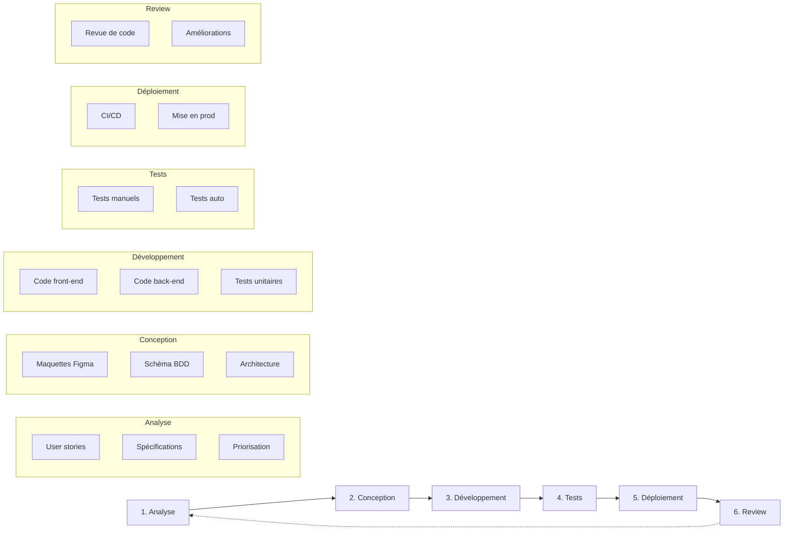
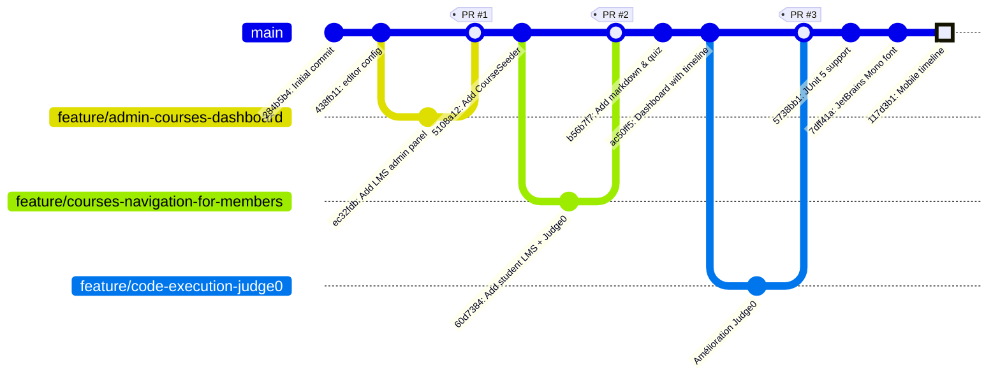

# 3. Gestion de Projet

## 3.1 Méthodologie adoptée

### Approche Agile adaptée

Pour ce projet réalisé en formation, j'ai adopté une méthodologie inspirée de l'Agile, adaptée au contexte d'un développeur solo :

- **Itérations courtes** : Développement par fonctionnalités complètes
- **Feedback continu** : Tests réguliers et ajustements
- **Priorisation** : Focus sur les fonctionnalités essentielles (MVP) d'abord
- **Documentation au fil de l'eau** : Code commenté et commits explicites

### Cycle de développement



## 3.2 Planning et organisation

### Découpage du projet en phases

Le projet a été découpé en six phases distinctes, chacune avec des objectifs précis.

La **phase d'initialisation** (semaines 1-2) a consisté à mettre en place l'environnement de développement, définir l'architecture technique et créer les premières maquettes dans Figma. Cette étape fondamentale a permis de poser des bases solides pour la suite du projet.

Durant la **phase Core Backend** (semaines 3-5), j'ai développé les modèles Eloquent, créé les migrations de base de données et mis en place l'API de base. Cette phase a établi la structure de données qui sous-tend l'ensemble de l'application.

La **phase Interface Admin** (semaines 6-8) a été consacrée au développement des fonctionnalités CRUD pour la gestion des cours, chapitres, leçons et blocs de contenu. L'objectif était de permettre la création et l'organisation du contenu pédagogique.

La **phase Interface Apprenant** (semaines 9-11) s'est concentrée sur l'expérience utilisateur côté étudiant : navigation dans les cours, affichage des leçons et système de suivi de progression.

La **phase Éditeur de Code** (semaines 12-14) représentait le cœur technique du projet avec l'intégration de Monaco Editor, la connexion à l'API Judge0 pour l'exécution de code, et la mise en place des tests JUnit 5 automatisés.

Enfin, la **phase de finalisation** (semaine 15 et au-delà) a couvert le déploiement en production, les optimisations de performance et la rédaction de la documentation.

### Suivi de l'avancement

Le suivi de l'avancement a été réalisé via :

1. **Git** : Historique des commits avec messages explicites
2. **GitHub Issues** : Suivi des tâches et bugs
3. **Tableau personnel** : Liste des fonctionnalités et leur statut

### Exemple de commits représentatifs

```
117d3b1 refactor: update mobile timeline to show current lesson and next 3 nodes
75dd459 test: group CodeExecutionTest under judge0 for improved organization
7dff41a feat: integrate JetBrains Mono font and enhance layout for better responsiveness
5738bb1 refactor: update test execution to use JUnit 5 and improve syntax highlighting
```

## 3.3 Outils de gestion utilisés

### Outils de développement

Pour le développement, **PhpStorm** a été mon IDE principal, offrant une excellente intégration avec PHP, Laravel et les technologies front-end. La gestion du code source s'est faite avec **Git** et **GitHub**, permettant un suivi rigoureux des modifications et une sauvegarde distante du projet.

Le maquettage des interfaces a été réalisé avec **Figma**, tandis que **DbDiagram** m'a permis de visualiser et concevoir le schéma de base de données. Pour tester les endpoints de l'API, j'ai utilisé **Postman**. Enfin, **Ghostty** a servi de terminal pour exécuter les commandes CLI Laravel et npm.

### Outils de collaboration et documentation

**GitHub** a joué un rôle central en hébergeant le code source, en permettant le suivi des tâches via les issues, et en automatisant les tests grâce aux GitHub Actions. La documentation personnelle a été rédigée en **markdown**, un format simple et versionnable. **Figma** a également servi au partage des maquettes.

### Outils de déploiement

La conteneurisation de l'application repose sur **Docker**, permettant une reproductibilité de l'environnement. Le déploiement en production est géré par **Laravel Cloud**, une plateforme managée optimisée pour les applications Laravel. Enfin, **GitHub Actions** orchestre le pipeline CI/CD, exécutant automatiquement les tests et le linting à chaque push.

## 3.4 Gestion des risques

### Risques identifiés et mitigation

Plusieurs risques ont été identifiés en amont du projet, avec des stratégies de mitigation adaptées.

Le risque le plus important concernait la **complexité de l'intégration Judge0**. Cette API d'exécution de code représentait un élément central du projet, mais sa documentation était parfois lacunaire. Pour y faire face, j'ai procédé par tests progressifs, en commençant par des cas simples avant d'ajouter la complexité des tests JUnit.

La **performance de l'éditeur de code** constituait un risque modéré. Le choix de Monaco Editor, le même moteur que VS Code, a permis de s'appuyer sur une solution éprouvée et performante, réduisant considérablement ce risque.

Enfin, le **temps de développement** pouvait être sous-estimé. Pour mitiger ce risque, j'ai adopté une approche MVP (Minimum Viable Product), en priorisant les fonctionnalités essentielles et en procédant par itérations successives.

## 3.5 Versioning et workflow Git

### Stratégie de branches



### Convention de commits

Avant de découvrir la convention [**Conventional Commits**](https://www.conventionalcommits.org/en/v1.0.0/), mes messages de commit étaient parfois vagues ou trop longs.

**Exemple d'évolution :**

```
Avant : fixed some linter issues
Après : refactor: update test execution to use JUnit 5 and improve syntax highlighting
```

La convention permet d'identifier immédiatement le type de changement (feat, fix, refactor, test, etc.) et facilite la recherche dans l'historique ainsi que la génération automatique de changelogs.


### Exemple de workflow

```bash
# Création d'une branche pour une nouvelle fonctionnalité
git checkout -b feature/quiz-block

# Développement avec commits atomiques
git commit -m "feat: add quiz block model and migration"
git commit -m "feat: add quiz block controller and routes"
git commit -m "feat: add quiz block frontend component"
git commit -m "test: add quiz block feature tests"

# Squash des commits et merge vers main après validation
git checkout main
git merge --squash feature/quiz-block
git commit -m "feat: add quiz block with tests"
git push origin main
```
