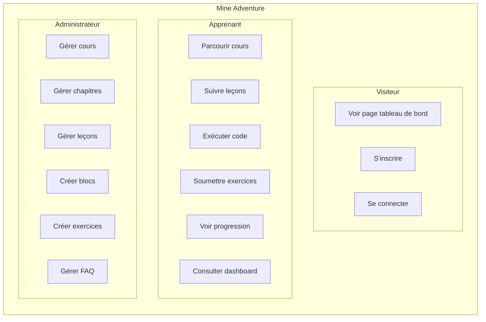

# 4. Spécifications Fonctionnelles

## 4.1 Expression des besoins

### Besoins fonctionnels

#### Module Authentification

Le module d'authentification couvre les fonctionnalités essentielles de gestion des utilisateurs. L'inscription et la connexion/déconnexion sont des fonctionnalités de haute priorité. Les sessions doivent être persistantes et sécurisées. L'administrateur dispose d'un accès à des fonctionnalités spécifiques réservées à son rôle.

#### Module Cours (Apprenant)

Le module cours permet à l'apprenant de consulter la liste des cours disponibles et de filtrer par niveau de difficulté. L'accès au détail d'un cours avec ses chapitres et sa progression est prioritaire, tout comme la possibilité de suivre des leçons avec différents types de contenus. L'apprenant peut marquer une leçon comme complétée et les leçons se débloquent de manière séquentielle.

#### Module Exercices de code

Ce module permet d'écrire du code Java dans un éditeur intégré et de l'exécuter pour voir le résultat. La soumission du code pour validation par tests JUnit est une fonctionnalité clé, accompagnée de l'affichage détaillé des tests passés ou échoués. Un code de départ pré-rempli peut être fourni pour guider l'apprenant.

#### Module Dashboard

Le tableau de bord affiche les statistiques globales de l'apprenant, notamment le nombre de cours commencés et terminés. Le streak d'apprentissage est une fonctionnalité secondaire pour la motivation. Un accès rapide au dernier cours en cours facilite la reprise de l'apprentissage.

#### Module Administration

L'administration permet de créer, modifier et supprimer des cours, de les organiser en chapitres et de créer des leçons avec différents types de blocs. Le réordonnancement par drag & drop des chapitres, leçons et blocs est disponible. Les administrateurs peuvent créer des exercices de code avec des tests JUnit et gérer les FAQ de chaque cours.

### Besoins non fonctionnels

En termes de **performance**, le temps de chargement des pages doit rester inférieur à 3 secondes. L'**accessibilité** est assurée par une interface compatible avec les lecteurs d'écran selon le RGAA. Le design **responsive** garantit une adaptation optimale sur mobile, tablette et desktop.

La **sécurité** est renforcée par une protection contre les attaques XSS, CSRF et les injections SQL. La **disponibilité** vise une accessibilité 24h/24 et 7j/7. Enfin, la **maintenabilité** repose sur un code structuré, documenté et testé.

## 4.2 Cas d'utilisation

### Diagramme de cas d'utilisation global



### Cas d'utilisation détaillé : Soumettre un exercice de code

**Acteur principal :** Apprenant authentifié

**Préconditions :**
- L'apprenant est connecté
- L'apprenant a accès à la leçon contenant l'exercice

**Scénario nominal :**

1. L'apprenant accède à une leçon contenant un bloc de type "Assignment"
2. Le système affiche l'énoncé de l'exercice et l'éditeur de code
3. L'apprenant écrit son code Java dans l'éditeur Monaco
4. L'apprenant clique sur "Run" pour tester son code
5. Le système envoie le code à l'API Judge0
6. Le système affiche le résultat de l'exécution (sortie console ou erreurs)
7. L'apprenant clique sur "Submit" pour valider
8. Le système exécute les tests JUnit 5 associés à l'exercice
9. Le système affiche le résultat des tests (passés/échoués avec détails)
10. Si tous les tests passent, le système marque l'exercice comme réussi

**Scénarios alternatifs :**

- **4a.** Le code ne compile pas → Le système affiche les erreurs de compilation
- **9a.** Certains tests échouent → L'apprenant peut modifier et re-soumettre

**Postconditions :**
- La progression de l'apprenant est mise à jour

## 4.3 User Stories

### Epic : Gestion des cours

```
En tant qu'apprenant,
Je veux parcourir le catalogue des cours,
Afin de choisir un cours adapté à mon niveau.

Critères d'acceptation :
- Les cours sont affichés avec leur vignette, titre et niveau de difficulté
- Je peux voir le nombre de chapitres et leçons de chaque cours
- Les niveaux de difficulté sont clairement identifiés (Facile, Moyen, Difficile)
```

```
En tant qu'apprenant,
Je veux voir ma progression dans un cours,
Afin de savoir où j'en suis dans mon apprentissage.

Critères d'acceptation :
- Un pourcentage de progression est affiché
- Les leçons complétées sont visuellement identifiées
- Je vois quelle est la prochaine leçon à suivre
```

### Epic : Exercices de code

```
En tant qu'apprenant,
Je veux écrire et exécuter du code Java dans mon navigateur,
Afin de pratiquer sans installer d'environnement de développement.

Critères d'acceptation :
- L'éditeur de code propose la coloration syntaxique Java
- Je peux exécuter mon code et voir la sortie console
- Les erreurs de compilation sont affichées clairement
```

```
En tant qu'apprenant,
Je veux soumettre mon code pour validation automatique,
Afin de vérifier que ma solution est correcte.

Critères d'acceptation :
- Les tests JUnit sont exécutés sur mon code
- Je vois le nombre de tests passés/échoués
- Le détail de chaque test est affiché (nom, statut, message d'erreur si échec)
```

### Epic : Administration

```
En tant qu'administrateur,
Je veux créer des exercices de code avec des tests automatiques,
Afin de valider les compétences des apprenants.

Critères d'acceptation :
- Je peux définir l'énoncé de l'exercice
- Je peux fournir un code de départ
- Je peux écrire des tests JUnit 5 pour valider les solutions
- Je peux optionnellement fournir une solution de référence
```

```
En tant qu'administrateur,
Je veux réorganiser l'ordre des éléments par glisser-déposer,
Afin de structurer mes contenus facilement.

Critères d'acceptation :
- Je peux réordonner les chapitres d'un cours
- Je peux réordonner les leçons d'un chapitre
- Je peux réordonner les blocs d'une leçon
- L'ordre est sauvegardé immédiatement
```

## 4.4 Règles de gestion

Plusieurs règles de gestion encadrent le fonctionnement de l'application.

Concernant l'**accès et l'authentification**, un apprenant doit être authentifié pour accéder aux cours (RG-01). Une leçon ne peut être accessible que si la précédente est complétée (RG-02), à l'exception de la première leçon de chaque chapitre qui est toujours accessible (RG-03). Seuls les administrateurs peuvent créer, modifier ou supprimer des contenus (RG-07).

En ce qui concerne la **structure des contenus**, un cours doit contenir au moins un chapitre (RG-04), un chapitre doit contenir au moins une leçon (RG-05), et une leçon doit contenir au moins un bloc de contenu (RG-06).

Pour l'**exécution de code**, le code soumis par l'apprenant est exécuté dans un environnement sandboxé via Judge0 pour des raisons de sécurité (RG-08). Le temps d'exécution est limité par un timeout pour éviter les boucles infinies (RG-09).

Enfin, les **niveaux de difficulté** possibles pour les cours sont : Facile, Moyen et Difficile (RG-10).
