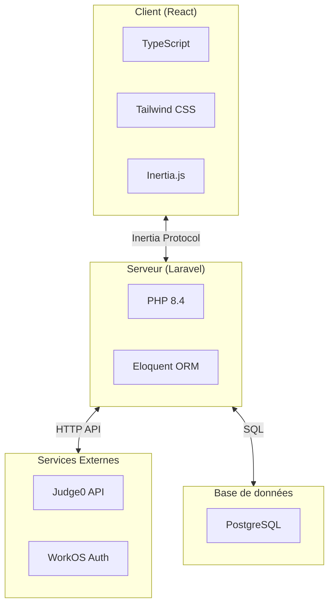
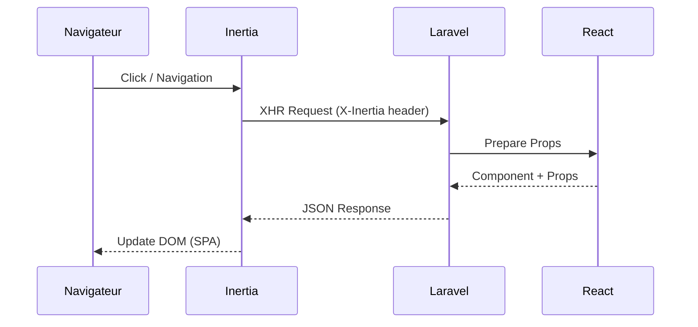
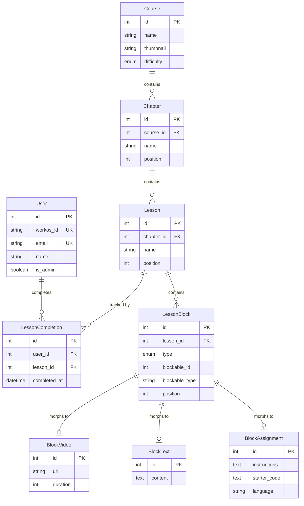
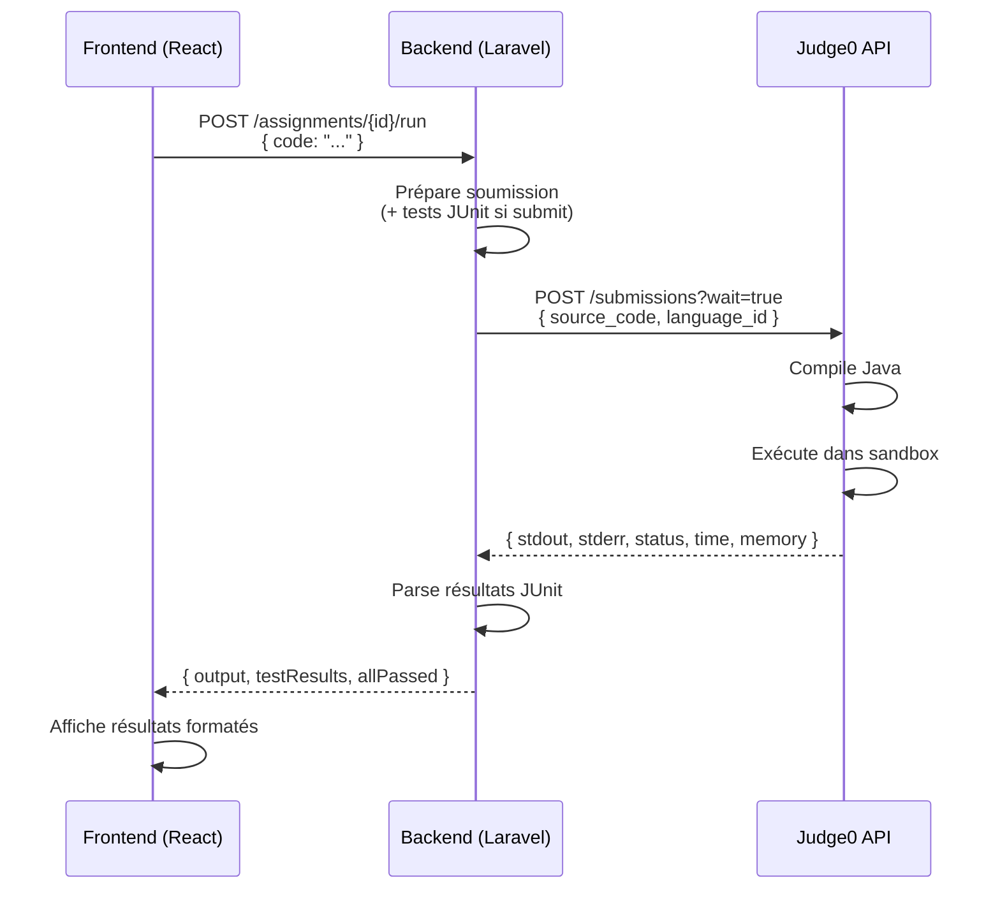

# 5. Spécifications Techniques

## 5.1 Architecture applicative

### Architecture globale

Mine Adventure suit une architecture **monolithique moderne** basée sur le pattern MVC (Model-View-Controller), enrichie par Inertia.js pour créer une expérience SPA (Single Page Application) tout en conservant les avantages du rendu côté serveur.

### Pattern Inertia.js

Inertia.js agit comme une couche de liaison entre le backend Laravel et le frontend React, permettant de :

- Conserver le routing côté serveur (routes Laravel)
- Utiliser des composants React pour le rendu
- Éviter la création d'une API REST séparée
- Bénéficier des fonctionnalités Laravel (sessions, middleware, validation)

## 5.2 Stack technique

### Vue d'ensemble

Le **backend** repose sur PHP 8.4 avec Laravel 12 comme framework principal. Inertia.js v2 assure la liaison entre le backend et le frontend, tandis qu'Eloquent ORM gère l'accès à la base de données.

Le **frontend** utilise React 19 avec TypeScript 5.x pour le typage statique. Tailwind CSS 4 sert de framework CSS et Vite 7 assure le bundling et le serveur de développement.

Les **composants UI** sont construits avec shadcn/ui et les primitives accessibles de Radix UI. Lucide React fournit les icônes, et Monaco Editor offre un éditeur de code intégré de qualité professionnelle.

La **base de données** est SQLite en développement et PostgreSQL 18 en production.

L'**authentification** est déléguée à WorkOS pour gérer le SSO et OAuth. L'**exécution de code** Java est sandboxée via Judge0.

Les **tests** utilisent Pest 4 pour PHP et JUnit 5 pour les exercices Java des apprenants.

Le **déploiement** s'appuie sur Docker pour la conteneurisation, Laravel Cloud comme plateforme PaaS, et GitHub Actions pour la CI/CD.

### Justification des choix techniques

#### Laravel 12

**Pourquoi Laravel ?**
- Framework PHP populaire et bien documenté
- Écosystème riche (Eloquent, Artisan, Blade, etc.)
- Excellent support de TypeScript via Inertia + Wayfinder
- Sécurité intégrée (CSRF, XSS, SQL injection)
- Outils de développement puissants (migrations, seeders, factories)

#### React 19 + TypeScript

**Pourquoi React ?**
- Bibliothèque mature et largement adoptée
- Écosystème de composants très riche
- Intégration parfaite avec Inertia.js
- TypeScript apporte la sécurité du typage statique

#### Tailwind CSS 4

**Pourquoi Tailwind ?**
- Productivité accrue avec les classes utilitaires
- Design system cohérent
- Excellent support du mode sombre
- Purging automatique pour des bundles optimisés

#### Monaco Editor

**Pourquoi Monaco ?**
- Éditeur utilisé par VS Code
- Coloration syntaxique Java native
- Autocomplétion et IntelliSense
- Performances excellentes

#### Judge0

**Pourquoi Judge0 ?**
- Exécution sécurisée de code dans un sandbox
- Support de nombreux langages dont Java
- Gestion des timeouts et limites mémoire
- API REST simple à intégrer

## 5.3 Modèle de données

### Diagramme Entité-Relation simplifié

### Description des entités principales

L'entité **User** représente un utilisateur de la plateforme et possède plusieurs LessonCompletions pour suivre sa progression.

L'entité **Course** représente un cours de formation. Elle contient plusieurs Chapters et peut avoir plusieurs FAQs associées.

L'entité **Chapter** représente un chapitre d'un cours. Elle appartient à un Course et contient plusieurs Lessons.

L'entité **Lesson** représente une leçon d'un chapitre. Elle appartient à un Chapter et contient plusieurs LessonBlocks.

L'entité **LessonBlock** est un bloc de contenu polymorphique. Elle appartient à une Lesson et référence un type de bloc spécifique parmi : **BlockVideo** (contenu vidéo), **BlockText** (contenu texte), **BlockResources** (liens vers des ressources), **BlockQuiz** (quiz à choix multiples), ou **BlockAssignment** (exercice de code avec tests associés).

Enfin, l'entité **LessonCompletion** assure le suivi de progression. Elle fait le lien entre un User et une Lesson pour indiquer quand celle-ci a été complétée.

## 5.4 API et endpoints

### Routes principales (Inertia)

**Routes publiques (apprenants) :**

Les routes publiques permettent aux apprenants de naviguer dans les cours. La route GET `/courses` (CourseController@index) affiche la liste des cours, tandis que GET `/courses/{course}` (CourseController@show) affiche le détail d'un cours spécifique.

Pour les leçons, GET `/courses/{course}/lessons/{lesson}` (LessonController@show) affiche une leçon et POST `/courses/{course}/lessons/{lesson}/complete` (LessonController@complete) permet de marquer une leçon comme terminée.

Les exercices de code disposent de deux endpoints : POST `/assignments/{assignment}/run` (AssignmentController@run) pour exécuter le code et POST `/assignments/{assignment}/submit` (AssignmentController@submit) pour soumettre le code aux tests JUnit.

**Routes administration :**

L'administration des cours utilise `/admin/courses` en GET pour lister et POST pour créer. La route `/admin/courses/{course}` accepte GET pour le détail, PATCH pour la modification et DELETE pour la suppression.

La gestion de la structure utilise POST `/admin/courses/{course}/chapters` pour créer un chapitre, PATCH `/admin/chapters/{chapter}` pour le modifier, POST `/admin/chapters/{chapter}/lessons` pour créer une leçon, et POST `/admin/lessons/{lesson}/blocks` pour ajouter un bloc. La route PATCH `/admin/blocks/{block}` permet de modifier un bloc existant.

### Intégration Judge0

