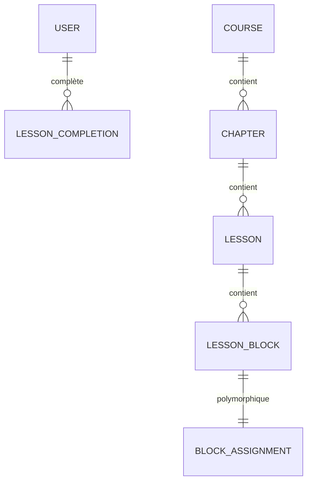

# 7.1 Mise en place de la base de données relationnelle

> **Compétence visée :** Mettre en place une base de données relationnelle

## Objectif

Cette section présente la conception et la mise en place de la base de données relationnelle pour Mine Adventure.

## SGBD

En **développement**, SQLite pour sa légèreté. En **production**, PostgreSQL 18 pour sa robustesse et son support JSON.

## Modèle Conceptuel de Données



Les blocs de contenu utilisent une **relation polymorphique** permettant différents types : vidéo, texte, ressources, quiz, et exercice de code.

## Migrations Laravel

Les migrations Laravel créent les tables avec typage strict, clés étrangères et index.

```php
Schema::create('courses', function (Blueprint $table) {
    $table->id();
    $table->string('name');
    $table->string('thumbnail')->nullable();
    $table->string('difficulty')->default(CourseDifficulty::Easy->value);
    $table->timestamps();
});

Schema::create('chapters', function (Blueprint $table) {
    $table->id();
    $table->foreignId('course_id')->constrained()->cascadeOnDelete();
    $table->string('name');
    $table->unsignedInteger('position')->default(0);
    $table->index(['course_id', 'position']);
});

Schema::create('lesson_blocks', function (Blueprint $table) {
    $table->id();
    $table->foreignId('lesson_id')->constrained()->cascadeOnDelete();
    $table->string('type'); // video, text, quiz, assignment...
    $table->morphs('blockable'); // Relation polymorphique
    $table->unsignedInteger('position')->default(0);
});
```

## Enums PHP

```php
enum CourseDifficulty: string
{
    case Easy = 'easy';
    case Medium = 'medium';
    case Hard = 'hard';
}

enum BlockType: string
{
    case Video = 'video';
    case Text = 'text';
    case Quiz = 'quiz';
    case Assignment = 'assignment';
}
```

## Schéma visuel

Le schéma complet est documenté dans `docs/schema.dbml`.


## Bonnes pratiques

**Normalisation** en 3NF. **Clés étrangères** avec contraintes. **Suppression en cascade** pour l'intégrité. **Index** sur les colonnes de tri. **Timestamps** automatiques. **Enums PHP** pour les valeurs contraintes.
