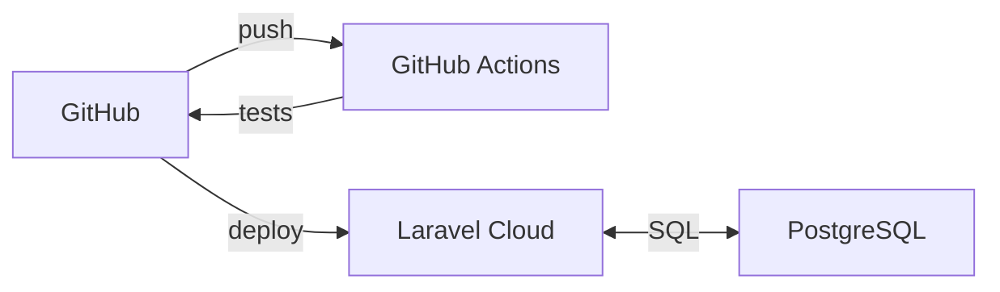

# 7.4 Documentation du déploiement

> **Compétence visée :** Documenter le déploiement d'une application dynamique web ou web mobile

## Architecture de déploiement



## Docker (référence)

Un Dockerfile multi-stage est maintenu pour le développement local. Il utilise Node.js pour le build des assets, Composer pour les dépendances PHP, et PHP-FPM avec Nginx pour la production.

```dockerfile
FROM node:20-alpine AS frontend-builder
# Build des assets (npm ci && npm run build)

FROM composer:2 AS composer-builder
# Installation dépendances PHP (composer install --no-dev)

FROM php:8.4-fpm-alpine AS production
# Image finale avec Nginx + PHP-FPM + Supervisor
```

## CI/CD avec GitHub Actions

Deux workflows séparés : **linting** (Pint, ESLint, Prettier) et **tests** (Pest).

```yaml
# .github/workflows/tests.yml
jobs:
  ci:
    runs-on: ubuntu-latest
    steps:
      - uses: shivammathur/setup-php@v2
        with: { php-version: 8.4 }
      - uses: actions/setup-node@v4
        with: { node-version: '22' }
      - run: composer install && npm ci && npm run build
      - run: ./vendor/bin/pest --exclude-group=judge0
```

## Laravel Cloud

**Laravel Cloud** est une plateforme PaaS managée offrant une infrastructure auto-scalable, des certificats SSL automatiques, des déploiements zero-downtime, et une base PostgreSQL managée.

### Configuration

1. Connexion du repository GitHub
2. Sélection de la branche `main`
3. Configuration des variables d'environnement (APP_KEY, JUDGE0_*, WORKOS_*)
4. Création de la base PostgreSQL (credentials auto-injectés)

### Processus de déploiement

1. Push sur main → GitHub Actions (tests)
2. Tests OK → Laravel Cloud détecte et build
3. Création nouveau worker + health check
4. Basculement du trafic (zero-downtime)
5. Post-déploiement : `php artisan migrate --force && php artisan optimize`

## Monitoring

Laravel Cloud fournit un dashboard avec logs en temps réel, métriques (CPU, mémoire), et health checks automatiques sur `/up`.

## Rollback

Via l'interface Laravel Cloud (redeploy d'une version précédente) ou via Git (`git revert HEAD && git push`).
