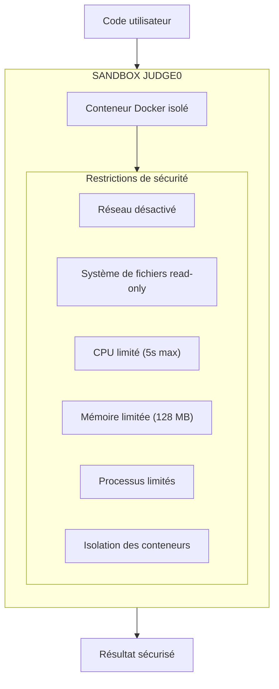

# 8. Sécurité

## Objectif

Cette section présente les mesures de sécurité implémentées dans Mine Adventure, couvrant la protection contre les vulnérabilités web courantes (OWASP Top 10), la conformité RGPD, et les bonnes pratiques de développement sécurisé.

## Sécurité intégrée de Laravel

Laravel fournit nativement de nombreuses protections de sécurité qui ont été exploitées dans ce projet.

La protection contre les **injections SQL** est assurée par l'ORM Eloquent qui utilise systématiquement des requêtes préparées. Les attaques **XSS** (Cross-Site Scripting) sont prévenues par l'échappement automatique des données dans les templates Blade et les composants React.

Laravel gère automatiquement les **tokens CSRF** (Cross-Site Request Forgery) pour toutes les requêtes POST, PUT, PATCH et DELETE. La protection contre le **Mass Assignment** est configurée via les propriétés `$fillable` des modèles Eloquent, empêchant l'injection de champs non autorisés.

Le **hachage des mots de passe** utilise les algorithmes Bcrypt ou Argon2, garantissant un stockage sécurisé. Enfin, les données sensibles peuvent être protégées par un **chiffrement AES-256-CBC** via la façade Crypt de Laravel.

## Protection contre les attaques OWASP Top 10

### 1. Injection SQL

**Risque :** Exécution de code SQL malveillant via les entrées utilisateur.

**Protection appliquée :**

```php
// Vulnérable - Ne jamais faire
$users = DB::select("SELECT * FROM users WHERE email = '$email'");

// Sécurisé - Eloquent ORM
$users = User::where('email', $email)->get();

// Sécurisé - Query Builder avec bindings
$users = DB::table('users')
    ->where('email', '?', [$email])
    ->get();
```

Toutes les requêtes dans Mine Adventure utilisent Eloquent ORM ou des requêtes préparées.

### 2. Cross-Site Scripting (XSS)

**Risque :** Injection de scripts malveillants dans les pages web.

**Protection appliquée :**

```tsx
// React échappe automatiquement les variables
<p>{userInput}</p> // Sécurisé - échappé automatiquement

// Dangereux - À éviter sauf cas exceptionnel
<div dangerouslySetInnerHTML={{ __html: content }} />

// Pour le contenu Markdown, utilisation de bibliothèques sûres
import ReactMarkdown from 'react-markdown';
<ReactMarkdown>{content}</ReactMarkdown>
```

### 3. Cross-Site Request Forgery (CSRF)

**Risque :** Forcer un utilisateur authentifié à exécuter des actions non désirées.

**Protection appliquée :**

```php
// Laravel génère automatiquement des tokens CSRF
// Inertia.js les inclut automatiquement dans les requêtes

// Middleware CSRF activé par défaut
// bootstrap/app.php
->withMiddleware(function (Middleware $middleware) {
    // CSRF middleware est inclus par défaut
})
```

```tsx
// Inertia inclut automatiquement le token CSRF
import { router } from '@inertiajs/react';
router.post('/endpoint', data); // Token CSRF inclus
```

### 4. Broken Authentication

**Risque :** Compromission des mécanismes d'authentification.

**Protection appliquée :**

```php
// Authentification déléguée à WorkOS (SSO)
// Pas de gestion de mots de passe dans l'application

// Sessions sécurisées
// config/session.php
return [
    'driver' => 'database',
    'lifetime' => 120,
    'expire_on_close' => false,
    'encrypt' => true,
    'secure' => true, // Cookies HTTPS uniquement
    'http_only' => true, // Pas d'accès JavaScript
    'same_site' => 'lax',
];
```

### 5. Broken Access Control

**Risque :** Accès non autorisé à des ressources.

**Protection appliquée :**

```php
// Middleware d'administration
class EnsureUserIsAdmin
{
    public function handle(Request $request, Closure $next)
    {
        if (!$request->user()?->is_admin) {
            abort(403, 'Accès réservé aux administrateurs.');
        }
        return $next($request);
    }
}

// Vérification d'accès aux leçons
public function show(Course $course, Lesson $lesson): Response
{
    $user = auth()->user();

    // Vérification que l'utilisateur peut accéder à cette leçon
    if (!$lesson->isAccessibleBy($user)) {
        abort(403, 'Vous devez compléter les leçons précédentes.');
    }

    // ...
}
```

### 6. Security Misconfiguration

**Risque :** Configuration incorrecte exposant des vulnérabilités.

**Protection appliquée :**

```env
# Production .env
APP_ENV=production
APP_DEBUG=false  # Désactiver le debug en production

# Headers de sécurité (via Nginx)
X-Frame-Options: SAMEORIGIN
X-Content-Type-Options: nosniff
X-XSS-Protection: 1; mode=block
Referrer-Policy: strict-origin-when-cross-origin
```

```nginx
# Configuration Nginx sécurisée
# Bloquer l'accès aux fichiers sensibles
location ~ /\.(?!well-known) {
    deny all;
}

location ~ \.(env|log|sql)$ {
    deny all;
}
```

### 7. Insecure Design

**Risque :** Failles de conception permettant des abus.

**Protection appliquée :**

- Validation systématique des entrées avec Form Requests
- Rate limiting sur les endpoints sensibles
- Principe du moindre privilège

```php
// Rate limiting
// bootstrap/app.php
->withMiddleware(function (Middleware $middleware) {
    $middleware->throttle('api', 60); // 60 requêtes/minute
})

// Form Request avec validation stricte
class SubmitCodeRequest extends FormRequest
{
    public function rules(): array
    {
        return [
            'code' => ['required', 'string', 'max:50000'],
        ];
    }
}
```

## Sécurité de l'exécution de code

L'exécution de code Java utilisateur représente un risque majeur. Voici les mesures prises :

### Isolation via Judge0



### Validation côté serveur

```php
// Limites sur la taille du code
public function rules(): array
{
    return [
        'code' => [
            'required',
            'string',
            'max:50000', // 50KB max
        ],
    ];
}

// Timeout sur les appels Judge0
Http::timeout(60)->post($judge0Url, $payload);
```

## Protection des données (RGPD)

### Données collectées

L'application collecte uniquement les données strictement nécessaires à son fonctionnement, toutes traitées sur la base légale de l'exécution du contrat.

L'**adresse email** est collectée pour l'authentification des utilisateurs via WorkOS. Le **nom** permet la personnalisation de l'interface et l'affichage dans le tableau de bord. La **progression** dans les cours est enregistrée pour assurer le suivi pédagogique et permettre à l'apprenant de reprendre où il s'était arrêté. Enfin, le **code soumis** lors des exercices est conservé pour l'évaluation automatisée via Judge0.

### Droits des utilisateurs

```php
// Exemple de méthode pour l'export des données (droit d'accès)
public function exportUserData(User $user): array
{
    return [
        'personal_info' => [
            'email' => $user->email,
            'name' => $user->name,
            'created_at' => $user->created_at,
        ],
        'progress' => $user->lessonCompletions()
            ->with('lesson.chapter.course')
            ->get()
            ->toArray(),
    ];
}

// Suppression des données (droit à l'effacement)
public function deleteUserData(User $user): void
{
    // Suppression en cascade grâce aux contraintes FK
    $user->delete();
}
```

### Mentions légales

L'application inclut :
- Politique de confidentialité accessible
- Mentions légales
- Bandeau de consentement cookies (si applicable)

## Bonnes pratiques appliquées

### Variables d'environnement

```php
// Ne jamais hardcoder les secrets
$apiKey = 'sk_xxxxxxxxxxxxx';

// Utiliser les variables d'environnement
$apiKey = config('services.judge0.api_key');
```

### Validation des entrées

```php
// Validation systématique avec Form Requests
public function rules(): array
{
    return [
        'name' => ['required', 'string', 'min:3', 'max:255'],
        'email' => ['required', 'email', 'unique:users'],
        'difficulty' => ['required', Rule::enum(CourseDifficulty::class)],
    ];
}
```

### Logging sécurisé

```php
// Ne jamais logger de données sensibles
Log::info('User logged in', ['user_id' => $user->id]);
// Pas de : Log::info('User logged in', ['password' => $password]);
```

## Tests de sécurité

### Tests automatisés

```php
it('prevents unauthorized access to admin routes', function () {
    $user = User::factory()->create(['is_admin' => false]);

    $this->actingAs($user)
        ->get('/admin/courses')
        ->assertForbidden();
});

it('prevents access to locked lessons', function () {
    $user = User::factory()->create();
    $lesson = Lesson::factory()->create(['position' => 1]);

    $this->actingAs($user)
        ->get("/courses/{$lesson->chapter->course_id}/lessons/{$lesson->id}")
        ->assertForbidden();
});

it('validates code submission size', function () {
    $user = User::factory()->create();
    $assignment = BlockAssignment::factory()->create();
    $hugeCode = str_repeat('a', 100000); // 100KB

    $this->actingAs($user)
        ->post("/assignments/{$assignment->id}/submit", ['code' => $hugeCode])
        ->assertInvalid(['code']);
});
```

## Checklist de sécurité

L'ensemble des mesures de sécurité ont été vérifiées et validées pour l'application Mine Adventure.

Au niveau du **transport et de la configuration**, HTTPS est activé sur l'ensemble du site, garantissant le chiffrement des communications. Les headers de sécurité sont correctement configurés (X-Frame-Options, X-Content-Type-Options, etc.) et le mode debug est désactivé en production pour éviter toute fuite d'informations sensibles.

Concernant la **protection des données et des formulaires**, la protection CSRF est active sur toutes les requêtes modifiant des données. La validation des entrées est systématiquement appliquée via les Form Requests de Laravel, et l'échappement des sorties est assuré automatiquement par React et Blade.

Pour l'**authentification et l'autorisation**, le système utilise une authentification sécurisée via SSO (WorkOS), et des contrôles d'autorisation sont en place sur toutes les routes sensibles, notamment via le middleware d'administration.

Enfin, les **bonnes pratiques opérationnelles** sont respectées : tous les secrets sont stockés dans des variables d'environnement, le rate limiting est configuré pour prévenir les abus, l'exécution de code utilisateur est sandboxée via Judge0, et les logs ne contiennent aucune donnée sensible.
