# Dossier de Projet - Mine Adventure

## Titre Professionnel Développeur Web et Web Mobile (RNCP37674)

**Candidat :** William Strainchamps

**Organisme de formation :** IRFA BFC

**Date de rendu :** 19 janvier 2026

**Date de l'examen :** 23 janvier 2026

## Sommaire

1. **Introduction**
   1. Présentation du candidat
   2. Contexte de la formation
   3. Objectifs du dossier

2. **Présentation du Projet**
   1. Description générale de Mine Adventure
   2. Objectifs pédagogiques du projet
   3. Public cible et besoins identifiés

3. **Gestion de Projet**
   1. Méthodologie adoptée
   2. Planning et organisation
   3. Outils de gestion utilisés

4. **Spécifications Fonctionnelles**
   1. Expression des besoins
   2. Cas d'utilisation
   3. User stories

5. **Spécifications Techniques**
   1. Architecture applicative
   2. Stack technique
   3. Choix technologiques

6. **Développer la partie front-end d'une application web ou web mobile sécurisée**
   1. Installation et configuration de l'environnement de travail
   2. Maquettage des interfaces utilisateur
   3. Réalisation des interfaces statiques
   4. Développement des interfaces dynamiques

7. **Développer la partie back-end d'une application web ou web mobile sécurisée**
   1. Mise en place de la base de données relationnelle
   2. Développement des composants d'accès aux données
   3. Développement des composants métier côté serveur
   4. Documentation du déploiement

8. **Sécurité**
   1. Mesures de sécurité implémentées
   2. Protection des données (RGPD)
   3. Bonnes pratiques appliquées

9. **Veille Technologique**
   1. Méthodologie de veille
   2. Technologies étudiées
   3. Impact sur le projet

10. **Bilan**
    1. Compétences acquises
    2. Difficultés rencontrées et solutions
    3. Perspectives d'évolution

11. **Annexes**
    1. Captures d'écran de l'application
    2. Extraits de code significatifs
    3. Diagrammes et schémas complémentaires


# 1. Introduction

## 1.1 Présentation du candidat

**Nom :** Strainchamps

**Prénom :** William

**Période de formation :** 5 mai 2025 - 2 février 2026

J'ai programmé sur Minecraft pendant plusieurs années en créant des plugins et mods. 
Passionné par le développement web, j'ai décidé de me former pour acquérir des compétences solides dans ce domaine et ainsi pouvoir créer des applications web. 
Mon objectif professionnel est de devenir développeur web full-stack et de contribuer à des projets intéressants.

## 1.2 Contexte de la formation

Ce dossier de projet est réalisé dans le cadre de la préparation au Titre Professionnel "Développeur Web et Web Mobile" inscrit au Répertoire National des Certifications Professionnelles sous le code RNCP37674.

Cette certification de niveau 5 (équivalent Bac+2) atteste des compétences nécessaires pour :
- Développer la partie front-end d'une application web ou web mobile sécurisée
- Développer la partie back-end d'une application web ou web mobile sécurisée

Le projet présenté dans ce dossier, **Mine Adventure**, a été entièrement réalisé durant ma formation, du 5 mai 2025 à aujourd'hui.

## 1.3 Objectifs du dossier

Ce dossier de projet a pour objectif de démontrer l'acquisition des compétences définies par le référentiel RNCP37674 à travers la réalisation concrète d'une application web complète.

Il présente :
- **Le contexte et les objectifs** du projet Mine Adventure
- **Les choix techniques et méthodologiques** effectués
- **Les réalisations concrètes** illustrant chaque compétence du référentiel
- **Les problématiques rencontrées** et les solutions apportées
- **La démarche de veille technologique** adoptée

### Compétences couvertes par ce projet

Le projet Mine Adventure couvre l'intégralité des compétences des deux blocs (CCP) :

**CCP1 - Développer la partie front-end d'une application web ou web mobile sécurisée :**
- Installation et configuration de l'environnement de développement (VS Code, Node.js, PHP, Composer)
- Maquettage avec Figma
- Interfaces statiques avec React, TypeScript et Tailwind CSS
- Interfaces dynamiques avec Inertia.js et la gestion d'état

**CCP2 - Développer la partie back-end d'une application web ou web mobile sécurisée :**
- Base de données PostgreSQL avec migrations Laravel
- Accès aux données via Eloquent ORM
- Composants métier (contrôleurs, services, API Judge0)
- Déploiement avec Docker et Laravel Cloud

## 1.4 Présentation synthétique du projet

**Mine Adventure** est un système de gestion d'apprentissage (LMS - Learning Management System) spécialisé dans l'enseignement de la programmation Java et la création de plugins/mods pour Minecraft.

Cette plateforme permet aux apprenants de suivre des cours structurés combinant :
- Contenus théoriques (vidéos, textes, ressources)
- Exercices pratiques avec un éditeur de code intégré
- Évaluation automatisée via l'exécution de tests JUnit 5
- Suivi de progression personnalisé

L'application est accessible à l'adresse : https://mineadventure.dev/


# 2. Présentation du Projet

## 2.1 Description générale de Mine Adventure

### Qu'est-ce que Mine Adventure ?

Mine Adventure est une plateforme d'apprentissage en ligne (LMS - Learning Management System) conçue pour enseigner la programmation Java dans le contexte spécifique du développement de plugins et mods pour le jeu Minecraft.

Cette plateforme répond à un besoin croissant : permettre aux passionnés de Minecraft d'apprendre à créer leurs propres extensions de jeu de manière structurée et progressive.

### Fonctionnalités principales

#### Pour les apprenants

Les apprenants disposent d'un **catalogue de cours** organisé par niveau de difficulté (Facile, Moyen, Difficile), leur permettant de choisir un parcours adapté à leurs compétences. La plateforme propose une **progression séquentielle** : chaque leçon se débloque après avoir complété la précédente, garantissant une acquisition progressive des connaissances.

Les contenus pédagogiques sont variés et incluent des vidéos explicatives, des textes détaillés, des liens vers des ressources externes et des quiz interactifs. L'élément central de l'apprentissage est l'**éditeur de code intégré**, basé sur Monaco Editor (le même moteur que VS Code), qui offre une coloration syntaxique Java et permet l'**exécution du code en temps réel** directement dans le navigateur.

Les exercices pratiques sont validés par des **tests automatisés JUnit 5**, offrant un feedback immédiat sur la qualité du code soumis. Un **tableau de bord personnalisé** permet à chaque apprenant de suivre ses statistiques et sa progression. Enfin, l'interface s'adapte aux préférences visuelles grâce au support du **mode sombre et clair**.

#### Pour les administrateurs

L'interface d'administration offre une **gestion complète des cours** avec toutes les opérations CRUD (création, lecture, modification, suppression) et la possibilité d'attribuer un niveau de difficulté à chaque cours. Les contenus sont organisés de manière hiérarchique en **chapitres**, eux-mêmes divisés en **leçons**.

Chaque leçon est composée de **blocs de contenu** de cinq types différents : vidéo, texte, ressources, quiz et exercices de code (assignations). L'**éditeur d'exercices** permet de définir un code de départ, une solution de référence et les tests JUnit qui valideront les soumissions des apprenants.

L'interface propose également une **réorganisation par glisser-déposer** pour ordonner intuitivement les chapitres, leçons et blocs. Chaque cours peut être enrichi d'une **FAQ** pour répondre aux questions fréquentes des apprenants.

## 2.2 Objectifs pédagogiques du projet

### Objectifs fonctionnels

1. **Démocratiser l'apprentissage du développement Java et de plugins sur Minecraft**
   - Proposer un parcours structuré du débutant à l'avancé

2. **Favoriser l'apprentissage par la pratique**
   - Intégrer un environnement de développement dans le navigateur
   - Permettre l'exécution et le test du code en temps réel

3. **Assurer un suivi personnalisé**
   - Tracker la progression de chaque apprenant
   - Motiver par des indicateurs de réussite (streaks, pourcentages)

### Objectifs techniques (liés à la certification)

Ce projet m'a permis de mettre en pratique l'ensemble des compétences du titre professionnel :

- **Front-end** : Création d'interfaces modernes, réactives et accessibles
- **Back-end** : Développement d'une API robuste et sécurisée
- **Base de données** : Modélisation et gestion de données relationnelles
- **Déploiement** : Mise en production sur infrastructure cloud

## 2.3 Public cible et besoins identifiés

### Analyse du public cible

**Profil type des apprenants :**
- Joueurs de Minecraft souhaitant créer leurs propres plugins/mods
- Âge : 14-35 ans principalement
- Niveau technique : débutant à intermédiaire en programmation
- Motivation : passion pour Minecraft, curiosité technique

**Profil des administrateurs :**
- Formateurs ou créateurs de contenu
- Connaissance de Java et du développement Minecraft
- Besoin d'outils simples pour créer du contenu pédagogique

### Besoins identifiés et solutions apportées

L'analyse du public cible a permis d'identifier plusieurs besoins clés auxquels Mine Adventure répond de manière ciblée.

Le premier obstacle pour les débutants est souvent l'**installation complexe d'un environnement de développement Java**. Pour y remédier, la plateforme intègre un éditeur de code directement dans le navigateur, permettant de commencer à coder immédiatement sans aucune configuration préalable.

Les apprenants ont également besoin de **progresser à leur propre rythme**. Le système de déblocage séquentiel des leçons répond à ce besoin en évitant de submerger l'utilisateur tout en maintenant une progression logique. Pour **valider leurs acquis**, les tests automatisés JUnit 5 offrent un feedback instantané et objectif sur la qualité du code produit.

Le **suivi de progression** est assuré par un tableau de bord affichant des statistiques détaillées : cours complétés, leçons terminées, séries de jours consécutifs d'apprentissage. L'**accessibilité multi-appareil** est garantie par une interface responsive qui s'adapte aux smartphones, tablettes et ordinateurs. Enfin, pour offrir une **expérience visuelle agréable**, l'interface propose un design moderne avec support du mode sombre.

### Cas d'utilisation principaux


## 2.4 Captures d'écran de l'application

- Le tableau de bord de l'apprenant


- Le catalogue des cours


- Une leçon avec différents types de blocs


- L'éditeur de code avec les résultats de tests


- L'interface d'administration


# 3. Gestion de Projet

## 3.1 Méthodologie adoptée

### Approche Agile adaptée

Pour ce projet réalisé en formation, j'ai adopté une méthodologie inspirée de l'Agile, adaptée au contexte d'un développeur solo :

- **Itérations courtes** : Développement par fonctionnalités complètes
- **Feedback continu** : Tests réguliers et ajustements
- **Priorisation** : Focus sur les fonctionnalités essentielles (MVP) d'abord
- **Documentation au fil de l'eau** : Code commenté et commits explicites

### Cycle de développement


## 3.2 Planning et organisation

### Découpage du projet en phases

Le projet a été découpé en six phases distinctes, chacune avec des objectifs précis.

La **phase d'initialisation** (semaines 1-2) a consisté à mettre en place l'environnement de développement, définir l'architecture technique et créer les premières maquettes dans Figma. Cette étape fondamentale a permis de poser des bases solides pour la suite du projet.

Durant la **phase Core Backend** (semaines 3-5), j'ai développé les modèles Eloquent, créé les migrations de base de données et mis en place l'API de base. Cette phase a établi la structure de données qui sous-tend l'ensemble de l'application.

La **phase Interface Admin** (semaines 6-8) a été consacrée au développement des fonctionnalités CRUD pour la gestion des cours, chapitres, leçons et blocs de contenu. L'objectif était de permettre la création et l'organisation du contenu pédagogique.

La **phase Interface Apprenant** (semaines 9-11) s'est concentrée sur l'expérience utilisateur côté étudiant : navigation dans les cours, affichage des leçons et système de suivi de progression.

La **phase Éditeur de Code** (semaines 12-14) représentait le cœur technique du projet avec l'intégration de Monaco Editor, la connexion à l'API Judge0 pour l'exécution de code, et la mise en place des tests JUnit 5 automatisés.

Enfin, la **phase de finalisation** (semaine 15 et au-delà) a couvert le déploiement en production, les optimisations de performance et la rédaction de la documentation.

### Suivi de l'avancement

Le suivi de l'avancement a été réalisé via :

1. **Git** : Historique des commits avec messages explicites
2. **GitHub Issues** : Suivi des tâches et bugs
3. **Tableau personnel** : Liste des fonctionnalités et leur statut

### Exemple de commits représentatifs

```
117d3b1 refactor: update mobile timeline to show current lesson and next 3 nodes
75dd459 test: group CodeExecutionTest under judge0 for improved organization
7dff41a feat: integrate JetBrains Mono font and enhance layout for better responsiveness
5738bb1 refactor: update test execution to use JUnit 5 and improve syntax highlighting
```

## 3.3 Outils de gestion utilisés

### Outils de développement

Pour le développement, **PhpStorm** a été mon IDE principal, offrant une excellente intégration avec PHP, Laravel et les technologies front-end. La gestion du code source s'est faite avec **Git** et **GitHub**, permettant un suivi rigoureux des modifications et une sauvegarde distante du projet.

Le maquettage des interfaces a été réalisé avec **Figma**, tandis que **DbDiagram** m'a permis de visualiser et concevoir le schéma de base de données. Pour tester les endpoints de l'API, j'ai utilisé **Postman**. Enfin, **Ghostty** a servi de terminal pour exécuter les commandes CLI Laravel et npm.

### Outils de collaboration et documentation

**GitHub** a joué un rôle central en hébergeant le code source, en permettant le suivi des tâches via les issues, et en automatisant les tests grâce aux GitHub Actions. La documentation personnelle a été rédigée en **markdown**, un format simple et versionnable. **Figma** a également servi au partage des maquettes.

### Outils de déploiement

La conteneurisation de l'application repose sur **Docker**, permettant une reproductibilité de l'environnement. Le déploiement en production est géré par **Laravel Cloud**, une plateforme managée optimisée pour les applications Laravel. Enfin, **GitHub Actions** orchestre le pipeline CI/CD, exécutant automatiquement les tests et le linting à chaque push.

## 3.4 Gestion des risques

### Risques identifiés et mitigation

Plusieurs risques ont été identifiés en amont du projet, avec des stratégies de mitigation adaptées.

Le risque le plus important concernait la **complexité de l'intégration Judge0**. Cette API d'exécution de code représentait un élément central du projet, mais sa documentation était parfois lacunaire. Pour y faire face, j'ai procédé par tests progressifs, en commençant par des cas simples avant d'ajouter la complexité des tests JUnit.

La **performance de l'éditeur de code** constituait un risque modéré. Le choix de Monaco Editor, le même moteur que VS Code, a permis de s'appuyer sur une solution éprouvée et performante, réduisant considérablement ce risque.

Enfin, le **temps de développement** pouvait être sous-estimé. Pour mitiger ce risque, j'ai adopté une approche MVP (Minimum Viable Product), en priorisant les fonctionnalités essentielles et en procédant par itérations successives.

## 3.5 Versioning et workflow Git

### Stratégie de branches


### Convention de commits

Avant de découvrir la convention [**Conventional Commits**](https://www.conventionalcommits.org/en/v1.0.0/), mes messages de commit étaient parfois vagues ou trop longs.

**Exemple d'évolution :**

```
Avant : fixed some linter issues
Après : refactor: update test execution to use JUnit 5 and improve syntax highlighting
```

La convention permet d'identifier immédiatement le type de changement (feat, fix, refactor, test, etc.) et facilite la recherche dans l'historique ainsi que la génération automatique de changelogs.


### Exemple de workflow

```bash
# Création d'une branche pour une nouvelle fonctionnalité
git checkout -b feature/quiz-block

# Développement avec commits atomiques
git commit -m "feat: add quiz block model and migration"
git commit -m "feat: add quiz block controller and routes"
git commit -m "feat: add quiz block frontend component"
git commit -m "test: add quiz block feature tests"

# Squash des commits et merge vers main après validation
git checkout main
git merge --squash feature/quiz-block
git commit -m "feat: add quiz block with tests"
git push origin main
```


# 4. Spécifications Fonctionnelles

## 4.1 Expression des besoins

### Besoins fonctionnels

#### Module Authentification

Le module d'authentification couvre les fonctionnalités essentielles de gestion des utilisateurs. L'inscription et la connexion/déconnexion sont des fonctionnalités de haute priorité. Les sessions doivent être persistantes et sécurisées. L'administrateur dispose d'un accès à des fonctionnalités spécifiques réservées à son rôle.

#### Module Cours (Apprenant)

Le module cours permet à l'apprenant de consulter la liste des cours disponibles et de filtrer par niveau de difficulté. L'accès au détail d'un cours avec ses chapitres et sa progression est prioritaire, tout comme la possibilité de suivre des leçons avec différents types de contenus. L'apprenant peut marquer une leçon comme complétée et les leçons se débloquent de manière séquentielle.

#### Module Exercices de code

Ce module permet d'écrire du code Java dans un éditeur intégré et de l'exécuter pour voir le résultat. La soumission du code pour validation par tests JUnit est une fonctionnalité clé, accompagnée de l'affichage détaillé des tests passés ou échoués. Un code de départ pré-rempli peut être fourni pour guider l'apprenant.

#### Module Dashboard

Le tableau de bord affiche les statistiques globales de l'apprenant, notamment le nombre de cours commencés et terminés. Le streak d'apprentissage est une fonctionnalité secondaire pour la motivation. Un accès rapide au dernier cours en cours facilite la reprise de l'apprentissage.

#### Module Administration

L'administration permet de créer, modifier et supprimer des cours, de les organiser en chapitres et de créer des leçons avec différents types de blocs. Le réordonnancement par drag & drop des chapitres, leçons et blocs est disponible. Les administrateurs peuvent créer des exercices de code avec des tests JUnit et gérer les FAQ de chaque cours.

### Besoins non fonctionnels

En termes de **performance**, le temps de chargement des pages doit rester inférieur à 3 secondes. L'**accessibilité** est assurée par une interface compatible avec les lecteurs d'écran selon le RGAA. Le design **responsive** garantit une adaptation optimale sur mobile, tablette et desktop.

La **sécurité** est renforcée par une protection contre les attaques XSS, CSRF et les injections SQL. La **disponibilité** vise une accessibilité 24h/24 et 7j/7. Enfin, la **maintenabilité** repose sur un code structuré, documenté et testé.

## 4.2 Cas d'utilisation

### Diagramme de cas d'utilisation global


### Cas d'utilisation détaillé : Soumettre un exercice de code

**Acteur principal :** Apprenant authentifié

**Préconditions :**
- L'apprenant est connecté
- L'apprenant a accès à la leçon contenant l'exercice

**Scénario nominal :**

1. L'apprenant accède à une leçon contenant un bloc de type "Assignment"
2. Le système affiche l'énoncé de l'exercice et l'éditeur de code
3. L'apprenant écrit son code Java dans l'éditeur Monaco
4. L'apprenant clique sur "Run" pour tester son code
5. Le système envoie le code à l'API Judge0
6. Le système affiche le résultat de l'exécution (sortie console ou erreurs)
7. L'apprenant clique sur "Submit" pour valider
8. Le système exécute les tests JUnit 5 associés à l'exercice
9. Le système affiche le résultat des tests (passés/échoués avec détails)
10. Si tous les tests passent, le système marque l'exercice comme réussi

**Scénarios alternatifs :**

- **4a.** Le code ne compile pas → Le système affiche les erreurs de compilation
- **9a.** Certains tests échouent → L'apprenant peut modifier et re-soumettre

**Postconditions :**
- La progression de l'apprenant est mise à jour

## 4.3 User Stories

### Epic : Gestion des cours

```
En tant qu'apprenant,
Je veux parcourir le catalogue des cours,
Afin de choisir un cours adapté à mon niveau.

Critères d'acceptation :
- Les cours sont affichés avec leur vignette, titre et niveau de difficulté
- Je peux voir le nombre de chapitres et leçons de chaque cours
- Les niveaux de difficulté sont clairement identifiés (Facile, Moyen, Difficile)
```

```
En tant qu'apprenant,
Je veux voir ma progression dans un cours,
Afin de savoir où j'en suis dans mon apprentissage.

Critères d'acceptation :
- Un pourcentage de progression est affiché
- Les leçons complétées sont visuellement identifiées
- Je vois quelle est la prochaine leçon à suivre
```

### Epic : Exercices de code

```
En tant qu'apprenant,
Je veux écrire et exécuter du code Java dans mon navigateur,
Afin de pratiquer sans installer d'environnement de développement.

Critères d'acceptation :
- L'éditeur de code propose la coloration syntaxique Java
- Je peux exécuter mon code et voir la sortie console
- Les erreurs de compilation sont affichées clairement
```

```
En tant qu'apprenant,
Je veux soumettre mon code pour validation automatique,
Afin de vérifier que ma solution est correcte.

Critères d'acceptation :
- Les tests JUnit sont exécutés sur mon code
- Je vois le nombre de tests passés/échoués
- Le détail de chaque test est affiché (nom, statut, message d'erreur si échec)
```

### Epic : Administration

```
En tant qu'administrateur,
Je veux créer des exercices de code avec des tests automatiques,
Afin de valider les compétences des apprenants.

Critères d'acceptation :
- Je peux définir l'énoncé de l'exercice
- Je peux fournir un code de départ
- Je peux écrire des tests JUnit 5 pour valider les solutions
- Je peux optionnellement fournir une solution de référence
```

```
En tant qu'administrateur,
Je veux réorganiser l'ordre des éléments par glisser-déposer,
Afin de structurer mes contenus facilement.

Critères d'acceptation :
- Je peux réordonner les chapitres d'un cours
- Je peux réordonner les leçons d'un chapitre
- Je peux réordonner les blocs d'une leçon
- L'ordre est sauvegardé immédiatement
```

## 4.4 Règles de gestion

Plusieurs règles de gestion encadrent le fonctionnement de l'application.

Concernant l'**accès et l'authentification**, un apprenant doit être authentifié pour accéder aux cours (RG-01). Une leçon ne peut être accessible que si la précédente est complétée (RG-02), à l'exception de la première leçon de chaque chapitre qui est toujours accessible (RG-03). Seuls les administrateurs peuvent créer, modifier ou supprimer des contenus (RG-07).

En ce qui concerne la **structure des contenus**, un cours doit contenir au moins un chapitre (RG-04), un chapitre doit contenir au moins une leçon (RG-05), et une leçon doit contenir au moins un bloc de contenu (RG-06).

Pour l'**exécution de code**, le code soumis par l'apprenant est exécuté dans un environnement sandboxé via Judge0 pour des raisons de sécurité (RG-08). Le temps d'exécution est limité par un timeout pour éviter les boucles infinies (RG-09).

Enfin, les **niveaux de difficulté** possibles pour les cours sont : Facile, Moyen et Difficile (RG-10).


# 5. Spécifications Techniques

## 5.1 Architecture applicative

### Architecture globale

Mine Adventure suit une architecture **monolithique moderne** basée sur le pattern MVC (Model-View-Controller), enrichie par Inertia.js pour créer une expérience SPA (Single Page Application) tout en conservant les avantages du rendu côté serveur.


### Pattern Inertia.js

Inertia.js agit comme une couche de liaison entre le backend Laravel et le frontend React, permettant de :

- Conserver le routing côté serveur (routes Laravel)
- Utiliser des composants React pour le rendu
- Éviter la création d'une API REST séparée
- Bénéficier des fonctionnalités Laravel (sessions, middleware, validation)


## 5.2 Stack technique

### Vue d'ensemble

Le **backend** repose sur PHP 8.4 avec Laravel 12 comme framework principal. Inertia.js v2 assure la liaison entre le backend et le frontend, tandis qu'Eloquent ORM gère l'accès à la base de données.

Le **frontend** utilise React 19 avec TypeScript 5.x pour le typage statique. Tailwind CSS 4 sert de framework CSS et Vite 7 assure le bundling et le serveur de développement.

Les **composants UI** sont construits avec shadcn/ui et les primitives accessibles de Radix UI. Lucide React fournit les icônes, et Monaco Editor offre un éditeur de code intégré de qualité professionnelle.

La **base de données** est SQLite en développement et PostgreSQL 18 en production.

L'**authentification** est déléguée à WorkOS pour gérer le SSO et OAuth. L'**exécution de code** Java est sandboxée via Judge0.

Les **tests** utilisent Pest 4 pour PHP et JUnit 5 pour les exercices Java des apprenants.

Le **déploiement** s'appuie sur Docker pour la conteneurisation, Laravel Cloud comme plateforme PaaS, et GitHub Actions pour la CI/CD.

### Justification des choix techniques

#### Laravel 12

**Pourquoi Laravel ?**
- Framework PHP populaire et bien documenté
- Écosystème riche (Eloquent, Artisan, Blade, etc.)
- Excellent support de TypeScript via Inertia + Wayfinder
- Sécurité intégrée (CSRF, XSS, SQL injection)
- Outils de développement puissants (migrations, seeders, factories)

#### React 19 + TypeScript

**Pourquoi React ?**
- Bibliothèque mature et largement adoptée
- Écosystème de composants très riche
- Intégration parfaite avec Inertia.js
- TypeScript apporte la sécurité du typage statique

#### Tailwind CSS 4

**Pourquoi Tailwind ?**
- Productivité accrue avec les classes utilitaires
- Design system cohérent
- Excellent support du mode sombre
- Purging automatique pour des bundles optimisés

#### Monaco Editor

**Pourquoi Monaco ?**
- Éditeur utilisé par VS Code
- Coloration syntaxique Java native
- Autocomplétion et IntelliSense
- Performances excellentes

#### Judge0

**Pourquoi Judge0 ?**
- Exécution sécurisée de code dans un sandbox
- Support de nombreux langages dont Java
- Gestion des timeouts et limites mémoire
- API REST simple à intégrer

## 5.3 Modèle de données

### Diagramme Entité-Relation simplifié


### Description des entités principales

L'entité **User** représente un utilisateur de la plateforme et possède plusieurs LessonCompletions pour suivre sa progression.

L'entité **Course** représente un cours de formation. Elle contient plusieurs Chapters et peut avoir plusieurs FAQs associées.

L'entité **Chapter** représente un chapitre d'un cours. Elle appartient à un Course et contient plusieurs Lessons.

L'entité **Lesson** représente une leçon d'un chapitre. Elle appartient à un Chapter et contient plusieurs LessonBlocks.

L'entité **LessonBlock** est un bloc de contenu polymorphique. Elle appartient à une Lesson et référence un type de bloc spécifique parmi : **BlockVideo** (contenu vidéo), **BlockText** (contenu texte), **BlockResources** (liens vers des ressources), **BlockQuiz** (quiz à choix multiples), ou **BlockAssignment** (exercice de code avec tests associés).

Enfin, l'entité **LessonCompletion** assure le suivi de progression. Elle fait le lien entre un User et une Lesson pour indiquer quand celle-ci a été complétée.

## 5.4 API et endpoints

### Routes principales (Inertia)

**Routes publiques (apprenants) :**

Les routes publiques permettent aux apprenants de naviguer dans les cours. La route GET `/courses` (CourseController@index) affiche la liste des cours, tandis que GET `/courses/{course}` (CourseController@show) affiche le détail d'un cours spécifique.

Pour les leçons, GET `/courses/{course}/lessons/{lesson}` (LessonController@show) affiche une leçon et POST `/courses/{course}/lessons/{lesson}/complete` (LessonController@complete) permet de marquer une leçon comme terminée.

Les exercices de code disposent de deux endpoints : POST `/assignments/{assignment}/run` (AssignmentController@run) pour exécuter le code et POST `/assignments/{assignment}/submit` (AssignmentController@submit) pour soumettre le code aux tests JUnit.

**Routes administration :**

L'administration des cours utilise `/admin/courses` en GET pour lister et POST pour créer. La route `/admin/courses/{course}` accepte GET pour le détail, PATCH pour la modification et DELETE pour la suppression.

La gestion de la structure utilise POST `/admin/courses/{course}/chapters` pour créer un chapitre, PATCH `/admin/chapters/{chapter}` pour le modifier, POST `/admin/chapters/{chapter}/lessons` pour créer une leçon, et POST `/admin/lessons/{lesson}/blocks` pour ajouter un bloc. La route PATCH `/admin/blocks/{block}` permet de modifier un bloc existant.

### Intégration Judge0

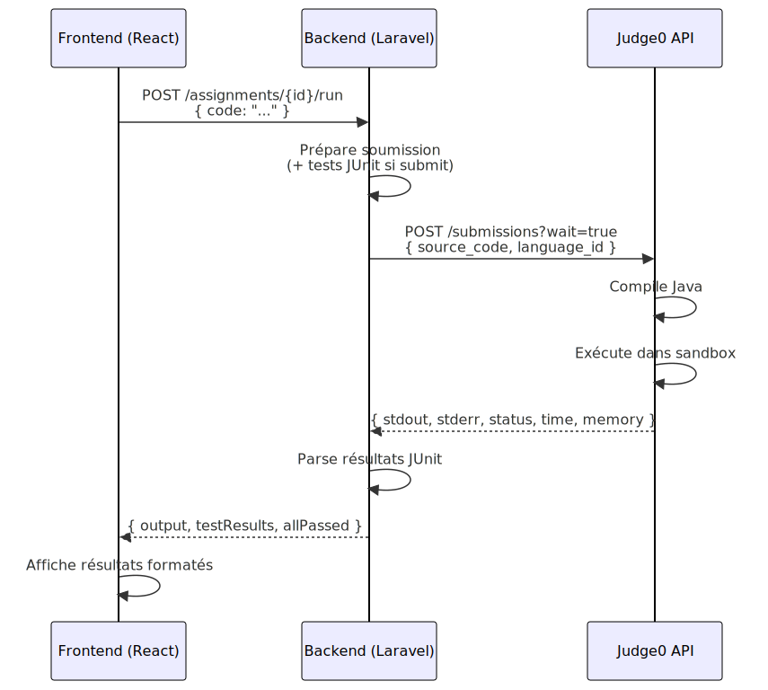


# 6.1 Installation et configuration de l'environnement de travail

> **Compétence visée :** Installer et configurer son environnement de travail en fonction du projet web ou web mobile

## Logiciels installés

- **IDE** : PhpStorm (support PHP, Laravel, TypeScript)
- **PHP** : 8.4 via script Laravel officiel
- **Composer** : 2.x (gestion dépendances PHP)
- **Node.js** : 22.x avec npm 10.x
- **Git** : 2.x (versioning)

## Base de données

- **Développement** : SQLite (sans serveur)
- **Production** : PostgreSQL 18 (géré par Laravel Cloud)

## Installation du projet

```bash
git clone https://github.com/[username]/mine-adventure.git
cd mine-adventure
composer install
npm install
cp .env.example .env
php artisan key:generate
php artisan migrate
```

## Lancement

```bash
composer run dev  # Lance Laravel + Vite
```

L'application est accessible sur `http://localhost:8000`

## Services externes

```env
# Judge0 (exécution de code)
JUDGE0_API_URL=https://instance-judge0.com
JUDGE0_API_KEY=xxxxx

# WorkOS (authentification)
WORKOS_CLIENT_ID=client_xxxxx
WORKOS_API_KEY=sk_xxxxx
```

## Structure du projet

```
mine-adventure/
├── app/           # PHP (Controllers, Models, Services)
├── resources/js/  # React/TypeScript (components, pages)
├── database/      # Migrations, factories, seeders
├── routes/        # Définition des routes
└── tests/         # Tests automatisés
```

## Qualité de code

- **PHP** : Laravel Pint (`./vendor/bin/pint`)
- **JS/TS** : ESLint + Prettier (`npm run lint`)


# 6.2 Maquettage des interfaces utilisateur

> **Compétence visée :** Maquetter des interfaces utilisateur web ou web mobile

## Objectif

Cette section présente la démarche de maquettage adoptée pour Mine Adventure.

## Outil : Figma

**Figma** a été choisi pour son aspect **collaboratif**, son **système de composants réutilisables**, ses fonctionnalités de **prototypage**, et sa **prévisualisation responsive**.

## Démarche de conception

### Parcours utilisateurs

**Apprenant :** Connexion → Dashboard → Catalogue → Cours → Leçon → Exercice

**Administrateur :** Connexion → Admin → Gestion cours → Création contenu

### Charte graphique

L'application utilise **OKLCH** pour les couleurs et supporte un thème clair/sombre.

- **Mode clair** : fond blanc, texte noir, bordures grises
- **Mode sombre** : fond noir, texte blanc, bordures sombres
- **Typographie** : Inter (texte), JetBrains Mono (code)

### Composants Figma

- **Boutons** : Primary, Secondary, Outline, Ghost, Destructive
- **Cartes** : Default, Hover, Selected
- **Inputs** : Default, Focus, Error, Disabled
- **Badges** : Easy (vert), Medium (jaune), Hard (rouge)
- **Navigation** : Desktop, Mobile, Breadcrumb

## Responsive Design

Trois breakpoints : **Mobile** (<768px), **Tablet** (768-1024px), **Desktop** (>1024px).

Adaptations mobile : navigation hamburger, cards en liste verticale, éditeur plein écran.

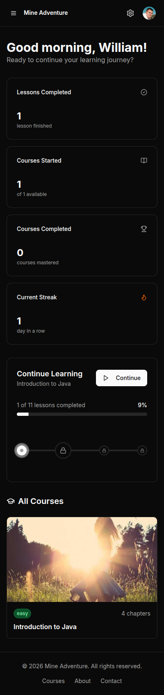

## Accessibilité (RGAA)

- **Contrastes** : ratio >4.5:1 pour le texte, >3:1 pour les éléments interactifs
- **Tailles** : police min 16px, zones cliquables min 44x44px
- **Focus** : états de focus visibles pour la navigation clavier

## Processus itératif

1. Wireframes (structure)
2. Maquettes avec charte graphique
3. Ajustements post-développement
4. Version finale avec mode sombre


# 6.3 Réalisation des interfaces utilisateur statiques

> **Compétence visée :** Réaliser des interfaces utilisateur statiques web ou web mobile

## Objectif

Cette section présente la réalisation des interfaces statiques de Mine Adventure : structure HTML sémantique, styling avec Tailwind CSS, et composants UI réutilisables.

## Technologies

**React 19** et **TypeScript 5.x** pour la bibliothèque UI. **Tailwind CSS 4** pour le styling. **shadcn/ui** et **Radix UI** pour les composants accessibles. **Lucide React** pour les icônes.

## Structure HTML sémantique

```tsx
<div className="min-h-screen bg-background">
    <header>
        <nav aria-label="Navigation principale">{/* ... */}</nav>
    </header>
    <main id="main-content">{/* Contenu */}</main>
    <footer>{/* ... */}</footer>
</div>
```

Les balises `<article>` encapsulent les cartes de cours, `<section>` organise les sections, `<aside>` la sidebar admin.

## Architecture des composants

```
resources/js/components/
├── ui/           # Composants shadcn/ui (button, card, input...)
├── blocks/       # Blocs de leçon (video, text, quiz, assignment)
├── dashboard/    # Composants tableau de bord
└── navigation/   # Navbar, sidebar
```

## Exemple : CourseCard

```tsx
export function CourseCard({ course }: CourseCardProps) {
    return (
        <Card className="overflow-hidden hover:shadow-lg transition-shadow">
            <div className="aspect-video bg-muted">
                
            </div>
            <CardHeader>
                <CardTitle>{course.name}</CardTitle>
                <Badge className={difficultyConfig[course.difficulty].className}>
                    {difficultyConfig[course.difficulty].label}
                </Badge>
            </CardHeader>
            <CardContent>
                <Progress value={course.progress} />
            </CardContent>
        </Card>
    );
}
```

## Tailwind CSS 4

```css
@import "../node_modules/tailwindcss/dist/lib.d.mts";

@theme {
    --color-primary: oklch(0.65 0.15 250);
    --font-sans: "Inter", system-ui, sans-serif;
    --font-mono: "JetBrains Mono", monospace;
}
```

## Responsive Design

Breakpoints : `sm:` (640px), `md:` (768px), `lg:` (1024px), `xl:` (1280px).

```tsx
<div className="flex flex-col lg:flex-row">
    <aside className="hidden lg:block w-64">{/* Sidebar desktop */}</aside>
    <div className="lg:hidden">{/* Menu mobile */}</div>
    <main className="flex-1 p-4 md:p-6 lg:p-8">{/* Contenu */}</main>
</div>
```

## Mode sombre

```tsx
<div className="bg-white dark:bg-gray-900 text-gray-900 dark:text-gray-100">
```

## Accessibilité

```tsx
<nav aria-label="Navigation principale">
<button aria-label="Fermer">{/* ... */}</button>
<Input id="email" aria-describedby="email-error" />
```

## Captures d'écran

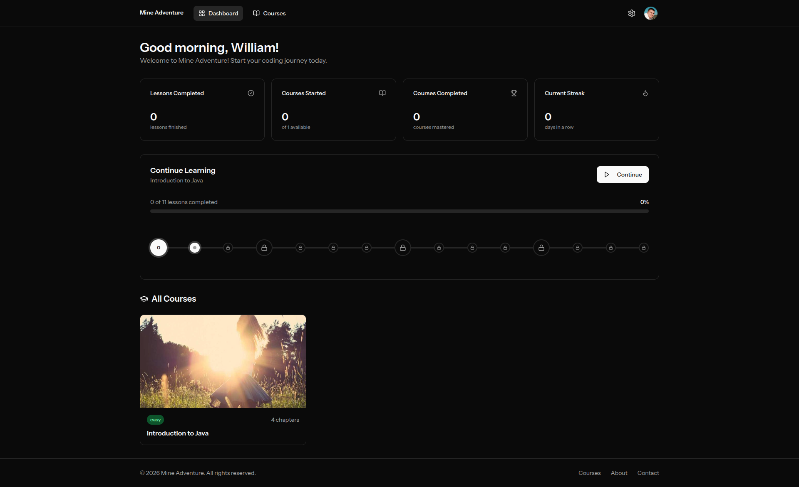


# 6.4 Développement des interfaces dynamiques

> **Compétence visée :** Développer la partie dynamique des interfaces utilisateur web ou web mobile

## Objectif

Cette section présente le développement des fonctionnalités dynamiques de Mine Adventure : gestion d'état, interactions utilisateur, formulaires, et intégration avec le backend via Inertia.js.

## Stack technologique

Les interfaces dynamiques reposent sur **React 19** et **Inertia.js v2** pour la communication client-serveur. **Zustand** gère l'état global et **Wayfinder** génère des routes type-safe.

## Navigation avec Inertia

```tsx
import { Link, router } from '@inertiajs/react';
import { show } from '@/actions/App/Http/Controllers/CourseController';

// Navigation déclarative
<Link href="/courses">Voir les cours</Link>

// Navigation programmatique type-safe
router.visit(show.url(courseId));
```

## Formulaires avec Inertia

```tsx
import { Form } from '@inertiajs/react';
import { store } from '@/actions/App/Http/Controllers/Admin/CourseController';

export function CreateCourseForm() {
    return (
        <Form {...store.form()}>
            {({ errors, processing }) => (
                <>
                    <Input name="name" className={errors.name ? 'border-destructive' : ''} />
                    {errors.name && <p className="text-destructive">{errors.name}</p>}
                    <Button disabled={processing}>
                        {processing ? 'Création...' : 'Créer'}
                    </Button>
                </>
            )}
        </Form>
    );
}
```

## Gestion d'état avec Zustand

```tsx
import { create } from 'zustand';

interface CodeEditorState {
    code: string;
    output: string;
    isRunning: boolean;
    setCode: (code: string) => void;
    setOutput: (output: string) => void;
}

export const useCodeEditorStore = create<CodeEditorState>((set) => ({
    code: '',
    output: '',
    isRunning: false,
    setCode: (code) => set({ code }),
    setOutput: (output) => set({ output }),
}));
```

## Exécution de code asynchrone

```tsx
export function useCodeExecution(assignmentId: number) {
    const store = useCodeEditorStore();

    async function runCode() {
        store.setRunning(true);
        router.post(run.url(assignmentId), { code: store.code }, {
            preserveState: true,
            onSuccess: (page) => store.setOutput(page.props.output),
            onFinish: () => store.setRunning(false),
        });
    }

    return { runCode };
}
```

## Drag and Drop

Le réordonnancement des chapitres et leçons utilise `@dnd-kit/core` pour une expérience fluide et accessible.

```tsx
import { DndContext, closestCenter } from '@dnd-kit/core';
import { SortableContext, arrayMove } from '@dnd-kit/sortable';

function handleDragEnd(event) {
    const newItems = arrayMove(items, oldIndex, newIndex);
    router.post(`/admin/courses/${courseId}/chapters/reorder`, {
        order: newItems.map((item) => item.id),
    });
}
```

## Mode sombre

```tsx
export function useTheme() {
    const [theme, setTheme] = useState<'light' | 'dark'>('light');

    useEffect(() => {
        document.documentElement.classList.toggle('dark', theme === 'dark');
        localStorage.setItem('theme', theme);
    }, [theme]);

    return { theme, toggleTheme: () => setTheme(t => t === 'light' ? 'dark' : 'light') };
}
```

## Captures d'écran

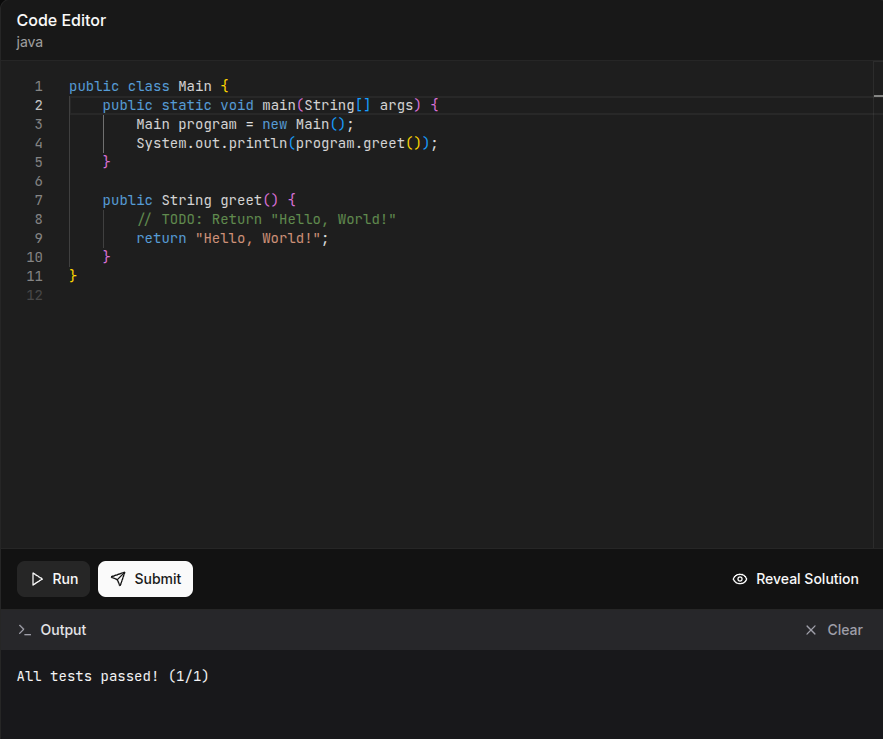


# 7.1 Mise en place de la base de données relationnelle

> **Compétence visée :** Mettre en place une base de données relationnelle

## Objectif

Cette section présente la conception et la mise en place de la base de données relationnelle pour Mine Adventure.

## SGBD

En **développement**, SQLite pour sa légèreté. En **production**, PostgreSQL 18 pour sa robustesse et son support JSON.

## Modèle Conceptuel de Données


Les blocs de contenu utilisent une **relation polymorphique** permettant différents types : vidéo, texte, ressources, quiz, et exercice de code.

## Migrations Laravel

Les migrations Laravel créent les tables avec typage strict, clés étrangères et index.

```php
Schema::create('courses', function (Blueprint $table) {
    $table->id();
    $table->string('name');
    $table->string('thumbnail')->nullable();
    $table->string('difficulty')->default(CourseDifficulty::Easy->value);
    $table->timestamps();
});

Schema::create('chapters', function (Blueprint $table) {
    $table->id();
    $table->foreignId('course_id')->constrained()->cascadeOnDelete();
    $table->string('name');
    $table->unsignedInteger('position')->default(0);
    $table->index(['course_id', 'position']);
});

Schema::create('lesson_blocks', function (Blueprint $table) {
    $table->id();
    $table->foreignId('lesson_id')->constrained()->cascadeOnDelete();
    $table->string('type'); // video, text, quiz, assignment...
    $table->morphs('blockable'); // Relation polymorphique
    $table->unsignedInteger('position')->default(0);
});
```

## Enums PHP

```php
enum CourseDifficulty: string
{
    case Easy = 'easy';
    case Medium = 'medium';
    case Hard = 'hard';
}

enum BlockType: string
{
    case Video = 'video';
    case Text = 'text';
    case Quiz = 'quiz';
    case Assignment = 'assignment';
}
```

## Schéma visuel

Le schéma complet est documenté dans `docs/schema.dbml`.

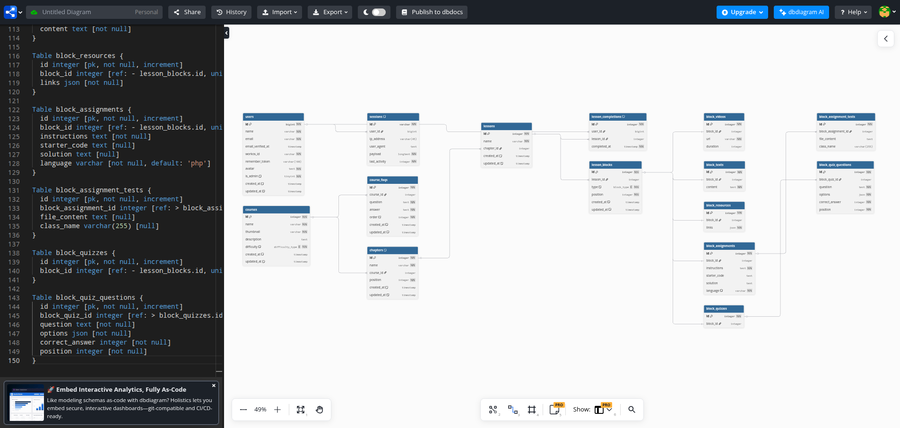

## Bonnes pratiques

**Normalisation** en 3NF. **Clés étrangères** avec contraintes. **Suppression en cascade** pour l'intégrité. **Index** sur les colonnes de tri. **Timestamps** automatiques. **Enums PHP** pour les valeurs contraintes.


# 7.2 Développement des composants d'accès aux données

> **Compétence visée :** Développer des composants d'accès aux données SQL et NoSQL

## Objectif

Cette section présente les composants d'accès aux données développés pour Mine Adventure, utilisant Eloquent ORM de Laravel.

## ORM Eloquent

Eloquent offre une **abstraction** sans SQL brut, une **sécurité** contre les injections SQL, une gestion intuitive des **relations**, et l'**Eager Loading** pour prévenir les problèmes N+1.

## Modèles principaux

### Modèle Course

```php
class Course extends Model
{
    protected $fillable = ['name', 'thumbnail', 'difficulty'];

    protected function casts(): array
    {
        return ['difficulty' => CourseDifficulty::class];
    }

    public function chapters(): HasMany
    {
        return $this->hasMany(Chapter::class)->orderBy('position');
    }

    public function progressForUser(User $user): int
    {
        $total = $this->lessons_count;
        if ($total === 0) return 0;
        $completed = LessonCompletion::where('user_id', $user->id)
            ->whereIn('lesson_id', $this->getAllLessonIds())->count();
        return (int) round(($completed / $total) * 100);
    }
}
```

### Modèle Lesson

```php
class Lesson extends Model
{
    public function isAccessibleBy(User $user): bool
    {
        if ($this->position === 0) return true;
        $previous = $this->chapter->lessons()
            ->where('position', '<', $this->position)
            ->orderByDesc('position')->first();
        return $previous?->isCompletedBy($user) ?? true;
    }
}
```

### Modèle LessonBlock (polymorphique)

Le système de blocs utilise une relation polymorphique pour supporter différents types de contenu (vidéo, texte, quiz, exercice).

```php
class LessonBlock extends Model
{
    protected function casts(): array
    {
        return ['type' => BlockType::class];
    }

    public function blockable(): MorphTo
    {
        return $this->morphTo();
    }
}
```

## Eager Loading

```php
// ❌ N+1 queries
foreach (Course::all() as $course) {
    echo $course->chapters->count();
}

// ✅ Eager loading (3 requêtes au lieu de N+1)
$courses = Course::with(['chapters.lessons'])->get();
```

## Query Scopes

```php
public function scopeByDifficulty($query, CourseDifficulty $difficulty)
{
    return $query->where('difficulty', $difficulty);
}

// Usage
$courses = Course::byDifficulty(CourseDifficulty::Easy)->get();
```

## Factories

```php
class CourseFactory extends Factory
{
    public function definition(): array
    {
        return [
            'name' => fake()->sentence(3),
            'difficulty' => fake()->randomElement(CourseDifficulty::cases()),
        ];
    }

    public function withChapters(int $count = 3): static
    {
        return $this->afterCreating(fn ($course) =>
            Chapter::factory()->count($count)->create(['course_id' => $course->id])
        );
    }
}
```

## Bonnes pratiques

L'**Eloquent ORM** est utilisé exclusivement sans SQL brut. L'**Eager Loading** prévient les N+1. Les **Query Scopes** créent des requêtes réutilisables. Les **transactions** assurent l'intégrité des données. Les **factories** garantissent des tests cohérents.


# 7.3 Développement des composants métier côté serveur

> **Compétence visée :** Développer des composants métier côté serveur

## Objectif

Cette section présente les composants métier développés pour Mine Adventure : contrôleurs, services, validation des données, et intégration avec l'API externe Judge0 pour l'exécution de code.

## Architecture des composants

```
app/
├── Http/
│   ├── Controllers/
│   │   ├── Admin/           # CRUD administration
│   │   ├── CourseController.php
│   │   ├── LessonController.php
│   │   └── AssignmentController.php
│   └── Requests/            # Validation
├── Services/
│   └── TestSubmissionService.php
└── Enums/
    ├── BlockType.php
    └── CourseDifficulty.php
```

## Contrôleurs

### Contrôleur Course (Public)

Le `CourseController` gère l'affichage des cours avec eager loading des relations et calcul de la progression utilisateur.

```php
class CourseController extends Controller
{
    public function index(): Response
    {
        $courses = Course::with(['chapters.lessons'])
            ->get()
            ->map(fn ($course) => [
                'id' => $course->id,
                'name' => $course->name,
                'progress' => $course->progressForUser(auth()->user()),
            ]);

        return Inertia::render('courses/index', ['courses' => $courses]);
    }
}
```

### Contrôleur Lesson

Le `LessonController` vérifie l'accès séquentiel aux leçons et gère leur complétion.

```php
class LessonController extends Controller
{
    public function show(Course $course, Lesson $lesson): Response
    {
        if (!$lesson->isAccessibleBy(auth()->user())) {
            abort(403, 'Vous devez compléter les leçons précédentes.');
        }

        return Inertia::render('lessons/show', [
            'lesson' => $lesson->load('blocks.blockable'),
        ]);
    }

    public function complete(Course $course, Lesson $lesson): RedirectResponse
    {
        LessonCompletion::create([
            'user_id' => auth()->id(),
            'lesson_id' => $lesson->id,
        ]);

        return back()->with('success', 'Leçon complétée !');
    }
}
```

### Contrôleur Assignment (Exécution de code)

L'`AssignmentController` expose deux endpoints : `run` pour l'exécution simple et `submit` pour la validation par tests JUnit.

```php
class AssignmentController extends Controller
{
    public function __construct(private TestSubmissionService $testService) {}

    public function run(Request $request, BlockAssignment $assignment): JsonResponse
    {
        $result = $this->executeCode($request->validated('code'));
        return response()->json($result);
    }

    public function submit(Request $request, BlockAssignment $assignment): JsonResponse
    {
        $testResults = $this->testService->runTests($request->code, $assignment);
        return response()->json([
            'tests' => $testResults,
            'allPassed' => collect($testResults)->every(fn ($t) => $t['passed']),
        ]);
    }
}
```

## Service d'exécution des tests

Le `TestSubmissionService` orchestre l'exécution des tests JUnit via Judge0 en construisant le code complet, l'envoyant à l'API, et parsant les résultats.

```php
class TestSubmissionService
{
    public function runTests(string $userCode, BlockAssignment $assignment): array
    {
        $fullCode = $this->buildTestCode($userCode, $assignment);
        $result = $this->executeWithJudge0($fullCode);
        return $this->parseTestResults($result['stdout'] ?? '');
    }

    private function executeWithJudge0(string $code): array
    {
        return Http::withHeaders(['X-Auth-Token' => config('services.judge0.api_key')])
            ->timeout(60)
            ->post(config('services.judge0.url') . '/submissions?wait=true', [
                'source_code' => base64_encode($code),
                'language_id' => 62, // Java
            ])
            ->json();
    }
}
```

## Validation des données

Les Form Requests centralisent la validation et l'autorisation. Exemple pour la création de cours :

```php
class StoreCourseRequest extends FormRequest
{
    public function authorize(): bool
    {
        return $this->user()?->is_admin ?? false;
    }

    public function rules(): array
    {
        return [
            'name' => ['required', 'string', 'min:3', 'max:255'],
            'difficulty' => ['required', Rule::enum(CourseDifficulty::class)],
        ];
    }
}
```

## Middleware Admin

Un middleware protège les routes d'administration :

```php
class EnsureUserIsAdmin
{
    public function handle(Request $request, Closure $next)
    {
        if (!$request->user()?->is_admin) {
            abort(403);
        }
        return $next($request);
    }
}
```

## Routes

Les routes sont organisées en deux groupes : publiques (authentifiées) et administration.

```php
// Routes publiques
Route::middleware('auth')->group(function () {
    Route::get('/courses', [CourseController::class, 'index']);
    Route::get('/courses/{course}/lessons/{lesson}', [LessonController::class, 'show']);
    Route::post('/assignments/{assignment}/submit', [AssignmentController::class, 'submit']);
});

// Routes administration
Route::middleware(['auth', 'admin'])->prefix('admin')->group(function () {
    Route::resource('courses', Admin\CourseController::class);
});
```

## Tests

```php
it('can complete a lesson', function () {
    $user = User::factory()->create();
    $lesson = Lesson::factory()->create();

    $this->actingAs($user)
        ->post("/courses/{$lesson->chapter->course_id}/lessons/{$lesson->id}/complete")
        ->assertRedirect();

    expect($lesson->isCompletedBy($user))->toBeTrue();
});
```


# 7.4 Documentation du déploiement

> **Compétence visée :** Documenter le déploiement d'une application dynamique web ou web mobile

## Architecture de déploiement


## Docker (référence)

Un Dockerfile multi-stage est maintenu pour le développement local. Il utilise Node.js pour le build des assets, Composer pour les dépendances PHP, et PHP-FPM avec Nginx pour la production.

```dockerfile
FROM node:20-alpine AS frontend-builder
# Build des assets (npm ci && npm run build)

FROM composer:2 AS composer-builder
# Installation dépendances PHP (composer install --no-dev)

FROM php:8.4-fpm-alpine AS production
# Image finale avec Nginx + PHP-FPM + Supervisor
```

## CI/CD avec GitHub Actions

Deux workflows séparés : **linting** (Pint, ESLint, Prettier) et **tests** (Pest).

```yaml
# .github/workflows/tests.yml
jobs:
  ci:
    runs-on: ubuntu-latest
    steps:
      - uses: shivammathur/setup-php@v2
        with: { php-version: 8.4 }
      - uses: actions/setup-node@v4
        with: { node-version: '22' }
      - run: composer install && npm ci && npm run build
      - run: ./vendor/bin/pest --exclude-group=judge0
```

## Laravel Cloud

**Laravel Cloud** est une plateforme PaaS managée offrant une infrastructure auto-scalable, des certificats SSL automatiques, des déploiements zero-downtime, et une base PostgreSQL managée.

### Configuration

1. Connexion du repository GitHub
2. Sélection de la branche `main`
3. Configuration des variables d'environnement (APP_KEY, JUDGE0_*, WORKOS_*)
4. Création de la base PostgreSQL (credentials auto-injectés)

### Processus de déploiement

1. Push sur main → GitHub Actions (tests)
2. Tests OK → Laravel Cloud détecte et build
3. Création nouveau worker + health check
4. Basculement du trafic (zero-downtime)
5. Post-déploiement : `php artisan migrate --force && php artisan optimize`

## Monitoring

Laravel Cloud fournit un dashboard avec logs en temps réel, métriques (CPU, mémoire), et health checks automatiques sur `/up`.

## Rollback

Via l'interface Laravel Cloud (redeploy d'une version précédente) ou via Git (`git revert HEAD && git push`).


# 8. Sécurité

## Objectif

Cette section présente les mesures de sécurité implémentées dans Mine Adventure, couvrant la protection contre les vulnérabilités web courantes (OWASP Top 10), la conformité RGPD, et les bonnes pratiques de développement sécurisé.

## Sécurité intégrée de Laravel

Laravel fournit nativement de nombreuses protections de sécurité qui ont été exploitées dans ce projet.

La protection contre les **injections SQL** est assurée par l'ORM Eloquent qui utilise systématiquement des requêtes préparées. Les attaques **XSS** (Cross-Site Scripting) sont prévenues par l'échappement automatique des données dans les templates Blade et les composants React.

Laravel gère automatiquement les **tokens CSRF** (Cross-Site Request Forgery) pour toutes les requêtes POST, PUT, PATCH et DELETE. La protection contre le **Mass Assignment** est configurée via les propriétés `$fillable` des modèles Eloquent, empêchant l'injection de champs non autorisés.

Le **hachage des mots de passe** utilise les algorithmes Bcrypt ou Argon2, garantissant un stockage sécurisé. Enfin, les données sensibles peuvent être protégées par un **chiffrement AES-256-CBC** via la façade Crypt de Laravel.

## Protection contre les attaques OWASP Top 10

### 1. Injection SQL

**Risque :** Exécution de code SQL malveillant via les entrées utilisateur.

**Protection appliquée :**

```php
// Vulnérable - Ne jamais faire
$users = DB::select("SELECT * FROM users WHERE email = '$email'");

// Sécurisé - Eloquent ORM
$users = User::where('email', $email)->get();

// Sécurisé - Query Builder avec bindings
$users = DB::table('users')
    ->where('email', '?', [$email])
    ->get();
```

Toutes les requêtes dans Mine Adventure utilisent Eloquent ORM ou des requêtes préparées.

### 2. Cross-Site Scripting (XSS)

**Risque :** Injection de scripts malveillants dans les pages web.

**Protection appliquée :**

```tsx
// React échappe automatiquement les variables
<p>{userInput}</p> // Sécurisé - échappé automatiquement

// Dangereux - À éviter sauf cas exceptionnel
<div dangerouslySetInnerHTML={{ __html: content }} />

// Pour le contenu Markdown, utilisation de bibliothèques sûres
import ReactMarkdown from 'react-markdown';
<ReactMarkdown>{content}</ReactMarkdown>
```

### 3. Cross-Site Request Forgery (CSRF)

**Risque :** Forcer un utilisateur authentifié à exécuter des actions non désirées.

**Protection appliquée :**

```php
// Laravel génère automatiquement des tokens CSRF
// Inertia.js les inclut automatiquement dans les requêtes

// Middleware CSRF activé par défaut
// bootstrap/app.php
->withMiddleware(function (Middleware $middleware) {
    // CSRF middleware est inclus par défaut
})
```

```tsx
// Inertia inclut automatiquement le token CSRF
import { router } from '@inertiajs/react';
router.post('/endpoint', data); // Token CSRF inclus
```

### 4. Broken Authentication

**Risque :** Compromission des mécanismes d'authentification.

**Protection appliquée :**

```php
// Authentification déléguée à WorkOS (SSO)
// Pas de gestion de mots de passe dans l'application

// Sessions sécurisées
// config/session.php
return [
    'driver' => 'database',
    'lifetime' => 120,
    'expire_on_close' => false,
    'encrypt' => true,
    'secure' => true, // Cookies HTTPS uniquement
    'http_only' => true, // Pas d'accès JavaScript
    'same_site' => 'lax',
];
```

### 5. Broken Access Control

**Risque :** Accès non autorisé à des ressources.

**Protection appliquée :**

```php
// Middleware d'administration
class EnsureUserIsAdmin
{
    public function handle(Request $request, Closure $next)
    {
        if (!$request->user()?->is_admin) {
            abort(403, 'Accès réservé aux administrateurs.');
        }
        return $next($request);
    }
}

// Vérification d'accès aux leçons
public function show(Course $course, Lesson $lesson): Response
{
    $user = auth()->user();

    // Vérification que l'utilisateur peut accéder à cette leçon
    if (!$lesson->isAccessibleBy($user)) {
        abort(403, 'Vous devez compléter les leçons précédentes.');
    }

    // ...
}
```

### 6. Security Misconfiguration

**Risque :** Configuration incorrecte exposant des vulnérabilités.

**Protection appliquée :**

```env
# Production .env
APP_ENV=production
APP_DEBUG=false  # Désactiver le debug en production

# Headers de sécurité (via Nginx)
X-Frame-Options: SAMEORIGIN
X-Content-Type-Options: nosniff
X-XSS-Protection: 1; mode=block
Referrer-Policy: strict-origin-when-cross-origin
```

```nginx
# Configuration Nginx sécurisée
# Bloquer l'accès aux fichiers sensibles
location ~ /\.(?!well-known) {
    deny all;
}

location ~ \.(env|log|sql)$ {
    deny all;
}
```

### 7. Insecure Design

**Risque :** Failles de conception permettant des abus.

**Protection appliquée :**

- Validation systématique des entrées avec Form Requests
- Rate limiting sur les endpoints sensibles
- Principe du moindre privilège

```php
// Rate limiting
// bootstrap/app.php
->withMiddleware(function (Middleware $middleware) {
    $middleware->throttle('api', 60); // 60 requêtes/minute
})

// Form Request avec validation stricte
class SubmitCodeRequest extends FormRequest
{
    public function rules(): array
    {
        return [
            'code' => ['required', 'string', 'max:50000'],
        ];
    }
}
```

## Sécurité de l'exécution de code

L'exécution de code Java utilisateur représente un risque majeur. Voici les mesures prises :

### Isolation via Judge0


### Validation côté serveur

```php
// Limites sur la taille du code
public function rules(): array
{
    return [
        'code' => [
            'required',
            'string',
            'max:50000', // 50KB max
        ],
    ];
}

// Timeout sur les appels Judge0
Http::timeout(60)->post($judge0Url, $payload);
```

## Protection des données (RGPD)

### Données collectées

L'application collecte uniquement les données strictement nécessaires à son fonctionnement, toutes traitées sur la base légale de l'exécution du contrat.

L'**adresse email** est collectée pour l'authentification des utilisateurs via WorkOS. Le **nom** permet la personnalisation de l'interface et l'affichage dans le tableau de bord. La **progression** dans les cours est enregistrée pour assurer le suivi pédagogique et permettre à l'apprenant de reprendre où il s'était arrêté. Enfin, le **code soumis** lors des exercices est conservé pour l'évaluation automatisée via Judge0.

### Droits des utilisateurs

```php
// Exemple de méthode pour l'export des données (droit d'accès)
public function exportUserData(User $user): array
{
    return [
        'personal_info' => [
            'email' => $user->email,
            'name' => $user->name,
            'created_at' => $user->created_at,
        ],
        'progress' => $user->lessonCompletions()
            ->with('lesson.chapter.course')
            ->get()
            ->toArray(),
    ];
}

// Suppression des données (droit à l'effacement)
public function deleteUserData(User $user): void
{
    // Suppression en cascade grâce aux contraintes FK
    $user->delete();
}
```

### Mentions légales

L'application inclut :
- Politique de confidentialité accessible
- Mentions légales
- Bandeau de consentement cookies (si applicable)

## Bonnes pratiques appliquées

### Variables d'environnement

```php
// Ne jamais hardcoder les secrets
$apiKey = 'sk_xxxxxxxxxxxxx';

// Utiliser les variables d'environnement
$apiKey = config('services.judge0.api_key');
```

### Validation des entrées

```php
// Validation systématique avec Form Requests
public function rules(): array
{
    return [
        'name' => ['required', 'string', 'min:3', 'max:255'],
        'email' => ['required', 'email', 'unique:users'],
        'difficulty' => ['required', Rule::enum(CourseDifficulty::class)],
    ];
}
```

### Logging sécurisé

```php
// Ne jamais logger de données sensibles
Log::info('User logged in', ['user_id' => $user->id]);
// Pas de : Log::info('User logged in', ['password' => $password]);
```

## Tests de sécurité

### Tests automatisés

```php
it('prevents unauthorized access to admin routes', function () {
    $user = User::factory()->create(['is_admin' => false]);

    $this->actingAs($user)
        ->get('/admin/courses')
        ->assertForbidden();
});

it('prevents access to locked lessons', function () {
    $user = User::factory()->create();
    $lesson = Lesson::factory()->create(['position' => 1]);

    $this->actingAs($user)
        ->get("/courses/{$lesson->chapter->course_id}/lessons/{$lesson->id}")
        ->assertForbidden();
});

it('validates code submission size', function () {
    $user = User::factory()->create();
    $assignment = BlockAssignment::factory()->create();
    $hugeCode = str_repeat('a', 100000); // 100KB

    $this->actingAs($user)
        ->post("/assignments/{$assignment->id}/submit", ['code' => $hugeCode])
        ->assertInvalid(['code']);
});
```

## Checklist de sécurité

L'ensemble des mesures de sécurité ont été vérifiées et validées pour l'application Mine Adventure.

Au niveau du **transport et de la configuration**, HTTPS est activé sur l'ensemble du site, garantissant le chiffrement des communications. Les headers de sécurité sont correctement configurés (X-Frame-Options, X-Content-Type-Options, etc.) et le mode debug est désactivé en production pour éviter toute fuite d'informations sensibles.

Concernant la **protection des données et des formulaires**, la protection CSRF est active sur toutes les requêtes modifiant des données. La validation des entrées est systématiquement appliquée via les Form Requests de Laravel, et l'échappement des sorties est assuré automatiquement par React et Blade.

Pour l'**authentification et l'autorisation**, le système utilise une authentification sécurisée via SSO (WorkOS), et des contrôles d'autorisation sont en place sur toutes les routes sensibles, notamment via le middleware d'administration.

Enfin, les **bonnes pratiques opérationnelles** sont respectées : tous les secrets sont stockés dans des variables d'environnement, le rate limiting est configuré pour prévenir les abus, l'exécution de code utilisateur est sandboxée via Judge0, et les logs ne contiennent aucune donnée sensible.


# 10. Bilan

## Objectif

Cette section conclut le dossier de projet en présentant les compétences acquises, les difficultés rencontrées et leurs solutions, ainsi que les perspectives d'évolution de Mine Adventure.

## Compétences acquises

### Compétences techniques

#### Front-end

Le développement de Mine Adventure m'a permis de faire progresser significativement mes compétences front-end. En **React avec TypeScript**, je suis passé d'un niveau intermédiaire à avancé grâce au développement de l'ensemble des interfaces de l'application. Ma maîtrise de **Tailwind CSS** a connu une progression similaire, passant de débutant à avancé en stylisant l'intégralité de l'application.

J'ai découvert **Zustand** pour la gestion d'état, atteignant un niveau intermédiaire en implémentant le store de l'éditeur de code. **Inertia.js** était nouveau pour moi et j'ai atteint un niveau avancé en l'utilisant comme architecture complète du projet. Enfin, l'utilisation de **Radix et shadcn/ui** pour les composants m'a fait progresser de débutant à avancé en créant une bibliothèque de composants cohérente.

#### Back-end

Côté back-end, ma maîtrise de **Laravel 12** est passée d'intermédiaire à avancé avec le développement du backend complet. Il en va de même pour **Eloquent ORM**, dont j'ai approfondi la connaissance à travers la modélisation de données et les requêtes complexes, notamment les relations polymorphiques.

L'intégration de l'API **Judge0** m'a permis de consolider mes compétences en **API REST**, atteignant un niveau avancé. Les **tests avec Pest** représentaient une nouveauté : je suis passé de débutant à intermédiaire en écrivant des tests unitaires et fonctionnels. Enfin, **Docker** était également nouveau et j'ai atteint un niveau intermédiaire en conteneurisant l'application.

#### DevOps

En DevOps, j'ai progressé de débutant à intermédiaire sur deux aspects. La mise en place du pipeline **CI/CD avec GitHub Actions** m'a permis de comprendre l'automatisation des tests et du linting. Le **déploiement sur Laravel Cloud** m'a initié à la mise en production d'applications web sur une plateforme managée.

### Compétences transversales

Au-delà des compétences techniques, ce projet m'a permis de développer des compétences transversales essentielles.

La **gestion de projet** s'est manifestée par la planification des phases de développement, la priorisation des fonctionnalités et le suivi de l'avancement. La **résolution de problèmes** a été constamment sollicitée à travers le debugging, la recherche de solutions et l'adaptation aux contraintes rencontrées.

J'ai également pratiqué la **veille technologique** en identifiant et évaluant de nouvelles technologies comme Inertia.js ou Zustand. La **documentation** a été un fil conducteur du projet, tant dans la rédaction technique que dans les commentaires de code. Enfin, ce projet réalisé en solo a renforcé mon **autonomie** et ma capacité à mener un développement complet de bout en bout.

## Difficultés rencontrées et solutions

### 1. Intégration de Judge0

**Problème :**
L'intégration de l'API Judge0 pour l'exécution de code Java s'est avérée complexe, notamment pour le parsing des résultats JUnit.

**Difficultés spécifiques :**
- Format de sortie JUnit variable selon les versions
- Gestion des timeouts et des erreurs de compilation
- Encodage base64 des entrées/sorties

**Solution :**
```php
// Création d'un service dédié avec parsing robuste
class TestSubmissionService
{
    private function parseTestResults(string $output): array
    {
        // Parsing flexible gérant plusieurs formats
        // Gestion des cas d'erreur et de compilation
        // ...
    }
}
```

**Apprentissage :** L'importance d'isoler la logique complexe dans des services dédiés et de prévoir tous les cas d'erreur.

### 2. Relations polymorphiques Laravel

**Problème :**
La structure des blocs de leçon (5 types différents) nécessitait une relation polymorphique, concept nouveau pour moi.

**Solution :**
```php
// Utilisation des relations morphTo/morphOne
class LessonBlock extends Model
{
    public function blockable(): MorphTo
    {
        return $this->morphTo();
    }
}

class BlockVideo extends Model
{
    public function lessonBlock(): MorphOne
    {
        return $this->morphOne(LessonBlock::class, 'blockable');
    }
}
```

**Apprentissage :** Les relations polymorphiques de Laravel sont puissantes pour modéliser des structures flexibles.

### 3. Performance du rendu des leçons

**Problème :**
Le chargement des leçons avec de nombreux blocs était lent à cause des requêtes N+1.

**Diagnostic :**
```php
// Avant - N+1 queries
$lesson = Lesson::find($id);
foreach ($lesson->blocks as $block) {
    echo $block->blockable->content; // Nouvelle requête à chaque fois
}
```

**Solution :**
```php
// Après - Eager loading
$lesson = Lesson::with(['blocks.blockable'])->find($id);
```

**Apprentissage :** Toujours vérifier les requêtes générées et utiliser l'eager loading systématiquement.

### 4. Gestion du state dans l'éditeur de code

**Problème :**
L'éditeur de code nécessitait une gestion d'état complexe (code, résultats, loading states) partagée entre plusieurs composants.

**Solution :**
Adoption de Zustand pour un store dédié :
```tsx
const useCodeEditorStore = create((set) => ({
    code: '',
    output: '',
    isRunning: false,
    testResults: [],
    setCode: (code) => set({ code }),
    // ...
}));
```

**Apprentissage :** Un store externe simplifie la gestion d'état complexe par rapport au prop drilling.

### 5. Configuration Docker multi-stage

**Problème :**
L'image Docker initiale était trop volumineuse (>1GB) et le build était lent.

**Solution :**
Implémentation d'un build multi-stage :
- Stage 1 : Build des assets frontend
- Stage 2 : Installation des dépendances PHP
- Stage 3 : Image de production légère

**Résultat :** Image finale < 200MB, build time réduit de 50%

**Apprentissage :** Les builds multi-stage sont essentiels pour des images Docker optimisées.

## Ce que je ferais différemment

Avec le recul, plusieurs aspects de ma méthodologie pourraient être améliorés pour un prochain projet.

Concernant les **tests**, je les ai souvent écrits après avoir terminé le code. À l'avenir, j'adopterais une approche TDD (Test-Driven Development) ou au minimum l'écriture des tests en parallèle du développement, ce qui permettrait de détecter les bugs plus tôt et de mieux structurer le code.

Pour la **documentation**, j'ai eu tendance à la rédiger en fin de projet, ce qui représente une charge importante. Une documentation continue, rédigée au fil du développement, serait plus efficace et plus fidèle aux décisions prises à chaque étape.

La **validation des données** a parfois été implémentée côté client uniquement. Je m'assurerais désormais de toujours valider côté serveur en priorité, le client n'étant qu'une amélioration de l'expérience utilisateur et non une garantie de sécurité.

Enfin, l'**accessibilité** a été ajoutée après coup dans certaines parties de l'application. L'intégrer dès le début du développement serait plus efficace et éviterait des refactorisations coûteuses.

## Perspectives d'évolution

### Fonctionnalités à court terme

1. **Système de commentaires**
   - Permettre aux apprenants de poser des questions sur les leçons
   - Réponses des instructeurs

2. **Certificats de complétion**
   - Génération PDF à la fin d'un cours
   - Partage sur LinkedIn

3. **Mode hors-ligne (PWA)**
   - Consultation des leçons sans connexion
   - Synchronisation au retour en ligne

### Fonctionnalités à moyen terme

1. **Éditeur de code amélioré**
   - Autocomplétion contextuelle
   - Détection d'erreurs en temps réel (LSP)

2. **Gamification**
   - Badges et achievements
   - Classements entre apprenants
   - Points d'expérience

3. **Parcours personnalisés**
   - Recommandations basées sur le niveau
   - Tests de positionnement

### Évolutions techniques

1. **Migration Base UI**
   - À considérer quand l'écosystème sera plus mature
   - Meilleure maintenance long terme

2. **Tests end-to-end**
   - Playwright ou Cypress
   - Couverture des parcours critiques

3. **Monitoring et observabilité**
   - Sentry pour le tracking d'erreurs
   - Analytics d'usage

## Conclusion personnelle

Le développement de Mine Adventure a été une expérience formatrice complète, me permettant de :

- **Maîtriser un stack moderne** : Laravel + React + TypeScript + Tailwind
- **Gérer un projet de A à Z** : De l'analyse des besoins au déploiement
- **Résoudre des problèmes complexes** : Exécution de code, polymorphisme, performance
- **Adopter les bonnes pratiques** : Tests, sécurité, documentation, CI/CD

Ce projet démontre ma capacité à concevoir, développer et déployer une application web complète, tout en maintenant une qualité de code professionnelle et en restant à jour sur les technologies.

Je suis confiant dans ma capacité à contribuer efficacement à des projets de développement web, que ce soit en entreprise ou en tant que développeur indépendant.


