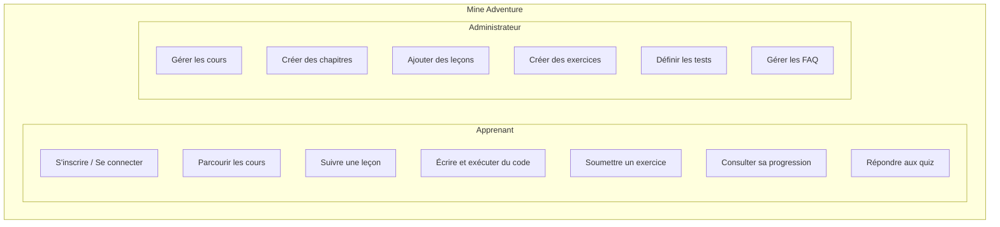

# 2. Présentation du Projet

## 2.1 Description générale de Mine Adventure

### Qu'est-ce que Mine Adventure ?

Mine Adventure est une plateforme d'apprentissage en ligne (LMS - Learning Management System) conçue pour enseigner la programmation Java dans le contexte spécifique du développement de plugins et mods pour le jeu Minecraft.

Cette plateforme répond à un besoin croissant : permettre aux passionnés de Minecraft d'apprendre à créer leurs propres extensions de jeu de manière structurée et progressive.

### Fonctionnalités principales

#### Pour les apprenants

| Fonctionnalité               | Description                                                    |
|------------------------------|----------------------------------------------------------------|
| **Catalogue de cours**       | Navigation par niveau de difficulté (Facile, Moyen, Difficile) |
| **Progression séquentielle** | Déblocage progressif des leçons                                |
| **Contenus variés**          | Vidéos, textes, ressources externes, quiz                      |
| **Éditeur de code intégré**  | Monaco Editor avec coloration syntaxique Java                  |
| **Exécution de code**        | Compilation et exécution Java en temps réel                    |
| **Tests automatisés**        | Validation des exercices via JUnit 5                           |
| **Tableau de bord**          | Suivi des statistiques et de la progression                    |
| **Mode sombre/clair**        | Interface adaptable aux préférences                            |

#### Pour les administrateurs

| Fonctionnalité                 | Description                                 |
|--------------------------------|---------------------------------------------|
| **Gestion des cours**          | CRUD complet avec niveaux de difficulté     |
| **Organisation en chapitres**  | Structure hiérarchique des contenus         |
| **Création de leçons**         | Assemblage de blocs de contenu              |
| **5 types de blocs**           | Vidéo, Texte, Ressources, Quiz, Assignation |
| **Éditeur d'exercices**        | Code de départ, solution, tests JUnit       |
| **Réorganisation drag & drop** | Interface intuitive de gestion              |
| **FAQ par cours**              | Gestion des questions fréquentes            |

## 2.2 Objectifs pédagogiques du projet

### Objectifs fonctionnels

1. **Démocratiser l'apprentissage du développement Java et de plugins sur Minecraft**
   - Proposer un parcours structuré du débutant à l'avancé

2. **Favoriser l'apprentissage par la pratique**
   - Intégrer un environnement de développement dans le navigateur
   - Permettre l'exécution et le test du code en temps réel

3. **Assurer un suivi personnalisé**
   - Tracker la progression de chaque apprenant
   - Motiver par des indicateurs de réussite (streaks, pourcentages)

### Objectifs techniques (liés à la certification)

Ce projet m'a permis de mettre en pratique l'ensemble des compétences du titre professionnel :

- **Front-end** : Création d'interfaces modernes, réactives et accessibles
- **Back-end** : Développement d'une API robuste et sécurisée
- **Base de données** : Modélisation et gestion de données relationnelles
- **Déploiement** : Mise en production sur infrastructure cloud

## 2.3 Public cible et besoins identifiés

### Analyse du public cible

**Profil type des apprenants :**
- Joueurs de Minecraft souhaitant créer leurs propres plugins/mods
- Âge : 14-35 ans principalement
- Niveau technique : débutant à intermédiaire en programmation
- Motivation : passion pour Minecraft, curiosité technique

**Profil des administrateurs :**
- Formateurs ou créateurs de contenu
- Connaissance de Java et du développement Minecraft
- Besoin d'outils simples pour créer du contenu pédagogique

### Besoins identifiés

| Besoin | Solution apportée |
|--------|-------------------|
| Apprendre Java sans installation complexe | Éditeur de code intégré au navigateur |
| Progresser à son rythme | Déblocage séquentiel des leçons |
| Valider ses acquis | Tests automatisés JUnit 5 |
| Suivre sa progression | Dashboard avec statistiques |
| Accéder depuis n'importe quel appareil | Interface responsive (mobile, tablette, desktop) |
| Interface moderne et agréable | Design soigné avec mode sombre |

### Cas d'utilisation principaux

## 2.4 Captures d'écran de l'application

- Le tableau de bord de l'apprenant

- Le catalogue des cours

- Une leçon avec différents types de blocs

- L'éditeur de code avec les résultats de tests

- L'interface d'administration

