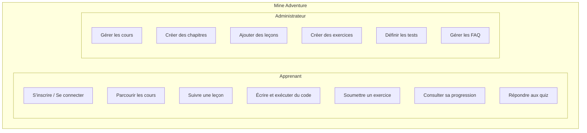
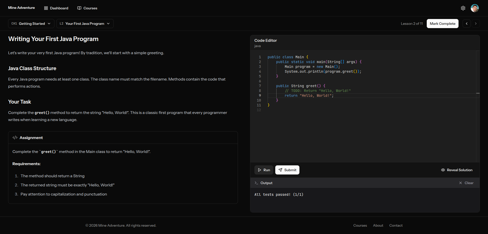

# 2. Présentation du Projet

## 2.1 Description générale de Mine Adventure

### Qu'est-ce que Mine Adventure ?

Mine Adventure est une plateforme d'apprentissage en ligne (LMS - Learning Management System) conçue pour enseigner la programmation Java dans le contexte spécifique du développement de plugins et mods pour le jeu Minecraft.

Cette plateforme répond à un besoin croissant : permettre aux passionnés de Minecraft d'apprendre à créer leurs propres extensions de jeu de manière structurée et progressive.

### Fonctionnalités principales

#### Pour les apprenants

Les apprenants disposent d'un **catalogue de cours** organisé par niveau de difficulté (Facile, Moyen, Difficile), leur permettant de choisir un parcours adapté à leurs compétences. La plateforme propose une **progression séquentielle** : chaque leçon se débloque après avoir complété la précédente, garantissant une acquisition progressive des connaissances.

Les contenus pédagogiques sont variés et incluent des vidéos explicatives, des textes détaillés, des liens vers des ressources externes et des quiz interactifs. L'élément central de l'apprentissage est l'**éditeur de code intégré**, basé sur Monaco Editor (le même moteur que VS Code), qui offre une coloration syntaxique Java et permet l'**exécution du code en temps réel** directement dans le navigateur.

Les exercices pratiques sont validés par des **tests automatisés JUnit 5**, offrant un feedback immédiat sur la qualité du code soumis. Un **tableau de bord personnalisé** permet à chaque apprenant de suivre ses statistiques et sa progression. Enfin, l'interface s'adapte aux préférences visuelles grâce au support du **mode sombre et clair**.

#### Pour les administrateurs

L'interface d'administration offre une **gestion complète des cours** avec toutes les opérations CRUD (création, lecture, modification, suppression) et la possibilité d'attribuer un niveau de difficulté à chaque cours. Les contenus sont organisés de manière hiérarchique en **chapitres**, eux-mêmes divisés en **leçons**.

Chaque leçon est composée de **blocs de contenu** de cinq types différents : vidéo, texte, ressources, quiz et exercices de code (assignations). L'**éditeur d'exercices** permet de définir un code de départ, une solution de référence et les tests JUnit qui valideront les soumissions des apprenants.

L'interface propose également une **réorganisation par glisser-déposer** pour ordonner intuitivement les chapitres, leçons et blocs. Chaque cours peut être enrichi d'une **FAQ** pour répondre aux questions fréquentes des apprenants.

## 2.2 Objectifs pédagogiques du projet

### Objectifs fonctionnels

1. **Démocratiser l'apprentissage du développement Java et de plugins sur Minecraft**
   - Proposer un parcours structuré du débutant à l'avancé

2. **Favoriser l'apprentissage par la pratique**
   - Intégrer un environnement de développement dans le navigateur
   - Permettre l'exécution et le test du code en temps réel

3. **Assurer un suivi personnalisé**
   - Tracker la progression de chaque apprenant
   - Motiver par des indicateurs de réussite (streaks, pourcentages)

### Objectifs techniques (liés à la certification)

Ce projet m'a permis de mettre en pratique l'ensemble des compétences du titre professionnel :

- **Front-end** : Création d'interfaces modernes, réactives et accessibles
- **Back-end** : Développement d'une API robuste et sécurisée
- **Base de données** : Modélisation et gestion de données relationnelles
- **Déploiement** : Mise en production sur infrastructure cloud

## 2.3 Public cible et besoins identifiés

### Analyse du public cible

**Profil type des apprenants :**
- Joueurs de Minecraft souhaitant créer leurs propres plugins/mods
- Âge : 14-35 ans principalement
- Niveau technique : débutant à intermédiaire en programmation
- Motivation : passion pour Minecraft, curiosité technique

**Profil des administrateurs :**
- Formateurs ou créateurs de contenu
- Connaissance de Java et du développement Minecraft
- Besoin d'outils simples pour créer du contenu pédagogique

### Besoins identifiés et solutions apportées

L'analyse du public cible a permis d'identifier plusieurs besoins clés auxquels Mine Adventure répond de manière ciblée.

Le premier obstacle pour les débutants est souvent l'**installation complexe d'un environnement de développement Java**. Pour y remédier, la plateforme intègre un éditeur de code directement dans le navigateur, permettant de commencer à coder immédiatement sans aucune configuration préalable.

Les apprenants ont également besoin de **progresser à leur propre rythme**. Le système de déblocage séquentiel des leçons répond à ce besoin en évitant de submerger l'utilisateur tout en maintenant une progression logique. Pour **valider leurs acquis**, les tests automatisés JUnit 5 offrent un feedback instantané et objectif sur la qualité du code produit.

Le **suivi de progression** est assuré par un tableau de bord affichant des statistiques détaillées : cours complétés, leçons terminées, séries de jours consécutifs d'apprentissage. L'**accessibilité multi-appareil** est garantie par une interface responsive qui s'adapte aux smartphones, tablettes et ordinateurs. Enfin, pour offrir une **expérience visuelle agréable**, l'interface propose un design moderne avec support du mode sombre.

### Cas d'utilisation principaux

## 2.4 Captures d'écran de l'application

- Le tableau de bord de l'apprenant

- Le catalogue des cours

- Une leçon avec différents types de blocs

- L'éditeur de code avec les résultats de tests

- L'interface d'administration

