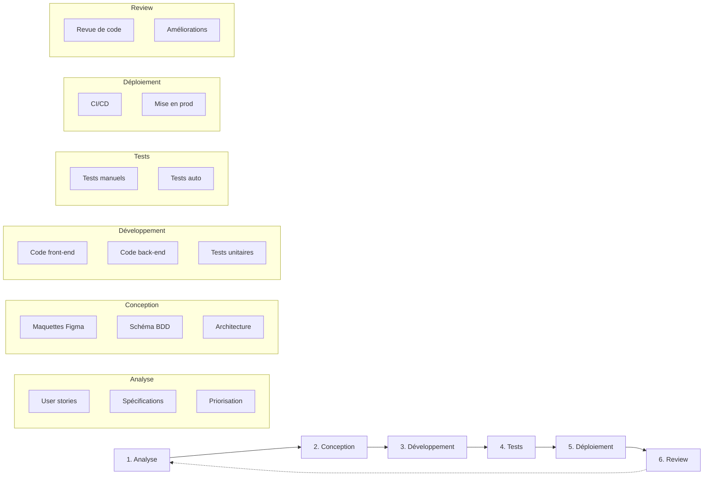
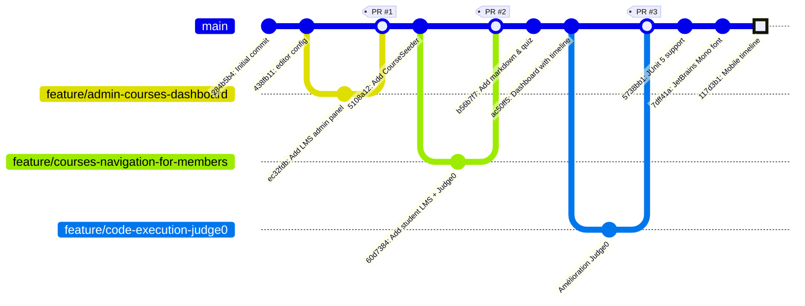

# 3. Gestion de Projet

## 3.1 Méthodologie adoptée

### Approche Agile adaptée

Pour ce projet réalisé en formation, j'ai adopté une méthodologie inspirée de l'Agile, adaptée au contexte d'un développeur solo :

- **Itérations courtes** : Développement par fonctionnalités complètes
- **Feedback continu** : Tests réguliers et ajustements
- **Priorisation** : Focus sur les fonctionnalités essentielles (MVP) d'abord
- **Documentation au fil de l'eau** : Code commenté et commits explicites

### Cycle de développement



## 3.2 Planning et organisation

### Découpage du projet en phases

| Phase                             | Période       | Objectifs                                       |
|-----------------------------------|---------------|-------------------------------------------------|
| **Phase 1 - Initialisation**      | Semaine 1-2   | Setup environnement, architecture, maquettes    |
| **Phase 2 - Core Backend**        | Semaine 3-5   | Modèles, migrations, API de base                |
| **Phase 3 - Interface Admin**     | Semaine 6-8   | CRUD cours, chapitres, leçons, blocs            |
| **Phase 4 - Interface Apprenant** | Semaine 9-11  | Navigation cours, affichage leçons, progression |
| **Phase 5 - Éditeur de Code**     | Semaine 12-14 | Monaco Editor, intégration Judge0, tests JUnit  |
| **Phase 6 - Finalisation**        | Semaine 15+   | Déploiement, optimisations, documentation       |

### Suivi de l'avancement

Le suivi de l'avancement a été réalisé via :

1. **Git** : Historique des commits avec messages explicites
2. **GitHub Issues** : Suivi des tâches et bugs
3. **Tableau personnel** : Liste des fonctionnalités et leur statut

### Exemple de commits représentatifs

```
117d3b1 refactor: update mobile timeline to show current lesson and next 3 nodes
75dd459 test: group CodeExecutionTest under judge0 for improved organization
7dff41a feat: integrate JetBrains Mono font and enhance layout for better responsiveness
5738bb1 refactor: update test execution to use JUnit 5 and improve syntax highlighting
```

## 3.3 Outils de gestion utilisés

### Outils de développement

| Catégorie           | Outil        | Usage                        |
|---------------------|--------------|------------------------------|
| **IDE**             | PhpStorm     | Développement principal      |
| **Versioning**      | Git + GitHub | Gestion du code source       |
| **Design**          | Figma        | Maquettage des interfaces    |
| **Base de données** | DbDiagram    | Visualisation et gestion BDD |
| **API Testing**     | Postman      | Test des endpoints           |
| **Terminal**        | Ghostty      | Commandes CLI                |

### Outils de collaboration et documentation

| Outil                 | Usage                              |
|-----------------------|------------------------------------|
| **GitHub**            | Hébergement du code, issues, CI/CD |
| **Notes en markdown** | Documentation personnelle          |
| **Figma**             | Partage des maquettes              |

### Outils de déploiement

| Outil              | Usage                               |
|--------------------|-------------------------------------|
| **Docker**         | Conteneurisation de l'application   |
| **Coolify**        | Plateforme de déploiement sur VPS   |
| **GitHub Actions** | CI/CD (tests, linting, déploiement) |

## 3.4 Gestion des risques

### Risques identifiés et mitigation

| Risque                             | Impact | Probabilité | Mitigation                              |
|------------------------------------|--------|-------------|-----------------------------------------|
| Complexité de l'intégration Judge0 | Élevé  | Moyenne     | Documentation API, tests progressifs    |
| Performance de l'éditeur de code   | Moyen  | Faible      | Utilisation de Monaco (éprouvé)         |
| Temps de développement sous-estimé | Moyen  | Moyenne     | Priorisation MVP, itérations            |

## 3.5 Versioning et workflow Git

### Stratégie de branches



### Convention de commits

Avant de découvrir la convention [**Conventional Commits**](https://www.conventionalcommits.org/en/v1.0.0/), mes messages de commit étaient parfois vagues ou trop longs.

**Exemple d'évolution :**

```
Avant : fixed some linter issues
Après : refactor: update test execution to use JUnit 5 and improve syntax highlighting
```

La convention permet d'identifier immédiatement le type de changement (feat, fix, refactor, test, etc.) et facilite la recherche dans l'historique ainsi que la génération automatique de changelogs.


### Exemple de workflow

```bash
# Création d'une branche pour une nouvelle fonctionnalité
git checkout -b feature/quiz-block

# Développement avec commits atomiques
git commit -m "feat: add quiz block model and migration"
git commit -m "feat: add quiz block controller and routes"
git commit -m "feat: add quiz block frontend component"
git commit -m "test: add quiz block feature tests"

# Merge vers main après validation
git checkout main
git merge feature/quiz-block
git push origin main
```
