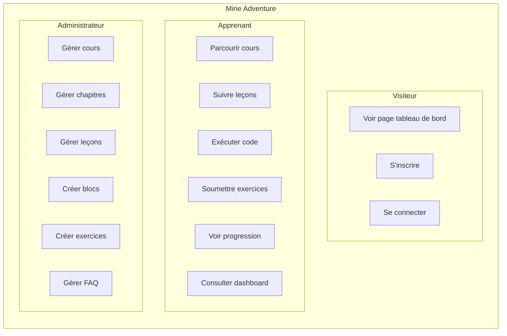

# 4. Spécifications Fonctionnelles

## 4.1 Expression des besoins

### Besoins fonctionnels

#### Module Authentification

| ID      | Besoin                                                     | Priorité |
|---------|------------------------------------------------------------|----------|
| AUTH-01 | L'utilisateur peut s'inscrire                              | Haute    |
| AUTH-02 | L'utilisateur peut se connecter/déconnecter                | Haute    |
| AUTH-03 | Les sessions sont persistantes et sécurisées               | Haute    |
| AUTH-04 | L'administrateur a accès à des fonctionnalités spécifiques | Haute    |

#### Module Cours (Apprenant)

| ID       | Besoin                                                | Priorité |
|----------|-------------------------------------------------------|----------|
| COURS-01 | Voir la liste des cours disponibles                   | Haute    |
| COURS-02 | Filtrer les cours par niveau de difficulté            | Moyenne  |
| COURS-03 | Accéder au détail d'un cours (chapitres, progression) | Haute    |
| COURS-04 | Suivre une leçon avec différents types de contenus    | Haute    |
| COURS-05 | Marquer une leçon comme complétée                     | Haute    |
| COURS-06 | Débloquer les leçons de manière séquentielle          | Haute    |

#### Module Exercices de code

| ID      | Besoin                                            | Priorité |
|---------|---------------------------------------------------|----------|
| CODE-01 | Écrire du code Java dans un éditeur intégré       | Haute    |
| CODE-02 | Exécuter le code et voir le résultat              | Haute    |
| CODE-03 | Soumettre le code pour validation par tests JUnit | Haute    |
| CODE-04 | Voir le détail des tests (passés/échoués)         | Haute    |
| CODE-05 | Avoir accès à un code de départ pré-rempli        | Moyenne  |

#### Module Dashboard

| ID      | Besoin                                       | Priorité |
|---------|----------------------------------------------|----------|
| DASH-01 | Voir ses statistiques globales               | Moyenne  |
| DASH-02 | Voir le nombre de cours commencés/terminés   | Moyenne  |
| DASH-03 | Voir son streak d'apprentissage              | Basse    |
| DASH-04 | Accéder rapidement au dernier cours en cours | Moyenne  |

#### Module Administration

| ID       | Besoin                                                | Priorité |
|----------|-------------------------------------------------------|----------|
| ADMIN-01 | Créer, modifier, supprimer des cours                  | Haute    |
| ADMIN-02 | Organiser les cours en chapitres                      | Haute    |
| ADMIN-03 | Créer des leçons avec différents types de blocs       | Haute    |
| ADMIN-04 | Réordonner chapitres, leçons et blocs par drag & drop | Moyenne  |
| ADMIN-05 | Créer des exercices de code avec tests JUnit          | Haute    |
| ADMIN-06 | Gérer les FAQ de chaque cours                         | Basse    |

### Besoins non fonctionnels

| Catégorie          | Besoin                                       |
|--------------------|----------------------------------------------|
| **Performance**    | Temps de chargement des pages < 3 secondes   |
| **Accessibilité**  | Interface compatible lecteurs d'écran (RGAA) |
| **Responsive**     | Adaptation mobile, tablette, desktop         |
| **Sécurité**       | Protection contre XSS, CSRF, injection SQL   |
| **Disponibilité**  | Application accessible 24/7                  |
| **Maintenabilité** | Code structuré, documenté, testé             |

## 4.2 Cas d'utilisation

### Diagramme de cas d'utilisation global



### Cas d'utilisation détaillé : Soumettre un exercice de code

**Acteur principal :** Apprenant authentifié

**Préconditions :**
- L'apprenant est connecté
- L'apprenant a accès à la leçon contenant l'exercice

**Scénario nominal :**

1. L'apprenant accède à une leçon contenant un bloc de type "Assignment"
2. Le système affiche l'énoncé de l'exercice et l'éditeur de code
3. L'apprenant écrit son code Java dans l'éditeur Monaco
4. L'apprenant clique sur "Run" pour tester son code
5. Le système envoie le code à l'API Judge0
6. Le système affiche le résultat de l'exécution (sortie console ou erreurs)
7. L'apprenant clique sur "Submit" pour valider
8. Le système exécute les tests JUnit 5 associés à l'exercice
9. Le système affiche le résultat des tests (passés/échoués avec détails)
10. Si tous les tests passent, le système marque l'exercice comme réussi

**Scénarios alternatifs :**

- **4a.** Le code ne compile pas → Le système affiche les erreurs de compilation
- **9a.** Certains tests échouent → L'apprenant peut modifier et re-soumettre

**Postconditions :**
- La progression de l'apprenant est mise à jour

## 4.3 User Stories

### Epic : Gestion des cours

```
En tant qu'apprenant,
Je veux parcourir le catalogue des cours,
Afin de choisir un cours adapté à mon niveau.

Critères d'acceptation :
- Les cours sont affichés avec leur vignette, titre et niveau de difficulté
- Je peux voir le nombre de chapitres et leçons de chaque cours
- Les niveaux de difficulté sont clairement identifiés (Facile, Moyen, Difficile)
```

```
En tant qu'apprenant,
Je veux voir ma progression dans un cours,
Afin de savoir où j'en suis dans mon apprentissage.

Critères d'acceptation :
- Un pourcentage de progression est affiché
- Les leçons complétées sont visuellement identifiées
- Je vois quelle est la prochaine leçon à suivre
```

### Epic : Exercices de code

```
En tant qu'apprenant,
Je veux écrire et exécuter du code Java dans mon navigateur,
Afin de pratiquer sans installer d'environnement de développement.

Critères d'acceptation :
- L'éditeur de code propose la coloration syntaxique Java
- Je peux exécuter mon code et voir la sortie console
- Les erreurs de compilation sont affichées clairement
```

```
En tant qu'apprenant,
Je veux soumettre mon code pour validation automatique,
Afin de vérifier que ma solution est correcte.

Critères d'acceptation :
- Les tests JUnit sont exécutés sur mon code
- Je vois le nombre de tests passés/échoués
- Le détail de chaque test est affiché (nom, statut, message d'erreur si échec)
```

### Epic : Administration

```
En tant qu'administrateur,
Je veux créer des exercices de code avec des tests automatiques,
Afin de valider les compétences des apprenants.

Critères d'acceptation :
- Je peux définir l'énoncé de l'exercice
- Je peux fournir un code de départ
- Je peux écrire des tests JUnit 5 pour valider les solutions
- Je peux optionnellement fournir une solution de référence
```

```
En tant qu'administrateur,
Je veux réorganiser l'ordre des éléments par glisser-déposer,
Afin de structurer mes contenus facilement.

Critères d'acceptation :
- Je peux réordonner les chapitres d'un cours
- Je peux réordonner les leçons d'un chapitre
- Je peux réordonner les blocs d'une leçon
- L'ordre est sauvegardé immédiatement
```

## 4.4 Règles de gestion

| Code  | Règle                                                                   |
|-------|-------------------------------------------------------------------------|
| RG-01 | Un apprenant doit être authentifié pour accéder aux cours               |
| RG-02 | Une leçon ne peut être accessible que si la précédente est complétée    |
| RG-03 | La première leçon d'un chapitre est toujours accessible                 |
| RG-04 | Un cours contient au moins un chapitre                                  |
| RG-05 | Un chapitre contient au moins une leçon                                 |
| RG-06 | Une leçon contient au moins un bloc de contenu                          |
| RG-07 | Seuls les administrateurs peuvent créer/modifier/supprimer des contenus |
| RG-08 | Le code soumis est exécuté dans un environnement sandboxé (Judge0)      |
| RG-09 | Le temps d'exécution du code est limité (timeout)                       |
| RG-10 | Les niveaux de difficulté possibles sont : Facile, Moyen, Difficile     |
