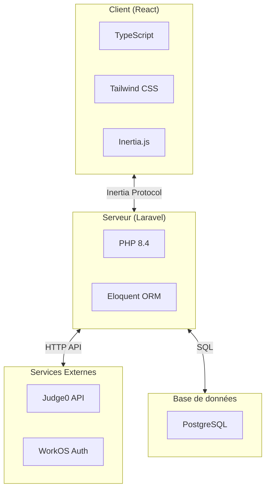
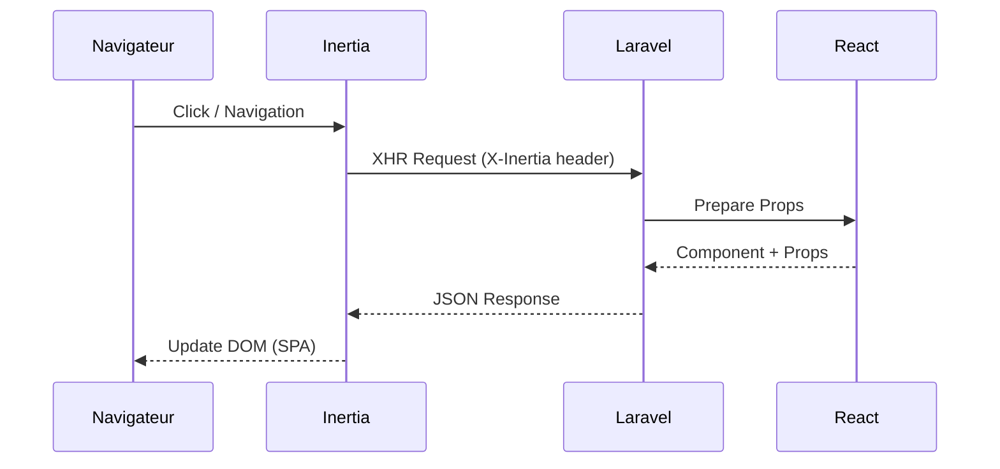
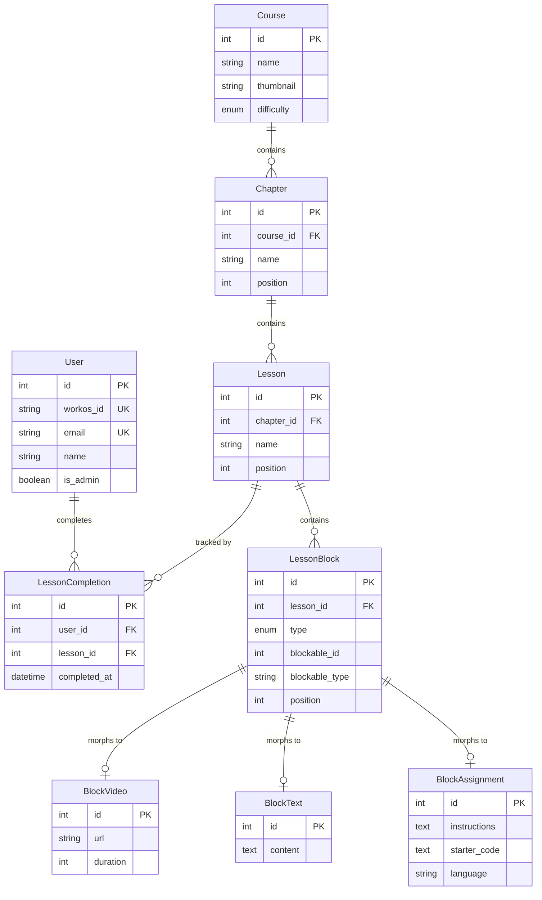
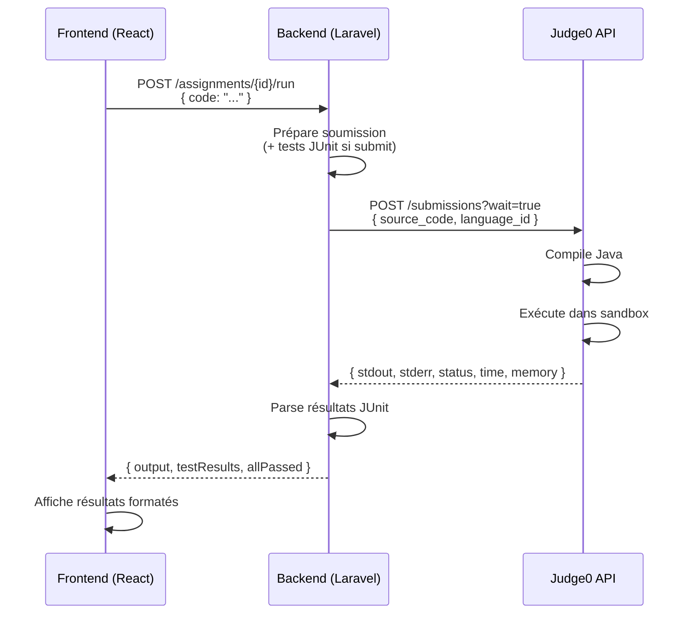

# 5. Spécifications Techniques

## 5.1 Architecture applicative

### Architecture globale

Mine Adventure suit une architecture **monolithique moderne** basée sur le pattern MVC (Model-View-Controller), enrichie par Inertia.js pour créer une expérience SPA (Single Page Application) tout en conservant les avantages du rendu côté serveur.

### Pattern Inertia.js

Inertia.js agit comme une couche de liaison entre le backend Laravel et le frontend React, permettant de :

- Conserver le routing côté serveur (routes Laravel)
- Utiliser des composants React pour le rendu
- Éviter la création d'une API REST séparée
- Bénéficier des fonctionnalités Laravel (sessions, middleware, validation)

## 5.2 Stack technique

### Tableau récapitulatif

| Couche                | Technologie    | Version | Rôle                     |
|-----------------------|----------------|---------|--------------------------|
| **Backend**           | PHP            | 8.4     | Langage serveur          |
|                       | Laravel        | 12      | Framework PHP            |
|                       | Inertia.js     | 2       | Liaison backend-frontend |
|                       | Eloquent ORM   | -       | Accès base de données    |
| **Frontend**          | React          | 19      | Bibliothèque UI          |
|                       | TypeScript     | 5.x     | Typage statique          |
|                       | Tailwind CSS   | 4       | Framework CSS            |
|                       | Vite           | 7       | Bundler et dev server    |
| **UI Components**     | shadcn/ui      | -       | Composants UI            |
|                       | Radix UI       | -       | Primitives accessibles   |
|                       | Lucide React   | -       | Icônes                   |
| **Éditeur de code**   | Monaco Editor  | -       | Éditeur intégré          |
| **Base de données**   | SQLite         | -       | Développement            |
|                       | PostgreSQL     | 17      | Production               |
| **Authentification**  | WorkOS         | -       | Auth / OAuth             |
| **Exécution de code** | Judge0         | -       | Sandbox Java             |
| **Tests**             | Pest           | 4       | Tests PHP                |
|                       | JUnit          | 5       | Tests Java (exercices)   |
| **Déploiement**       | Docker         | -       | Conteneurisation         |
|                       | Coolify        | -       | Plateforme PaaS          |
|                       | GitHub Actions | -       | CI/CD                    |

### Justification des choix techniques

#### Laravel 12

**Pourquoi Laravel ?**
- Framework PHP populaire et bien documenté
- Écosystème riche (Eloquent, Artisan, Blade, etc.)
- Excellent support de TypeScript via Inertia + Wayfinder
- Sécurité intégrée (CSRF, XSS, SQL injection)
- Outils de développement puissants (migrations, seeders, factories)

#### React 19 + TypeScript

**Pourquoi React ?**
- Bibliothèque mature et largement adoptée
- Écosystème de composants très riche
- Intégration parfaite avec Inertia.js
- TypeScript apporte la sécurité du typage statique

#### Tailwind CSS 4

**Pourquoi Tailwind ?**
- Productivité accrue avec les classes utilitaires
- Design system cohérent
- Excellent support du mode sombre
- Purging automatique pour des bundles optimisés

#### Monaco Editor

**Pourquoi Monaco ?**
- Éditeur utilisé par VS Code
- Coloration syntaxique Java native
- Autocomplétion et IntelliSense
- Performances excellentes

#### Judge0

**Pourquoi Judge0 ?**
- Exécution sécurisée de code dans un sandbox
- Support de nombreux langages dont Java
- Gestion des timeouts et limites mémoire
- API REST simple à intégrer

## 5.3 Modèle de données

### Diagramme Entité-Relation simplifié

### Description des entités principales

| Entité               | Description                     | Relations                                              |
|----------------------|---------------------------------|--------------------------------------------------------|
| **User**             | Utilisateur de la plateforme    | A plusieurs LessonCompletions                          |
| **Course**           | Cours de formation              | A plusieurs Chapters, A plusieurs FAQs                 |
| **Chapter**          | Chapitre d'un cours             | Appartient à Course, A plusieurs Lessons               |
| **Lesson**           | Leçon d'un chapitre             | Appartient à Chapter, A plusieurs LessonBlocks         |
| **LessonBlock**      | Bloc de contenu (polymorphique) | Appartient à Lesson, Référence un type de Block*       |
| **BlockVideo**       | Contenu vidéo                   | Peut être référencé par LessonBlock                    |
| **BlockText**        | Contenu texte                   | Peut être référencé par LessonBlock                    |
| **BlockResources**   | Liens vers ressources           | Peut être référencé par LessonBlock                    |
| **BlockQuiz**        | Quiz à choix multiples          | Peut être référencé par LessonBlock                    |
| **BlockAssignment**  | Exercice de code                | Peut être référencé par LessonBlock, A plusieurs Tests |
| **LessonCompletion** | Suivi de progression            | Appartient à User, Appartient à Lesson                 |

## 5.4 API et endpoints

### Routes principales (Inertia)

**Routes publiques (apprenants) :**

| Méthode | Route                                         | Contrôleur                  | Description          |
|---------|-----------------------------------------------|-----------------------------|----------------------|
| GET     | `/courses`                                    | CourseController@index      | Liste des cours      |
| GET     | `/courses/{course}`                           | CourseController@show       | Détail d'un cours    |
| GET     | `/courses/{course}/lessons/{lesson}`          | LessonController@show       | Afficher une leçon   |
| POST    | `/courses/{course}/lessons/{lesson}/complete` | LessonController@complete   | Marquer complété     |
| POST    | `/assignments/{assignment}/run`               | AssignmentController@run    | Exécuter le code     |
| POST    | `/assignments/{assignment}/submit`            | AssignmentController@submit | Soumettre pour tests |

**Routes administration :**

| Méthode          | Route                               | Description                       |
|------------------|-------------------------------------|-----------------------------------|
| GET/POST         | `/admin/courses`                    | Liste et création de cours        |
| GET/PATCH/DELETE | `/admin/courses/{course}`           | Détail, modification, suppression |
| POST             | `/admin/courses/{course}/chapters`  | Créer un chapitre                 |
| PATCH            | `/admin/chapters/{chapter}`         | Modifier un chapitre              |
| POST             | `/admin/chapters/{chapter}/lessons` | Créer une leçon                   |
| POST             | `/admin/lessons/{lesson}/blocks`    | Ajouter un bloc                   |
| PATCH            | `/admin/blocks/{block}`             | Modifier un bloc                  |

### Intégration Judge0

