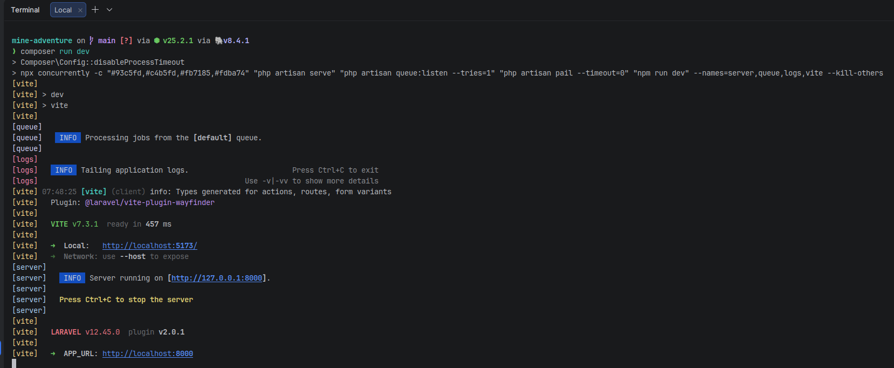

# 6.1 Installation et configuration de l'environnement de travail

> **Compétence visée :** Installer et configurer son environnement de travail en fonction du projet web ou web mobile

## Objectif

Cette section présente l'installation et la configuration de l'environnement de développement utilisé pour le projet Mine Adventure, conformément aux bonnes pratiques et aux besoins spécifiques du projet.

## Logiciels et outils installés

### 1. Éditeur de code / IDE

**PhpStorm** a été utilisé comme environnement de développement. Il offre une excellente prise en charge de PHP, Laravel, JavaScript/TypeScript, ainsi que des outils intégrés pour la gestion de bases de données et le versioning.

### 2. Runtime et gestionnaires de paquets

#### PHP 8.4

Installation via le script Laravel officiel :

```bash
# macOS
/bin/bash -c "$(curl -fsSL https://php.new/install/mac/8.4)"

# Linux
/bin/bash -c "$(curl -fsSL https://php.new/install/linux/8.4)"

# Windows (PowerShell Admin)
Set-ExecutionPolicy Bypass -Scope Process -Force; [System.Net.ServicePointManager]::SecurityProtocol = [System.Net.ServicePointManager]::SecurityProtocol -bor 3072; iex ((New-Object System.Net.WebClient).DownloadString('https://php.new/install/windows/8.4'))
```

Vérification de l'installation :

```bash
php -v
# PHP 8.4.1 (cli)
```

#### Composer

Installé automatiquement avec le script php.new, ou manuellement :

```bash
composer -V
# Composer version 2.x.x
```

#### Node.js et npm

```bash
node -v
# v20.x.x

npm -v
# 10.x.x
```

### 3. Base de données

#### SQLite (Développement)

SQLite est utilisé en développement pour sa simplicité (pas de serveur à configurer).

Configuration dans `.env` :

```env
DB_CONNECTION=sqlite
# Le fichier database/database.sqlite est créé automatiquement
```

#### PostgreSQL (Production)

Pour les tests de production locale :

```bash
# Installation via Coolify (ajout d'une ressource).
```


### 4. Outils de versioning

#### Git

```bash
git --version
# git version 2.x.x

# Configuration globale
git config --global user.name "William Strainchamps"
git config --global user.email "william.strainchamps@gmail.com"
git config --global init.defaultBranch main
```

## Installation du projet

### Clonage et configuration initiale

```bash
# Cloner le repository
git clone https://github.com/[username]/mine-adventure.git
cd mine-adventure

# Installer les dépendances PHP
composer install

# Installer les dépendances JavaScript
npm install

# Copier le fichier d'environnement
cp .env.example .env

# Générer la clé d'application
php artisan key:generate

# Créer la base de données SQLite
touch database/database.sqlite

# Exécuter les migrations
php artisan migrate

# (Optionnel) Peupler avec des données de test
php artisan db:seed
```

### Lancement de l'environnement de développement

```bash
# Méthode 1 : Commande unique (recommandée)
composer run dev

# Méthode 2 : Terminaux séparés
# Terminal 1 : Serveur Laravel
php artisan serve

# Terminal 2 : Vite (compilation assets)
npm run dev

# Terminal 3 : File d'attente (si nécessaire)
php artisan queue:work
```

L'application est accessible sur `http://localhost:8000`

## Configuration des services externes

### Judge0 API

Pour l'exécution de code Java, configuration dans `.env` :

```env
JUDGE0_API_URL=https://votre-instance-judge0.com
JUDGE0_API_KEY=votre-cle-api
```

### WorkOS (Authentification)

```env
WORKOS_CLIENT_ID=client_xxxxx
WORKOS_API_KEY=sk_xxxxx
WORKOS_REDIRECT_URI=http://localhost:8000/redirect
```

## Structure du projet

```
mine-adventure/
├── app/                    # Code PHP (Controllers, Models, Services)
│   ├── Http/
│   │   └── Controllers/
│   ├── Models/
│   └── Services/
├── bootstrap/              # Fichiers d'amorçage Laravel
├── config/                 # Configuration de l'application
├── database/
│   ├── migrations/         # Migrations de base de données
│   ├── factories/          # Factories pour les tests
│   └── seeders/            # Seeders de données
├── public/                 # Point d'entrée web
├── resources/
│   ├── js/                 # Code React/TypeScript
│   │   ├── components/     # Composants réutilisables
│   │   ├── pages/          # Pages Inertia
│   │   └── layouts/        # Layouts de page
│   └── css/                # Styles CSS
├── routes/                 # Définition des routes
├── storage/                # Fichiers générés
├── tests/                  # Tests automatisés
├── .env                    # Variables d'environnement
├── composer.json           # Dépendances PHP
├── package.json            # Dépendances JavaScript
├── tailwind.config.js      # Configuration Tailwind
├── tsconfig.json           # Configuration TypeScript
└── vite.config.ts          # Configuration Vite
```

## Outils de qualité de code

### Laravel Pint (PHP)

Formatage automatique du code PHP :

```bash
# Vérifier le formatage
./vendor/bin/pint --test

# Appliquer le formatage
./vendor/bin/pint
```

### ESLint + Prettier (JavaScript/TypeScript)

```bash
# Vérifier le code
npm run lint

# Corriger automatiquement
npm run lint:fix
```

## Captures d'écran de l'environnement

- Votre IDE avec le projet ouvert


- Le terminal avec les serveurs en cours d'exécution


