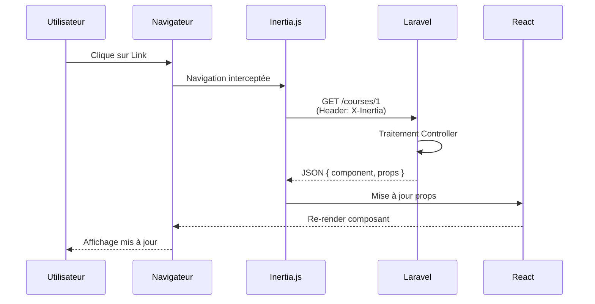

# 6.4 Développement des interfaces dynamiques

> **Compétence visée :** Développer la partie dynamique des interfaces utilisateur web ou web mobile

## Objectif

Cette section présente le développement des fonctionnalités dynamiques de Mine Adventure : gestion d'état, interactions utilisateur, appels API, formulaires, et intégration avec le backend via Inertia.js.

## Architecture front-end dynamique

### Stack technologique

| Technologie         | Rôle                            |
|---------------------|---------------------------------|
| **React 19**        | Rendu et gestion des composants |
| **Inertia.js v2**   | Communication client-serveur    |
| **TypeScript**      | Typage statique                 |
| **Zustand**         | Gestion d'état global           |
| **React Hook Form** | Gestion des formulaires         |
| **Wayfinder**       | Routes type-safe                |

### Flux de données avec Inertia.js



## Navigation avec Inertia

### Composant Link

```tsx
import { Link } from '@inertiajs/react';

// Navigation simple
<Link href="/courses">Voir les cours</Link>

// Navigation avec préservation de l'état
<Link href="/courses" preserveState>Cours</Link>

// Navigation avec remplacement d'historique
<Link href="/dashboard" replace>Dashboard</Link>
```

### Navigation programmatique avec Wayfinder

```tsx
import { router } from '@inertiajs/react';
import { show } from '@/actions/App/Http/Controllers/CourseController';

// Navigation type-safe
function handleCourseClick(courseId: number) {
    router.visit(show.url(courseId));
}

// Avec des paramètres de requête
router.visit(show.url(courseId, { query: { tab: 'lessons' } }));
```

## Gestion des formulaires

### Formulaire avec le composant Form d'Inertia

```tsx
import { Form } from '@inertiajs/react';
import { store } from '@/actions/App/Http/Controllers/Admin/CourseController';

export function CreateCourseForm() {
    return (
        <Form {...store.form()}>
            {({ errors, processing, wasSuccessful }) => (
                <div className="space-y-4">
                    {/* Champ nom */}
                    <div>
                        <Label htmlFor="name">Nom du cours</Label>
                        <Input
                            id="name"
                            name="name"
                            placeholder="Introduction to Java"
                            className={errors.name ? 'border-destructive' : ''}
                        />
                        {errors.name && (
                            <p className="text-sm text-destructive mt-1">
                                {errors.name}
                            </p>
                        )}
                    </div>

                    {/* Sélection de difficulté */}
                    <div>
                        <Label htmlFor="difficulty">Difficulté</Label>
                        <Select name="difficulty" defaultValue="easy">
                            <SelectTrigger>
                                <SelectValue placeholder="Sélectionner" />
                            </SelectTrigger>
                            <SelectContent>
                                <SelectItem value="easy">Facile</SelectItem>
                                <SelectItem value="medium">Moyen</SelectItem>
                                <SelectItem value="hard">Difficile</SelectItem>
                            </SelectContent>
                        </Select>
                    </div>

                    {/* Bouton de soumission */}
                    <Button type="submit" disabled={processing}>
                        {processing ? 'Création...' : 'Créer le cours'}
                    </Button>

                    {wasSuccessful && (
                        <p className="text-green-600">Cours créé avec succès !</p>
                    )}
                </div>
            )}
        </Form>
    );
}
```

### Formulaire avec useForm (contrôle avancé)

```tsx
import { useForm } from '@inertiajs/react';

export function AssignmentSubmitForm({ assignmentId }: { assignmentId: number }) {
    const { data, setData, post, processing, errors } = useForm({
        code: '',
    });

    function handleSubmit(e: React.FormEvent) {
        e.preventDefault();
        post(`/assignments/${assignmentId}/submit`);
    }

    return (
        <form onSubmit={handleSubmit}>
            <MonacoEditor
                value={data.code}
                onChange={(value) => setData('code', value || '')}
                language="java"
            />

            <Button type="submit" disabled={processing}>
                {processing ? 'Exécution...' : 'Soumettre'}
            </Button>
        </form>
    );
}
```

## Gestion d'état avec Zustand

### Store pour l'éditeur de code

```tsx
// stores/code-editor-store.ts
import { create } from 'zustand';

interface TestResult {
    name: string;
    passed: boolean;
    message?: string;
}

interface CodeEditorState {
    code: string;
    output: string;
    isRunning: boolean;
    isSubmitting: boolean;
    testResults: TestResult[];

    // Actions
    setCode: (code: string) => void;
    setOutput: (output: string) => void;
    setRunning: (running: boolean) => void;
    setSubmitting: (submitting: boolean) => void;
    setTestResults: (results: TestResult[]) => void;
    reset: () => void;
}

export const useCodeEditorStore = create<CodeEditorState>((set) => ({
    code: '',
    output: '',
    isRunning: false,
    isSubmitting: false,
    testResults: [],

    setCode: (code) => set({ code }),
    setOutput: (output) => set({ output }),
    setRunning: (isRunning) => set({ isRunning }),
    setSubmitting: (isSubmitting) => set({ isSubmitting }),
    setTestResults: (testResults) => set({ testResults }),
    reset: () => set({
        code: '',
        output: '',
        isRunning: false,
        isSubmitting: false,
        testResults: [],
    }),
}));
```

### Utilisation du store

```tsx
import { useCodeEditorStore } from '@/stores/code-editor-store';

export function CodeEditor() {
    const {
        code,
        setCode,
        isRunning,
        output,
        testResults
    } = useCodeEditorStore();

    return (
        <div className="grid grid-cols-2 gap-4">
            <div>
                <MonacoEditor
                    value={code}
                    onChange={setCode}
                    language="java"
                />
            </div>

            <div>
                {isRunning ? (
                    <div className="flex items-center gap-2">
                        <Loader2 className="animate-spin" />
                        <span>Exécution en cours...</span>
                    </div>
                ) : (
                    <>
                        <h3>Sortie console</h3>
                        <pre className="bg-muted p-4 rounded">
                            {output || 'Aucune sortie'}
                        </pre>

                        {testResults.length > 0 && (
                            <div className="mt-4">
                                <h3>Résultats des tests</h3>
                                <ul>
                                    {testResults.map((test, i) => (
                                        <li key={i} className="flex items-center gap-2">
                                            {test.passed ? (
                                                <CheckCircle className="text-green-500" />
                                            ) : (
                                                <XCircle className="text-red-500" />
                                            )}
                                            <span>{test.name}</span>
                                        </li>
                                    ))}
                                </ul>
                            </div>
                        )}
                    </>
                )}
            </div>
        </div>
    );
}
```

## Interactions dynamiques

### Exécution de code asynchrone

```tsx
import { router } from '@inertiajs/react';
import { run, submit } from '@/actions/App/Http/Controllers/AssignmentController';

export function useCodeExecution(assignmentId: number) {
    const store = useCodeEditorStore();

    async function runCode() {
        store.setRunning(true);
        store.setOutput('');

        router.post(run.url(assignmentId),
            { code: store.code },
            {
                preserveState: true,
                onSuccess: (page) => {
                    const result = page.props.executionResult as {
                        output: string;
                        error?: string;
                    };
                    store.setOutput(result.error || result.output);
                },
                onFinish: () => store.setRunning(false),
            }
        );
    }

    async function submitCode() {
        store.setSubmitting(true);

        router.post(submit.url(assignmentId),
            { code: store.code },
            {
                preserveState: true,
                onSuccess: (page) => {
                    const result = page.props.testResults as TestResult[];
                    store.setTestResults(result);
                },
                onFinish: () => store.setSubmitting(false),
            }
        );
    }

    return { runCode, submitCode };
}
```

### Drag and Drop pour réorganisation

```tsx
import {
    DndContext,
    closestCenter,
    KeyboardSensor,
    PointerSensor,
    useSensor,
    useSensors,
} from '@dnd-kit/core';
import {
    arrayMove,
    SortableContext,
    sortableKeyboardCoordinates,
    verticalListSortingStrategy,
} from '@dnd-kit/sortable';

export function SortableChapterList({ chapters, courseId }) {
    const [items, setItems] = useState(chapters);

    const sensors = useSensors(
        useSensor(PointerSensor),
        useSensor(KeyboardSensor, {
            coordinateGetter: sortableKeyboardCoordinates,
        })
    );

    function handleDragEnd(event) {
        const { active, over } = event;

        if (active.id !== over.id) {
            setItems((items) => {
                const oldIndex = items.findIndex((i) => i.id === active.id);
                const newIndex = items.findIndex((i) => i.id === over.id);
                const newItems = arrayMove(items, oldIndex, newIndex);

                // Sauvegarder le nouvel ordre
                router.post(`/admin/courses/${courseId}/chapters/reorder`, {
                    order: newItems.map((item) => item.id),
                });

                return newItems;
            });
        }
    }

    return (
        <DndContext
            sensors={sensors}
            collisionDetection={closestCenter}
            onDragEnd={handleDragEnd}
        >
            <SortableContext
                items={items}
                strategy={verticalListSortingStrategy}
            >
                {items.map((chapter) => (
                    <SortableChapterItem key={chapter.id} chapter={chapter} />
                ))}
            </SortableContext>
        </DndContext>
    );
}
```

### Marquage de leçon comme complétée

```tsx
import { router } from '@inertiajs/react';
import { complete } from '@/actions/App/Http/Controllers/LessonController';

export function LessonCompleteButton({ courseId, lessonId, isCompleted }) {
    const [completing, setCompleting] = useState(false);

    function handleComplete() {
        setCompleting(true);

        router.post(complete.url(courseId, lessonId), {}, {
            preserveScroll: true,
            onFinish: () => setCompleting(false),
        });
    }

    if (isCompleted) {
        return (
            <Button variant="outline" disabled>
                <CheckCircle className="mr-2 h-4 w-4" />
                Leçon complétée
            </Button>
        );
    }

    return (
        <Button onClick={handleComplete} disabled={completing}>
            {completing ? (
                <>
                    <Loader2 className="mr-2 h-4 w-4 animate-spin" />
                    Validation...
                </>
            ) : (
                <>
                    <Check className="mr-2 h-4 w-4" />
                    Marquer comme terminée
                </>
            )}
        </Button>
    );
}
```

## Gestion du thème (Mode sombre)

```tsx
// hooks/use-theme.ts
import { useEffect, useState } from 'react';

export function useTheme() {
    const [theme, setTheme] = useState<'light' | 'dark'>('light');

    useEffect(() => {
        const stored = localStorage.getItem('theme') as 'light' | 'dark' | null;
        const systemPreference = window.matchMedia('(prefers-color-scheme: dark)').matches
            ? 'dark'
            : 'light';

        setTheme(stored || systemPreference);
    }, []);

    useEffect(() => {
        document.documentElement.classList.toggle('dark', theme === 'dark');
        localStorage.setItem('theme', theme);
    }, [theme]);

    const toggleTheme = () => setTheme(theme === 'light' ? 'dark' : 'light');

    return { theme, setTheme, toggleTheme };
}
```

## Validation côté client
// TODO: Exemple avec validation HTML5 et messages d'erreur personnalisés

## Captures d'écran

- L'éditeur de code en action avec résultats de tests


- Le drag & drop de réorganisation

- Un formulaire avec validation en temps réel
- Les notifications toast après une action
