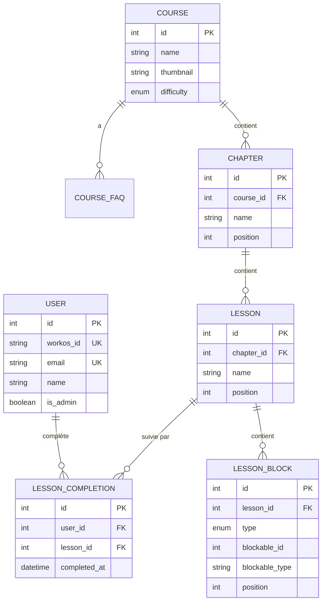
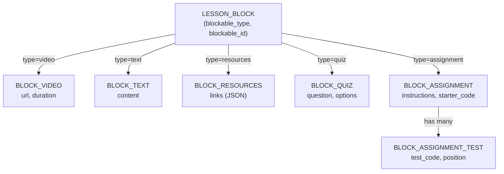

# 7.1 Mise en place de la base de données relationnelle

> **Compétence visée :** Mettre en place une base de données relationnelle

## Objectif

Cette section présente la conception et la mise en place de la base de données relationnelle pour Mine Adventure, incluant le modèle conceptuel, les migrations Laravel, et les bonnes pratiques appliquées.

## Système de gestion de base de données

| Environnement     | SGBD          | Justification                                |
|-------------------|---------------|----------------------------------------------|
| **Développement** | SQLite        | Léger, sans serveur, idéal pour le dev local |
| **Production**    | PostgreSQL 17 | Robuste, performant, excellent support JSON  |

## Modèle Conceptuel de Données (MCD)

### Entités principales



### Relation polymorphique des blocs



## Migrations Laravel

### Création des tables principales

#### Migration : Users

```php
<?php

use Illuminate\Database\Migrations\Migration;
use Illuminate\Database\Schema\Blueprint;
use Illuminate\Support\Facades\Schema;

return new class extends Migration
{
    public function up(): void
    {
        Schema::create('users', function (Blueprint $table) {
            $table->id();
            $table->string('workos_id')->unique();
            $table->string('email')->unique();
            $table->string('name');
            $table->boolean('is_admin')->default(false);
            $table->timestamps();
        });
    }

    public function down(): void
    {
        Schema::dropIfExists('users');
    }
};
```

#### Migration : Courses

```php
<?php

use App\Enums\CourseDifficulty;
use Illuminate\Database\Migrations\Migration;
use Illuminate\Database\Schema\Blueprint;
use Illuminate\Support\Facades\Schema;

return new class extends Migration
{
    public function up(): void
    {
        Schema::create('courses', function (Blueprint $table) {
            $table->id();
            $table->string('name');
            $table->string('thumbnail')->nullable();
            $table->string('difficulty')->default(CourseDifficulty::Easy->value);
            $table->timestamps();
        });
    }

    public function down(): void
    {
        Schema::dropIfExists('courses');
    }
};
```

#### Migration : Chapters

```php
<?php

return new class extends Migration
{
    public function up(): void
    {
        Schema::create('chapters', function (Blueprint $table) {
            $table->id();
            $table->foreignId('course_id')
                  ->constrained()
                  ->cascadeOnDelete();
            $table->string('name');
            $table->unsignedInteger('position')->default(0);
            $table->timestamps();

            // Index pour optimiser les requêtes de tri
            $table->index(['course_id', 'position']);
        });
    }

    public function down(): void
    {
        Schema::dropIfExists('chapters');
    }
};
```

#### Migration : Lessons

```php
<?php

return new class extends Migration
{
    public function up(): void
    {
        Schema::create('lessons', function (Blueprint $table) {
            $table->id();
            $table->foreignId('chapter_id')
                  ->constrained()
                  ->cascadeOnDelete();
            $table->string('name');
            $table->unsignedInteger('position')->default(0);
            $table->timestamps();

            $table->index(['chapter_id', 'position']);
        });
    }

    public function down(): void
    {
        Schema::dropIfExists('lessons');
    }
};
```

#### Migration : Lesson Blocks (polymorphique)

```php
<?php

use App\Enums\BlockType;

return new class extends Migration
{
    public function up(): void
    {
        Schema::create('lesson_blocks', function (Blueprint $table) {
            $table->id();
            $table->foreignId('lesson_id')
                  ->constrained()
                  ->cascadeOnDelete();
            $table->string('type'); // BlockType enum
            $table->morphs('blockable'); // blockable_id + blockable_type
            $table->unsignedInteger('position')->default(0);
            $table->timestamps();

            $table->index(['lesson_id', 'position']);
        });
    }

    public function down(): void
    {
        Schema::dropIfExists('lesson_blocks');
    }
};
```

#### Migration : Block Assignments avec tests

```php
<?php

return new class extends Migration
{
    public function up(): void
    {
        Schema::create('block_assignments', function (Blueprint $table) {
            $table->id();
            $table->text('instructions');
            $table->text('starter_code')->nullable();
            $table->string('language')->default('java');
            $table->text('solution')->nullable();
            $table->timestamps();
        });

        // Table des tests JUnit associés
        Schema::create('block_assignment_tests', function (Blueprint $table) {
            $table->id();
            $table->foreignId('block_assignment_id')
                  ->constrained()
                  ->cascadeOnDelete();
            $table->text('test_code');
            $table->unsignedInteger('position')->default(0);
            $table->timestamps();
        });
    }

    public function down(): void
    {
        Schema::dropIfExists('block_assignment_tests');
        Schema::dropIfExists('block_assignments');
    }
};
```

#### Migration : Lesson Completions

```php
<?php

return new class extends Migration
{
    public function up(): void
    {
        Schema::create('lesson_completions', function (Blueprint $table) {
            $table->id();
            $table->foreignId('user_id')
                  ->constrained()
                  ->cascadeOnDelete();
            $table->foreignId('lesson_id')
                  ->constrained()
                  ->cascadeOnDelete();
            $table->timestamp('completed_at');
            $table->timestamps();

            // Contrainte d'unicité : un user ne peut compléter une leçon qu'une fois
            $table->unique(['user_id', 'lesson_id']);
        });
    }

    public function down(): void
    {
        Schema::dropIfExists('lesson_completions');
    }
};
```

## Exécution des migrations

```bash
# Exécuter toutes les migrations
php artisan migrate

# Voir le statut des migrations
php artisan migrate:status

# Annuler la dernière migration
php artisan migrate:rollback

# Réinitialiser et re-migrer (développement uniquement)
php artisan migrate:fresh

# Avec les seeders
php artisan migrate:fresh --seed
```

## Enums PHP

### BlockType Enum

```php
<?php

namespace App\Enums;

enum BlockType: string
{
    case Video = 'video';
    case Text = 'text';
    case Resources = 'resources';
    case Quiz = 'quiz';
    case Assignment = 'assignment';

    public function label(): string
    {
        return match($this) {
            self::Video => 'Vidéo',
            self::Text => 'Texte',
            self::Resources => 'Ressources',
            self::Quiz => 'Quiz',
            self::Assignment => 'Exercice de code',
        };
    }
}
```

### CourseDifficulty Enum

```php
<?php

namespace App\Enums;

enum CourseDifficulty: string
{
    case Easy = 'easy';
    case Medium = 'medium';
    case Hard = 'hard';

    public function label(): string
    {
        return match($this) {
            self::Easy => 'Facile',
            self::Medium => 'Moyen',
            self::Hard => 'Difficile',
        };
    }

    public function color(): string
    {
        return match($this) {
            self::Easy => 'green',
            self::Medium => 'yellow',
            self::Hard => 'red',
        };
    }
}
```

## Intégrité référentielle

### Clés étrangères avec cascade

```php
// Suppression en cascade : quand un cours est supprimé,
// tous ses chapitres, leçons et blocs sont supprimés
$table->foreignId('course_id')
      ->constrained()
      ->cascadeOnDelete();
```

### Contraintes d'unicité

```php
// Un utilisateur ne peut compléter une leçon qu'une seule fois
$table->unique(['user_id', 'lesson_id']);

// L'email et workos_id sont uniques
$table->string('email')->unique();
$table->string('workos_id')->unique();
```

## Index pour l'optimisation

```php
// Index composites pour les requêtes de tri
$table->index(['course_id', 'position']); // Chapitres triés par cours
$table->index(['chapter_id', 'position']); // Leçons triées par chapitre
$table->index(['lesson_id', 'position']);  // Blocs triés par leçon
```

## Schéma final de la base de données

Le schéma complet est documenté dans `docs/schema.dbml` au format DBML (Database Markup Language).


## Bonnes pratiques appliquées

| Pratique            | Application                                  |
|---------------------|----------------------------------------------|
| **Normalisation**   | Tables normalisées (3NF), pas de redondance  |
| **Clés primaires**  | ID auto-incrémenté sur chaque table          |
| **Clés étrangères** | Relations explicites avec contraintes        |
| **Cascade**         | Suppression en cascade pour l'intégrité      |
| **Index**           | Index sur les colonnes fréquemment utilisées |
| **Timestamps**      | created_at et updated_at automatiques        |
| **Soft deletes**    | Non utilisé (suppression définitive)         |
| **Enums**           | Types PHP pour les valeurs contraintes       |
