# 7.4 Documentation du déploiement

> **Compétence visée :** Documenter le déploiement d'une application dynamique web ou web mobile

## Objectif

Cette section documente le processus complet de déploiement de Mine Adventure, incluant la conteneurisation Docker, la configuration CI/CD avec GitHub Actions, et le déploiement sur Coolify.

## Architecture de déploiement


## Conteneurisation avec Docker

### Dockerfile (multi-stage build)

```dockerfile
# =============================================================================
# Stage 1: Build des assets frontend
# =============================================================================
FROM node:20-alpine AS frontend-builder

WORKDIR /app

# Copier les fichiers de dépendances
COPY package*.json ./

# Installer les dépendances
RUN npm ci

# Copier le code source
COPY . .

# Build des assets
RUN npm run build

# =============================================================================
# Stage 2: Installation des dépendances PHP
# =============================================================================
FROM composer:2 AS composer-builder

WORKDIR /app

COPY composer.json composer.lock ./

RUN composer install \
    --no-dev \
    --no-scripts \
    --no-autoloader \
    --prefer-dist

COPY . .

RUN composer dump-autoload --optimize

# =============================================================================
# Stage 3: Image de production
# =============================================================================
FROM php:8.4-fpm-alpine AS production

# Installer les extensions PHP nécessaires
RUN apk add --no-cache \
    nginx \
    supervisor \
    libpq-dev \
    && docker-php-ext-install pdo pdo_pgsql opcache

# Configurer PHP pour la production
RUN mv "$PHP_INI_DIR/php.ini-production" "$PHP_INI_DIR/php.ini"

# Copier la configuration OPcache
COPY docker/php/opcache.ini /usr/local/etc/php/conf.d/opcache.ini

# Copier la configuration Nginx
COPY docker/nginx/nginx.conf /etc/nginx/nginx.conf
COPY docker/nginx/default.conf /etc/nginx/http.d/default.conf

# Copier la configuration Supervisor
COPY docker/supervisor/supervisord.conf /etc/supervisor/conf.d/supervisord.conf

# Définir le répertoire de travail
WORKDIR /var/www/html

# Copier l'application depuis les stages précédents
COPY --from=composer-builder /app/vendor ./vendor
COPY --from=frontend-builder /app/public/build ./public/build
COPY . .

# Créer les répertoires nécessaires et définir les permissions
RUN mkdir -p storage/logs storage/framework/{sessions,views,cache} bootstrap/cache \
    && chown -R www-data:www-data storage bootstrap/cache \
    && chmod -R 775 storage bootstrap/cache

# Exposer le port 80
EXPOSE 80

# Commande de démarrage
CMD ["/usr/bin/supervisord", "-c", "/etc/supervisor/conf.d/supervisord.conf"]
```

### Configuration Nginx

```nginx
# docker/nginx/default.conf
server {
    listen 80;
    server_name _;
    root /var/www/html/public;
    index index.php;

    # Logs
    access_log /var/log/nginx/access.log;
    error_log /var/log/nginx/error.log;

    # Gzip compression
    gzip on;
    gzip_types text/plain text/css application/json application/javascript text/xml application/xml;

    # Assets statiques avec cache long
    location ~* \.(css|js|jpg|jpeg|png|gif|ico|svg|woff|woff2)$ {
        expires 1y;
        add_header Cache-Control "public, immutable";
    }

    # Toutes les requêtes vers index.php (Laravel)
    location / {
        try_files $uri $uri/ /index.php?$query_string;
    }

    # Configuration PHP-FPM
    location ~ \.php$ {
        fastcgi_pass 127.0.0.1:9000;
        fastcgi_index index.php;
        fastcgi_param SCRIPT_FILENAME $realpath_root$fastcgi_script_name;
        include fastcgi_params;
    }

    # Bloquer l'accès aux fichiers sensibles
    location ~ /\.(?!well-known) {
        deny all;
    }
}
```

### Configuration Supervisor

```ini
# docker/supervisor/supervisord.conf
[supervisord]
nodaemon=true
user=root
logfile=/var/log/supervisor/supervisord.log
pidfile=/var/run/supervisord.pid

[program:nginx]
command=/usr/sbin/nginx -g "daemon off;"
autostart=true
autorestart=true
stdout_logfile=/dev/stdout
stdout_logfile_maxbytes=0
stderr_logfile=/dev/stderr
stderr_logfile_maxbytes=0

[program:php-fpm]
command=/usr/local/sbin/php-fpm -F
autostart=true
autorestart=true
stdout_logfile=/dev/stdout
stdout_logfile_maxbytes=0
stderr_logfile=/dev/stderr
stderr_logfile_maxbytes=0
```

## CI/CD avec GitHub Actions

### Workflow principal

```yaml
# .github/workflows/ci-cd.yml
name: CI/CD Pipeline

on:
  push:
    branches: [main]
  pull_request:
    branches: [main]

jobs:
  # ==========================================================================
  # Job 1: Tests et Linting
  # ==========================================================================
  test:
    name: Tests & Linting
    runs-on: ubuntu-latest

    steps:
      - name: Checkout code
        uses: actions/checkout@v4

      - name: Setup PHP
        uses: shivammathur/setup-php@v2
        with:
          php-version: '8.4'
          extensions: pdo, pdo_sqlite
          coverage: none

      - name: Setup Node.js
        uses: actions/setup-node@v4
        with:
          node-version: '20'
          cache: 'npm'

      - name: Install PHP dependencies
        run: composer install --no-interaction --prefer-dist

      - name: Install Node dependencies
        run: npm ci

      - name: Build assets
        run: npm run build

      - name: Copy .env
        run: cp .env.example .env

      - name: Generate key
        run: php artisan key:generate

      - name: Create database
        run: touch database/database.sqlite

      - name: Run migrations
        run: php artisan migrate --force

      # Linting
      - name: Check PHP code style (Pint)
        run: ./vendor/bin/pint --test

      - name: Check JavaScript code style (ESLint)
        run: npm run lint

      # Tests
      - name: Run PHP tests (Pest)
        run: php artisan test --parallel

  # ==========================================================================
  # Job 2: Déploiement (uniquement sur main)
  # ==========================================================================
  deploy:
    name: Deploy to Production
    runs-on: ubuntu-latest
    needs: test
    if: github.ref == 'refs/heads/main' && github.event_name == 'push'

    steps:
      - name: Checkout code
        uses: actions/checkout@v4

      - name: Deploy to Coolify
        run: |
          curl -X POST \
            -H "Authorization: Bearer ${{ secrets.COOLIFY_TOKEN }}" \
            -H "Content-Type: application/json" \
            "${{ secrets.COOLIFY_WEBHOOK_URL }}"
```

## Déploiement sur Coolify

### Présentation de Coolify

**Coolify** est une plateforme de déploiement open-source auto-hébergée qui permet de déployer des applications facilement sur un VPS.

| Avantage | Description |
|----------|-------------|
| **Self-hosted** | Contrôle total sur l'infrastructure |
| **Docker native** | Support complet de Docker et Docker Compose |
| **SSL automatique** | Certificats Let's Encrypt automatiques |
| **Zero-downtime** | Déploiement sans interruption |
| **Webhooks** | Déploiement automatique via CI/CD |

### Configuration dans Coolify

#### 1. Création du projet

1. Se connecter à l'interface Coolify
2. Créer un nouveau projet "Mine Adventure"
3. Ajouter une nouvelle ressource de type "Application"

#### 2. Configuration de l'application

```yaml
# Configuration Coolify (interface)
Source: GitHub Repository
Repository: username/mine-adventure
Branch: main
Build Pack: Dockerfile
Dockerfile Location: ./Dockerfile
Port: 80
```

#### 3. Variables d'environnement

```env
APP_NAME="Mine Adventure"
APP_ENV=production
APP_KEY=base64:xxxxxxxxxxxxxxxxxxxxxxxxxxxxx
APP_DEBUG=false
APP_URL=https://mine-adventure.example.com

DB_CONNECTION=pgsql
DB_HOST=postgres
DB_PORT=5432
DB_DATABASE=mine_adventure
DB_USERNAME=postgres
DB_PASSWORD=secure_password

JUDGE0_API_URL=https://judge0.example.com
JUDGE0_API_KEY=xxxxxxxxxxxxx

WORKOS_CLIENT_ID=client_xxxxx
WORKOS_API_KEY=sk_xxxxx
```

#### 4. Base de données PostgreSQL

1. Ajouter une ressource "Database" de type PostgreSQL
2. Configurer la connexion interne via le réseau Docker
3. Créer la base de données "mine_adventure"

### Processus de déploiement

```mermaid
flowchart TD
    A["1. Push sur main"] --> B["2. Pipeline CI"]
    B --> B1["Installation dépendances"]
    B --> B2["Vérification code<br/>(Pint, ESLint)"]
    B --> B3["Exécution tests<br/>(Pest)"]

    B1 & B2 & B3 --> C{"Tests OK ?"}
    C -->|"Non"| X["❌ Échec"]
    C -->|"Oui"| D["3. Webhook Coolify"]

    D --> E["4. Build sur Coolify"]
    E --> E1["Pull code GitHub"]
    E --> E2["Build Docker<br/>(multi-stage)"]
    E --> E3["Push registre interne"]

    E1 & E2 & E3 --> F["5. Déploiement"]
    F --> F1["Arrêt ancien conteneur"]
    F --> F2["Démarrage nouveau conteneur"]
    F --> F3["Health check"]

    F1 & F2 & F3 --> G["6. Post-déploiement"]
    G --> G1["php artisan migrate"]
    G --> G2["php artisan config:cache"]
    G --> G3["php artisan route:cache"]

    G1 & G2 & G3 --> H["✅ Déploiement terminé"]
```



## Commandes post-déploiement

Ces commandes sont exécutées automatiquement après chaque déploiement :

```bash
# Migrations de base de données
php artisan migrate --force

# Cache de configuration (performance)
php artisan config:cache

# Cache des routes (performance)
php artisan route:cache

# Cache des vues (performance)
php artisan view:cache

# Optimisation de l'autoloader
composer dump-autoload --optimize
```

## Monitoring et logs

### Accès aux logs

```bash
# Via Coolify
# Interface web → Application → Logs

# Via SSH sur le VPS
docker logs mine-adventure-app

# Logs Laravel
docker exec mine-adventure-app cat storage/logs/laravel.log
```

### Health checks

```php
// routes/web.php
Route::get('/health', function () {
    return response()->json([
        'status' => 'ok',
        'timestamp' => now()->toISOString(),
        'database' => DB::connection()->getPdo() ? 'connected' : 'error',
    ]);
});
```

## Procédure de rollback

En cas de problème après un déploiement :

1. **Via Coolify** : Cliquer sur "Rollback" pour revenir à la version précédente
2. **Via Git** : Revert du commit et push, déclenchant un nouveau déploiement

```bash
# Rollback Git
git revert HEAD
git push origin main
```

## Sauvegardes

### Base de données

```bash
# Backup automatique (cron sur le VPS)
0 2 * * * docker exec postgres pg_dump -U postgres mine_adventure > /backups/db_$(date +\%Y\%m\%d).sql
```

### Fichiers uploadés

```bash
# Sync vers stockage externe (si applicable)
0 3 * * * rsync -av /var/www/html/storage/app/public/ /backups/uploads/
```

## Checklist de déploiement

| Étape | Vérification |
|-------|--------------|
| ✅ | Code pushé sur la branche main |
| ✅ | Tests CI passés (Pint, ESLint, Pest) |
| ✅ | Build Docker réussi |
| ✅ | Migrations exécutées |
| ✅ | Application accessible |
| ✅ | Health check OK |
| ✅ | SSL valide |
| ✅ | Fonctionnalités critiques testées |

## Diagramme de l'infrastructure

```mermaid
flowchart TB
    Internet["🌐 Internet"]
    CF["☁️ Cloudflare<br/>(DNS + CDN)"]

    subgraph VPS["VPS (Ubuntu Server)"]
        subgraph Coolify
            subgraph DockerNetwork["Docker Network"]
                App["🐳 Container App<br/>Nginx + PHP-FPM"]
                DB["🐘 PostgreSQL"]
            end
        end
    end

    Internet --> CF
    CF --> App
    App <--> DB
```


