# 8. Sécurité

## Objectif

Cette section présente les mesures de sécurité implémentées dans Mine Adventure, couvrant la protection contre les vulnérabilités web courantes (OWASP Top 10), la conformité RGPD, et les bonnes pratiques de développement sécurisé.

## Sécurité intégrée de Laravel

Laravel fournit nativement de nombreuses protections de sécurité :

| Protection | Implémentation Laravel |
|------------|------------------------|
| **Injection SQL** | Eloquent ORM avec requêtes préparées |
| **XSS** | Échappement automatique dans Blade/React |
| **CSRF** | Tokens CSRF automatiques |
| **Mass Assignment** | Protection via `$fillable` |
| **Hashing** | Bcrypt/Argon2 pour les mots de passe |
| **Encryption** | Chiffrement AES-256-CBC |

## Protection contre les attaques OWASP Top 10

### 1. Injection SQL

**Risque :** Exécution de code SQL malveillant via les entrées utilisateur.

**Protection appliquée :**

```php
// ❌ Vulnérable - Ne jamais faire
$users = DB::select("SELECT * FROM users WHERE email = '$email'");

// ✅ Sécurisé - Eloquent ORM
$users = User::where('email', $email)->get();

// ✅ Sécurisé - Query Builder avec bindings
$users = DB::table('users')
    ->where('email', '?', [$email])
    ->get();
```

Toutes les requêtes dans Mine Adventure utilisent Eloquent ORM ou des requêtes préparées.

### 2. Cross-Site Scripting (XSS)

**Risque :** Injection de scripts malveillants dans les pages web.

**Protection appliquée :**

```tsx
// React échappe automatiquement les variables
<p>{userInput}</p> // Sécurisé - échappé automatiquement

// ❌ Dangereux - À éviter sauf cas exceptionnel
<div dangerouslySetInnerHTML={{ __html: content }} />

// ✅ Pour le contenu Markdown, utilisation de bibliothèques sûres
import ReactMarkdown from 'react-markdown';
<ReactMarkdown>{content}</ReactMarkdown>
```

### 3. Cross-Site Request Forgery (CSRF)

**Risque :** Forcer un utilisateur authentifié à exécuter des actions non désirées.

**Protection appliquée :**

```php
// Laravel génère automatiquement des tokens CSRF
// Inertia.js les inclut automatiquement dans les requêtes

// Middleware CSRF activé par défaut
// bootstrap/app.php
->withMiddleware(function (Middleware $middleware) {
    // CSRF middleware est inclus par défaut
})
```

```tsx
// Inertia inclut automatiquement le token CSRF
import { router } from '@inertiajs/react';
router.post('/endpoint', data); // Token CSRF inclus
```

### 4. Broken Authentication

**Risque :** Compromission des mécanismes d'authentification.

**Protection appliquée :**

```php
// Authentification déléguée à WorkOS (SSO)
// Pas de gestion de mots de passe dans l'application

// Sessions sécurisées
// config/session.php
return [
    'driver' => 'database',
    'lifetime' => 120,
    'expire_on_close' => false,
    'encrypt' => true,
    'secure' => true, // Cookies HTTPS uniquement
    'http_only' => true, // Pas d'accès JavaScript
    'same_site' => 'lax',
];
```

### 5. Broken Access Control

**Risque :** Accès non autorisé à des ressources.

**Protection appliquée :**

```php
// Middleware d'administration
class EnsureUserIsAdmin
{
    public function handle(Request $request, Closure $next)
    {
        if (!$request->user()?->is_admin) {
            abort(403, 'Accès réservé aux administrateurs.');
        }
        return $next($request);
    }
}

// Vérification d'accès aux leçons
public function show(Course $course, Lesson $lesson): Response
{
    $user = auth()->user();

    // Vérification que l'utilisateur peut accéder à cette leçon
    if (!$lesson->isAccessibleBy($user)) {
        abort(403, 'Vous devez compléter les leçons précédentes.');
    }

    // ...
}
```

### 6. Security Misconfiguration

**Risque :** Configuration incorrecte exposant des vulnérabilités.

**Protection appliquée :**

```env
# Production .env
APP_ENV=production
APP_DEBUG=false  # Désactiver le debug en production

# Headers de sécurité (via Nginx)
X-Frame-Options: SAMEORIGIN
X-Content-Type-Options: nosniff
X-XSS-Protection: 1; mode=block
Referrer-Policy: strict-origin-when-cross-origin
```

```nginx
# Configuration Nginx sécurisée
# Bloquer l'accès aux fichiers sensibles
location ~ /\.(?!well-known) {
    deny all;
}

location ~ \.(env|log|sql)$ {
    deny all;
}
```

### 7. Insecure Design

**Risque :** Failles de conception permettant des abus.

**Protection appliquée :**

- Validation systématique des entrées avec Form Requests
- Rate limiting sur les endpoints sensibles
- Principe du moindre privilège

```php
// Rate limiting
// bootstrap/app.php
->withMiddleware(function (Middleware $middleware) {
    $middleware->throttle('api', 60); // 60 requêtes/minute
})

// Form Request avec validation stricte
class SubmitCodeRequest extends FormRequest
{
    public function rules(): array
    {
        return [
            'code' => ['required', 'string', 'max:50000'],
        ];
    }
}
```

## Sécurité de l'exécution de code

L'exécution de code Java utilisateur représente un risque majeur. Voici les mesures prises :

### Isolation via Judge0

```mermaid
flowchart TB
    subgraph Judge0["🔒 SANDBOX JUDGE0"]
        direction TB
        DC["🐳 Conteneur Docker isolé"]

        subgraph Restrictions["Restrictions de sécurité"]
            R1["🚫 Réseau désactivé"]
            R2["📁 Système de fichiers read-only"]
            R3["⏱️ CPU limité (5s max)"]
            R4["💾 Mémoire limitée (128 MB)"]
            R5["🔐 Processus limités"]
            R6["🚧 Isolation des conteneurs"]
        end

        DC --> Restrictions
    end

    UserCode["Code utilisateur"] --> Judge0
    Judge0 --> Result["Résultat sécurisé"]
```



### Validation côté serveur

```php
// Limites sur la taille du code
public function rules(): array
{
    return [
        'code' => [
            'required',
            'string',
            'max:50000', // 50KB max
        ],
    ];
}

// Timeout sur les appels Judge0
Http::timeout(60)->post($judge0Url, $payload);
```

## Protection des données (RGPD)

### Données collectées

| Donnée | Finalité | Base légale |
|--------|----------|-------------|
| Email | Authentification | Exécution du contrat |
| Nom | Personnalisation | Exécution du contrat |
| Progression | Suivi pédagogique | Exécution du contrat |
| Code soumis | Évaluation | Exécution du contrat |

### Droits des utilisateurs

```php
// Exemple de méthode pour l'export des données (droit d'accès)
public function exportUserData(User $user): array
{
    return [
        'personal_info' => [
            'email' => $user->email,
            'name' => $user->name,
            'created_at' => $user->created_at,
        ],
        'progress' => $user->lessonCompletions()
            ->with('lesson.chapter.course')
            ->get()
            ->toArray(),
    ];
}

// Suppression des données (droit à l'effacement)
public function deleteUserData(User $user): void
{
    // Suppression en cascade grâce aux contraintes FK
    $user->delete();
}
```

### Mentions légales

L'application inclut :
- Politique de confidentialité accessible
- Mentions légales
- Bandeau de consentement cookies (si applicable)

## Bonnes pratiques appliquées

### Variables d'environnement

```php
// ❌ Ne jamais hardcoder les secrets
$apiKey = 'sk_xxxxxxxxxxxxx';

// ✅ Utiliser les variables d'environnement
$apiKey = config('services.judge0.api_key');
```

### Validation des entrées

```php
// Validation systématique avec Form Requests
public function rules(): array
{
    return [
        'name' => ['required', 'string', 'min:3', 'max:255'],
        'email' => ['required', 'email', 'unique:users'],
        'difficulty' => ['required', Rule::enum(CourseDifficulty::class)],
    ];
}
```

### Logging sécurisé

```php
// Ne jamais logger de données sensibles
Log::info('User logged in', ['user_id' => $user->id]);
// Pas de : Log::info('User logged in', ['password' => $password]);
```

## Tests de sécurité

### Tests automatisés

```php
it('prevents unauthorized access to admin routes', function () {
    $user = User::factory()->create(['is_admin' => false]);

    $this->actingAs($user)
        ->get('/admin/courses')
        ->assertForbidden();
});

it('prevents access to locked lessons', function () {
    $user = User::factory()->create();
    $lesson = Lesson::factory()->create(['position' => 1]);

    $this->actingAs($user)
        ->get("/courses/{$lesson->chapter->course_id}/lessons/{$lesson->id}")
        ->assertForbidden();
});

it('validates code submission size', function () {
    $user = User::factory()->create();
    $assignment = BlockAssignment::factory()->create();
    $hugeCode = str_repeat('a', 100000); // 100KB

    $this->actingAs($user)
        ->post("/assignments/{$assignment->id}/submit", ['code' => $hugeCode])
        ->assertInvalid(['code']);
});
```

## Checklist de sécurité

| Vérification | Statut |
|--------------|--------|
| HTTPS activé | ✅ |
| Headers de sécurité configurés | ✅ |
| CSRF protection active | ✅ |
| Validation des entrées | ✅ |
| Échappement des sorties | ✅ |
| Authentification sécurisée (SSO) | ✅ |
| Autorisation sur toutes les routes | ✅ |
| Secrets dans variables d'environnement | ✅ |
| Debug désactivé en production | ✅ |
| Rate limiting configuré | ✅ |
| Exécution de code sandboxée | ✅ |
| Logs sans données sensibles | ✅ |
