# 9. Veille Technologique

## Objectif

Cette section présente la démarche de veille technologique adoptée durant le développement de Mine Adventure, incluant les sources d'information, les technologies étudiées, et l'impact des découvertes sur le projet.

## Méthodologie de veille

### Sources d'information

| Source | Type | Fréquence |
|--------|------|-----------|
| **Twitter/X** | Réseaux sociaux | Quotidienne |
| **GitHub Trending** | Projets open source | Hebdomadaire |
| **Dev.to / Hashnode** | Articles techniques | Quotidienne |
| **YouTube** | Tutoriels vidéo | Hebdomadaire |
| **Newsletters** | Laravel News, React Status | Hebdomadaire |
| **Documentation officielle** | Docs Laravel, React, etc. | Continue |
| **Discord / Slack** | Communautés dev | Continue |

### Processus de veille

```mermaid
flowchart LR
    subgraph Collecte["1. COLLECTE"]
        C1["Twitter/X"]
        C2["Newsletters"]
        C3["GitHub Trending"]
    end

    subgraph Filtrage["2. FILTRAGE"]
        F1["Pertinence projet"]
        F2["Maturité techno"]
        F3["Taille communauté"]
    end

    subgraph Experimentation["3. EXPÉRIMENTATION"]
        E1["Proof of Concept"]
        E2["Tests performance"]
        E3["Courbe apprentissage"]
    end

    subgraph Decision["4. DÉCISION"]
        D1["✅ Intégration"]
        D2["❌ Rejet"]
        D3["📝 Documentation"]
    end

    Collecte --> Filtrage
    Filtrage --> Experimentation
    Experimentation --> Decision
```



## Technologies étudiées

### 1. shadcn/ui

**Contexte :** Recherche d'une bibliothèque de composants UI moderne et personnalisable.

**Découverte :**
shadcn/ui n'est pas une bibliothèque traditionnelle à installer via npm, mais une collection de composants copiables directement dans le projet. Elle est construite sur Radix UI et stylée avec Tailwind CSS.

**Avantages identifiés :**
- Composants copiés = contrôle total du code
- Basé sur Radix UI (accessibilité native)
- Styling Tailwind CSS (cohérent avec le projet)
- Thème clair/sombre intégré
- Communauté très active

**Décision :** ✅ Adopté pour Mine Adventure

```bash
# Installation de shadcn/ui
npx shadcn@latest init
npx shadcn@latest add button card input
```

### 2. Base UI vs Radix UI

**Contexte :** Évaluation des alternatives aux primitives UI pour le long terme.

**Analyse comparative :**

| Critère | Radix UI | Base UI |
|---------|----------|---------|
| **Éditeur** | WorkOS | MUI Team |
| **Maturité** | Établi (2020) | Nouveau (v1.0 en 2025) |
| **API** | Composants composables (asChild) | Render props |
| **Écosystème** | Large (shadcn/ui) | Croissant |
| **Maintenance** | ⚠️ Réduite récemment | Active |
| **Packaging** | Par composant | Package unique |

**Points clés découverts :**

1. **Base UI** a atteint la v1.0 stable en décembre 2025, signalant sa maturité pour la production.

2. **Radix UI** a des problèmes de maintenance signalés - les créateurs ont annoncé que la bibliothèque n'est plus activement maintenue.

3. **shadcn/ui** supporte maintenant les deux : Radix UI et Base UI lors de l'initialisation.

4. **Base UI** offre des composants non disponibles dans Radix comme le multi-select, combobox, et autocomplete natifs.

**Décision :** ⏸️ Rester sur Radix UI pour ce projet

**Justification :**
- Le projet est déjà construit sur Radix UI via shadcn/ui
- La migration nécessiterait un refactoring important
- L'écosystème Radix (shadcn/ui, Radix Themes) est plus mature
- Certains composants Base UI n'ont pas encore d'équivalents traduits pour shadcn/ui
- Pour un nouveau projet, Base UI serait à considérer sérieusement

**Sources :**
- [Base UI vs Radix UI - shadcnstudio.com](https://shadcnstudio.com/blog/base-ui-vs-radix-ui)
- [Radix UI vs Base UI - preblocks.com](https://preblocks.com/blog/radix-ui-vs-base-ui)
- [React UI Libraries 2025 - makersden.io](https://makersden.io/blog/react-ui-libs-2025-comparing-shadcn-radix-mantine-mui-chakra)

### 3. Inertia.js v2

**Contexte :** Migration vers la nouvelle version d'Inertia.js.

**Nouveautés étudiées :**

| Feature | Description | Utilisation dans le projet |
|---------|-------------|---------------------------|
| **Polling** | Rafraîchissement automatique des données | Non utilisé |
| **Prefetching** | Préchargement des pages au survol | ✅ Navigation cours |
| **Deferred Props** | Chargement différé des données lourdes | ✅ Dashboard |
| **WhenVisible** | Chargement au scroll (infinite scroll) | Non utilisé |
| **Form Component** | Nouveau composant de formulaire | ✅ Tous les formulaires |

**Impact sur le projet :**
- Amélioration des performances perçues grâce au prefetching
- Code plus propre avec le composant `<Form>`
- Meilleure UX avec les deferred props sur le dashboard

### 4. Tailwind CSS v4

**Contexte :** Mise à jour vers Tailwind CSS v4.

**Changements majeurs :**
- Configuration CSS-first avec `@theme` (plus de JS config)
- Import via `@import "tailwindcss"` au lieu des directives `@tailwind`
- Nouvelles syntaxes pour les couleurs avec opacité

```css
/* Avant (v3) */
.bg-primary/50

/* Après (v4) - même syntaxe, mais */
/* les utilitaires comme bg-opacity-* sont dépréciés */
```

**Adaptations effectuées :**
- Migration de la configuration vers CSS
- Remplacement des utilitaires dépréciés
- Mise à jour des imports

### 5. React 19

**Contexte :** Adoption de React 19 pour les nouvelles fonctionnalités.

**Fonctionnalités explorées :**
- Actions (gestion simplifiée des mutations)
- useOptimistic (UI optimiste)
- use() pour le data fetching

**Décision :** Adoption partielle, en complément d'Inertia.js

### 6. Monaco Editor

**Contexte :** Recherche d'un éditeur de code intégrable.

**Alternatives évaluées :**

| Éditeur | Avantages | Inconvénients |
|---------|-----------|---------------|
| **Monaco** | Complet, VS Code compatible | Bundle size |
| **CodeMirror** | Léger, extensible | Config plus complexe |
| **Ace** | Mature, léger | Moins moderne |

**Décision :** ✅ Monaco Editor adopté

**Justification :**
- Expérience utilisateur familière (VS Code)
- Coloration syntaxique Java excellente
- Autocomplétion de base incluse
- Bundle size acceptable avec lazy loading

### 7. Judge0 vs alternatives

**Contexte :** Choix d'un service d'exécution de code.

**Alternatives évaluées :**

| Service | Type | Avantages | Inconvénients |
|---------|------|-----------|---------------|
| **Judge0** | Self-hosted/Cloud | Open source, complet | Setup complexe |
| **Piston** | Self-hosted | Simple | Moins de langages |
| **JDoodle** | Cloud | Simple API | Payant, limité |
| **Repl.it** | Cloud | Complet | Cher, overkill |

**Décision :** ✅ Judge0 adopté

**Justification :**
- Open source et self-hostable
- Support complet de Java avec JUnit
- Sandbox sécurisé
- Documentation complète

## Impact de la veille sur le projet

### Décisions influencées par la veille

| Découverte | Impact | Bénéfice |
|------------|--------|----------|
| shadcn/ui | Adoption pour tous les composants | Productivité ×3 |
| Inertia v2 Form | Refactoring des formulaires | Code plus propre |
| Tailwind v4 | Migration de la config | Performance |
| Monaco Editor | Éditeur de code | UX professionnelle |

### Évolutions futures identifiées

1. **Migration vers Base UI** : À considérer si Radix UI n'est plus maintenu
2. **React Server Components** : Quand le support Inertia sera disponible
3. **Bun** : Remplacement potentiel de Node.js pour plus de performance

## Ressources de veille recommandées

### Newsletters
- [Laravel News Weekly](https://laravel-news.com/newsletter)
- [React Status](https://react.statuscode.com/)
- [JavaScript Weekly](https://javascriptweekly.com/)

### Comptes Twitter/X à suivre
- @taylorotwell (Laravel)
- @shadcn (shadcn/ui)
- @dan_abramov (React)
- @adamwathan (Tailwind CSS)

### Communautés
- Discord Laravel
- Discord Reactiflux
- GitHub Discussions des projets utilisés

## Conclusion

La veille technologique est une activité continue et essentielle pour :
- Rester à jour sur les évolutions des technologies utilisées
- Découvrir de nouvelles solutions à des problèmes existants
- Anticiper les changements à venir (dépréciations, nouvelles versions)
- Prendre des décisions techniques éclairées

Dans le cas de Mine Adventure, la veille a permis d'adopter des technologies modernes (shadcn/ui, Inertia v2) tout en faisant des choix pragmatiques (rester sur Radix UI plutôt que migrer vers Base UI prématurément).
